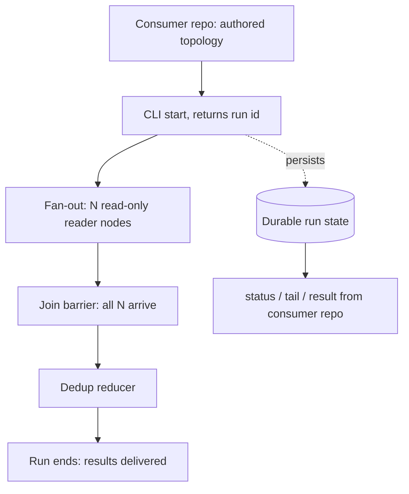

# Engine Slice 1 - Plan

## Goal Capsule

- **Objective:** Build the first slice of the Engine track — a generic graph engine that accepts an externally-authored declarative topology and runs it detached, proven by sensei's on-demand mining workload (runtime-sized batch fan-out → read-only readers → join → dedup) invoked from the sensei repo.
- **Product authority:** `STRATEGY.md` (Engine and Agent-legible observability tracks), issue graph-bro#1 (validating driver, boundary invariant), issue sensei#30 (the driver's own requirements). The Human-checkpoint and Calibration tracks are not active scope here.
- **Open blockers:** none. All outstanding questions are deferred to planning.

---

## Product Contract

### Summary

A workflow-orchestration engine slice that executes consumer-authored declarative graph topologies: dynamic fan-out over runtime-determined batches, read-only CLI-agent nodes, a join with a dedup reducer, durable crash-safe run state, and a detached CLI (start / status / tail / result) usable from the consumer repo. The run ends when results are delivered; review happens in the consumer afterward.

### Problem Frame

Running many parallel coding-agent workflows, the operator is the message bus: every handoff routes through human attention serially, capping parallelism. The Engine track exists to remove that bus, and it needs a first workload that proves the engine's external interface without risking anything. sensei's full-mode mining (sensei#30) is that workload: read-only (lowest blast radius), naturally parallel (batch fan-out is the core primitive to prove), measurable against a deterministic baseline, and honestly external — the mining graph is authored in sensei and handed in from outside, so it exercises the real product surface rather than a graph graph-bro ships to itself.

### Key Decisions

- **Slice boundary is driver-defined, not build-order-defined.** The slice contains exactly the capabilities sensei#30's mining graph needs to run, rather than a prefix of the research doc's dependency-ordered build list. (session-settled: user-directed — chosen over cutting at a build-order prefix: "sensei can use it" is the finish line.)
- **Durable run state in, in-run pause out.** The run terminates at results-delivered; the engine persists run state durably and resumes after a crash, but no interrupt/resume-into-a-live-run primitive ships in this slice. (session-settled: user-approved — chosen over in-run interrupt/resume and over no-persistence: review gates nothing downstream yet, while durable state has three day-one consumers — crash-safe resume of paid LLM fan-outs, consumer-reachable run history, and cost data.)
- **Future HITL must be batch-shaped.** When human-in-the-loop pause lands in a later slice, it is a checkpoint interview — questions batched and dependency-aware, dictated once — never one-by-one interrupts. This constraint binds planning and later slices; nothing in this slice may bake in an interrupt-style primitive that fights it. (session-settled: user-directed — strategy-session constraint carried in from the ratified strategy.)
- **CLI is the only slice-1 surface.** Start/status/tail/result as a command-line interface; MCP and any consumer-side skill wrap the same CLI later without rework. (session-settled: user-approved — chosen over MCP-first or multiple surfaces: zero-registration invocation from consumer repos, and avoids building surfaces that may not be needed.)
- **Engine acceptance excludes mining recall.** The engine is done when the external graph runs detached and observably; recall-vs-`mine.py` stays sensei#30's metric. (session-settled: user-approved — surfaced in the scope synthesis and confirmed: a recall bar would make the engine's "done" depend on mining semantics, violating the boundary invariant.)
- **The research doc's settled architecture stands.** State-snapshot-per-super-step rather than event-sourced replay, a serializable condition/topology format rather than opaque callables, loud-fail on unreduced concurrent writes, mandatory step caps, join barrier-mode split from merge policy, and the CLI-agent executor rules are inherited from `docs/research/graph-orchestration-landscape.md` §16 and are not re-litigated here.

<!-- ce-section: work-relationships -->
### How This Work Fits Together

This plan owns the Engine slice only. The surrounding breakdown is the current understanding, not a committed roadmap:

- sensei#30 (mining graph definition, mining semantics, recall metric) — Depends on this slice's CLI and primitives; owns everything mining-shaped.
- Human-checkpoint track (batched interview, in-run pause) — Enabled by this slice: the eventual interrupt/resume primitive builds on the durable run state shipped here; blocked until the interview design exists.
- Calibration track — Shares the run trace as a data source; can proceed independently of this slice.
- Observability extensions (cost-baseline comparison reporting, retrieval over run logs) — Still to decide; the trace must carry the data, the features come later.

### Actors

- A1. Operator (Florian) — starts runs, reads status, reviews results after a run completes.
- A2. Consumer-side agent session — authors the topology in the consumer repo, invokes the CLI, reads the trace to answer "what happened."
- A3. The engine — executes the topology detached; never knows which consumer is calling.

### Requirements

**Topology intake and boundary**

- R1. The engine accepts a declarative topology authored in a consumer repo and executes it unchanged; graph-bro ships no workflow or artifact that names a consumer or its domain.
- R2. The topology format is serializable: a topology survives process restart and contains no opaque callables.
- R3. A topology can declare runtime-determined fan-out — fan out over N items where N is known only from run state — with a join that fires on completion of all N.

**Execution core**

- R4. A node is a function of shared state whose result is a state update.
- R5. Concurrent or repeated writes to one state key resolve through a registered reducer (append, merge, dedup); unregistered write conflicts fail loudly.
- R6. The engine runs a CLI coding agent as a node: deliver a prompt, capture its output into state, and kill the node's full process tree on cancellation or timeout.
- R7. A topology can declare a node read-only — it reads and proposes, never mutates the consumer repo; enforcement mechanics are planning's choice, the declaration is required.
- R8. Every run has a mandatory step cap; exceeding it halts the run as a visible failure, never a hang.

**Durability and resume**

- R9. Run state persists durably as the run progresses: a killed or crashed run resumes without re-running completed nodes, so completed LLM work is never paid for twice.
- R10. One failed branch in a fan-out never silently discards other branches' completed work; the failure is visible in run status and trace.

**Detached control surface and observability**

- R11. The CLI starts a run and returns immediately with a run identifier; status, tail, and result read the durable run state — all usable from the consumer repo with no graph-bro checkout.
- R12. The run trace answers "what happened on the way" to an agent reader from the consumer repo: per-node start/end, outputs, failures, and routing, with enough per-node data to compute cost later.

**Showcase**

- R13. graph-bro ships one generic example graph (anonymous fan-out → read → join) as smoke test and showcase; it names no consumer.

### Key Flows

- F1. Driver-shaped run end-to-end
  - **Trigger:** A2 starts a run from the consumer repo via the CLI, passing the topology and input.
  - **Steps:** Engine persists the run, sizes the fan-out from run state, executes N read-only reader nodes, fires the join when all N arrive, applies the dedup reducer, and ends the run with results delivered.
  - **Outcome:** A2 reads the result and the trace; review happens in the consumer after the run.
  - **Covers R1, R3, R4, R5, R6, R7, R11, R12.**
- F2. Crash and resume
  - **Trigger:** The engine process dies (or is killed) mid-fan-out.
  - **Steps:** A resume command loads the durable run state, skips every completed node, and re-runs only incomplete work.
  - **Outcome:** The run completes; no completed node re-executed.
  - **Covers R9.**
- F3. Branch failure
  - **Trigger:** One reader node fails while sibling branches run.
  - **Steps:** The failure policy applies (default is planning's choice); completed branch outputs stay in state; the failure lands in status and trace.
  - **Outcome:** No silent loss of paid work; the failure is diagnosable from the trace.
  - **Covers R10, R12.**

### Acceptance Examples

- AE1. **Covers R3.** Given a topology declaring fan-out over input batches, when the input yields 17 batches at run time, then 17 reader nodes execute and the join fires only after all 17 complete.
- AE2. **Covers R9.** Given a run killed after 12 of 17 readers completed, when the run is resumed, then the 12 completed readers are not re-executed and the run completes.
- AE3. **Covers R10.** Given one reader fails, when the run ends or halts, then the other readers' outputs are present in run state and the failure is visible in status.
- AE4. **Covers R8.** Given a run that exceeds its step cap, when the cap is hit, then the run halts with a visible failure rather than hanging.
- AE5. **Covers R11.** Given a start command issued from the consumer repo, when it returns, then it returns promptly with a run identifier while the run continues detached.
- AE6. **Covers R1, R13.** Given graph-bro's shipped engine and example graphs, when searched for any consumer name or consumer-domain term, then none appears.

### Success Criteria

- sensei's externally-authored mining graph, started from the sensei repo via the CLI, runs to completion detached — issue graph-bro#1's finish line.
- Kill-and-resume is demonstrated on a real run without re-running completed readers.
- An agent session in the consumer repo answers "what happened on the way" from the trace alone.
- Recall versus `mine.py` is not an engine criterion; it belongs to sensei#30.

### Scope Boundaries

**Deferred for later**

- In-run interrupt/resume and the batched-interview machinery (Human-checkpoint track; builds on this slice's durable run state).
- Conditional routing and loops (review→fix, retry-with-feedback) — the Engine track's headline primitive, but the mining driver never branches; next slice.
- A structured per-node error-routing primitive beyond R10's no-silent-loss guarantee.
- MCP surface and any consumer-side skill wrapper — both wrap the slice's CLI later.
- The side-effects idempotency ledger — a read-only driver has no engine-known external side effects to protect.
- Cost-baseline comparison reporting — the trace must carry per-node cost data (R12); the reporting comes later.
- Retrieval over run logs — deferred but open; this slice designs it neither in nor out.

**Outside this product's identity**

- The mining graph definition and mining semantics — sensei's deliverables, per the boundary invariant.
- Graph memory / knowledge graphs / GraphRAG as a product direction.

### Dependencies / Assumptions

- The repo is docs-only today; this slice is the first code.
- sensei#30's open questions (cadence, sampling, detector promotion) do not block the engine; the driver contract is the topology shape, not mining semantics.
- Review happens in sensei after run completion; "run complete = interview ready" is this slice's checkpoint convention.
- `docs/research/graph-orchestration-landscape.md` is the binding technical reference for planning — §16 carries the build order and the settled architecture decisions this contract inherits.

### Outstanding Questions

**Deferred to Planning**

- Implementation language and stack. The research reference implementation is Python-flavored (athena-graphs); standing conventions favor the mature ecosystem and zod-everywhere when TypeScript. Planning owns the call.
- Where durable run state physically lives so that consumer repos can reach it.
- The branch-failure default: fail-fast versus collect-errors.
- The concrete topology grammar (the serializable format's shape).
- Checkpoint granularity and write cadence.

**Resolve Before Planning**

- None.

### Sources / Research

- `docs/research/graph-orchestration-landscape.md` — §7.5 (dynamic fan-out), §13 (minimal engine walkthrough, CLI-agent node executor), §14 (pitfalls), §15 (test checklist), §16 (build order and settled architecture decisions).
- `STRATEGY.md` — Engine and Agent-legible observability tracks; key metrics the run trace must eventually serve.
- `docs/design/calibration-loop.md` — the calibration loop that will later read engine run data.
- Issue graph-bro#1 — validating driver, boundary invariant, surfaced capability list.
- Issue FlorianRiquelme/sensei#30 — the driver's own requirements and open questions.
