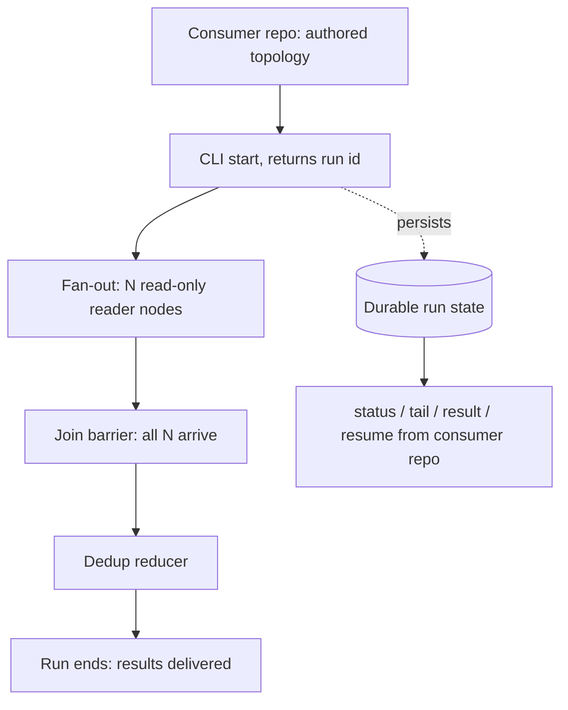
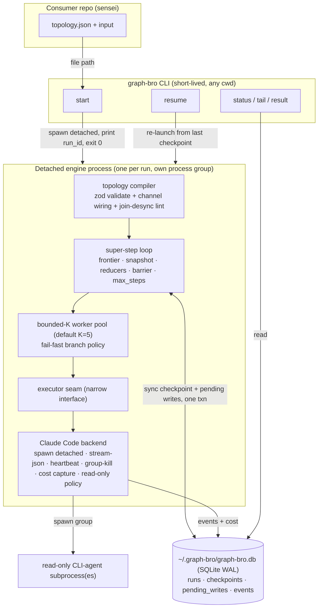

# Engine Slice 1 - Plan

## Goal Capsule

- **Objective:** Build the first slice of the Engine track — a generic graph engine that accepts an externally-authored declarative topology and runs it detached, proven by sensei's on-demand mining workload (runtime-sized batch fan-out → read-only readers → join → dedup) invoked from the sensei repo.
- **Product authority:** `STRATEGY.md` (Engine and Agent-legible observability tracks), issue graph-bro#1 (validating driver, boundary invariant), issue sensei#30 (the driver's own requirements). The Human-checkpoint and Calibration tracks are not active scope here.
- **Open blockers:** none. All outstanding questions are resolved as ADR-0001..0011 (`docs/adr/`, indexed in `CONTEXT.md`).

---

## Product Contract

> **Product Contract preservation:** the Product Contract below is carried forward from the requirements-only artifact unchanged, with **one clarification**: the CLI is **five verbs, not four** — `resume <run_id>` joins start/status/tail/result. The Summary and R11 originally listed four; resume was always required by R9/F2/AE2, so this closes an internal undercount, not a scope change. No product behavior, actor, or success criterion changed.

### Summary

A workflow-orchestration engine slice that executes consumer-authored declarative graph topologies: dynamic fan-out over runtime-determined batches, read-only CLI-agent nodes, a join with a dedup reducer, durable crash-safe run state, and a detached CLI (start / status / tail / result / resume) usable from the consumer repo. The run ends when results are delivered; review happens in the consumer afterward.

### Problem Frame

Running many parallel coding-agent workflows, the operator is the message bus: every handoff routes through human attention serially, capping parallelism. The Engine track exists to remove that bus, and it needs a first workload that proves the engine's external interface without risking anything. sensei's full-mode mining (sensei#30) is that workload: read-only (lowest blast radius), naturally parallel (batch fan-out is the core primitive to prove), measurable against a deterministic baseline, and honestly external — the mining graph is authored in sensei and handed in from outside, so it exercises the real product surface rather than a graph graph-bro ships to itself.

### Key Decisions

- **Slice boundary is driver-defined, not build-order-defined.** The slice contains exactly the capabilities sensei#30's mining graph needs to run, rather than a prefix of the research doc's dependency-ordered build list. (session-settled: user-directed — chosen over cutting at a build-order prefix: "sensei can use it" is the finish line.)
- **Durable run state in, in-run pause out.** The run terminates at results-delivered; the engine persists run state durably and resumes after a crash, but no interrupt/resume-into-a-live-run primitive ships in this slice. (session-settled: user-approved — chosen over in-run interrupt/resume and over no-persistence: review gates nothing downstream yet, while durable state has three day-one consumers — crash-safe resume of paid LLM fan-outs, consumer-reachable run history, and cost data.)
- **Future HITL must be batch-shaped.** When human-in-the-loop pause lands in a later slice, it is a checkpoint interview — questions batched and dependency-aware, dictated once — never one-by-one interrupts. This constraint binds planning and later slices; nothing in this slice may bake in an interrupt-style primitive that fights it. (session-settled: user-directed — strategy-session constraint carried in from the ratified strategy.)
- **CLI is the only slice-1 surface.** Start/status/tail/result/resume as a command-line interface; MCP and any consumer-side skill wrap the same CLI later without rework. (session-settled: user-approved — chosen over MCP-first or multiple surfaces: zero-registration invocation from consumer repos, and avoids building surfaces that may not be needed.)
- **Engine acceptance excludes mining recall.** The engine is done when the external graph runs detached and observably; recall-vs-`mine.py` stays sensei#30's metric. (session-settled: user-approved — surfaced in the scope synthesis and confirmed: a recall bar would make the engine's "done" depend on mining semantics, violating the boundary invariant.)
- **The research doc's settled architecture stands.** State-snapshot-per-super-step rather than event-sourced replay, a serializable condition/topology format rather than opaque callables, loud-fail on unreduced concurrent writes, mandatory step caps, join barrier-mode split from merge policy, and the CLI-agent executor rules are inherited from `docs/research/graph-orchestration-landscape.md` §16 and are not re-litigated here.

<!-- ce-section: work-relationships -->
### How This Work Fits Together

This plan owns the Engine slice only. The surrounding breakdown is the current understanding, not a committed roadmap:

- sensei#30 (mining graph definition, mining semantics, recall metric) — Depends on this slice's CLI and primitives; owns everything mining-shaped.
- Human-checkpoint track (batched interview, in-run pause) — Enabled by this slice: the eventual interrupt/resume primitive builds on the durable run state shipped here; blocked until the interview design exists.
- Calibration track — Shares the run trace as a data source; can proceed independently of this slice.
- Observability extensions (cost-baseline comparison reporting, retrieval over run logs) — Still to decide; the trace must carry the data, the features come later.

### Actors

- A1. Operator (Florian) — starts runs, reads status, reviews results after a run completes.
- A2. Consumer-side agent session — authors the topology in the consumer repo, invokes the CLI, reads the trace to answer "what happened."
- A3. The engine — executes the topology detached; never knows which consumer is calling.

### Requirements

**Topology intake and boundary**

- R1. The engine accepts a declarative topology authored in a consumer repo and executes it unchanged; graph-bro ships no workflow or artifact that names a consumer or its domain.
- R2. The topology format is serializable: a topology survives process restart and contains no opaque callables.
- R3. A topology can declare runtime-determined fan-out — fan out over N items where N is known only from run state — with a join that fires on completion of all N.

**Execution core**

- R4. A node is a function of shared state whose result is a state update.
- R5. Concurrent or repeated writes to one state key resolve through a registered reducer (append, merge, dedup); unregistered write conflicts fail loudly.
- R6. The engine runs a CLI coding agent as a node: deliver a prompt, capture its output into state, and kill the node's full process tree on cancellation or timeout.
- R7. A topology can declare a node read-only — it reads and proposes, never mutates the consumer repo; enforcement mechanics are planning's choice, the declaration is required.
- R8. Every run has a mandatory step cap; exceeding it halts the run as a visible failure, never a hang.

**Durability and resume**

- R9. Run state persists durably as the run progresses: a killed or crashed run resumes without re-running completed nodes, so completed LLM work is never paid for twice.
- R10. One failed branch in a fan-out never silently discards other branches' completed work; the failure is visible in run status and trace.

**Detached control surface and observability**

- R11. The CLI starts a run and returns immediately with a run identifier; status, tail, result, and resume read (or re-launch from) the durable run state — all usable from the consumer repo with no graph-bro checkout.
- R12. The run trace answers "what happened on the way" to an agent reader from the consumer repo: per-node start/end, outputs, failures, and routing, with enough per-node data to compute cost later.

**Showcase**

- R13. graph-bro ships one generic example graph (anonymous fan-out → read → join) as smoke test and showcase; it names no consumer.

### Key Flows



- F1. Driver-shaped run end-to-end
  - **Trigger:** A2 starts a run from the consumer repo via the CLI, passing the topology and input.
  - **Steps:** Engine persists the run, sizes the fan-out from run state, executes N read-only reader nodes, fires the join when all N arrive, applies the dedup reducer, and ends the run with results delivered.
  - **Outcome:** A2 reads the result and the trace; review happens in the consumer after the run.
  - **Covers R1, R3, R4, R5, R6, R7, R11, R12.**
- F2. Crash and resume
  - **Trigger:** The engine process dies (or is killed) mid-fan-out.
  - **Steps:** A `resume` command loads the durable run state, skips every completed node, and re-runs only incomplete work.
  - **Outcome:** The run completes; no completed node re-executed.
  - **Covers R9.**
- F3. Branch failure
  - **Trigger:** One reader node fails while sibling branches run.
  - **Steps:** The fail-fast policy halts the run per super-step (ADR-0006); completed branch outputs stay in state as durable pending writes; the failure lands in status and trace.
  - **Outcome:** No silent loss of paid work; the failure is diagnosable from the trace; `resume` retries only the failed branch.
  - **Covers R10, R12.**

### Acceptance Examples

- AE1. **Covers R3.** Given a topology declaring fan-out over input batches, when the input yields 17 batches at run time, then 17 reader nodes execute and the join fires only after all 17 complete.
- AE2. **Covers R9.** Given a run killed after 12 of 17 readers completed, when the run is resumed, then the 12 completed readers are not re-executed and the run completes.
- AE3. **Covers R10.** Given one reader fails, when the run ends or halts, then the other readers' outputs are present in run state and the failure is visible in status.
- AE4. **Covers R8.** Given a run that exceeds its step cap, when the cap is hit, then the run halts with a visible failure rather than hanging.
- AE5. **Covers R11.** Given a start command issued from the consumer repo, when it returns, then it returns promptly with a run identifier while the run continues detached.
- AE6. **Covers R1, R13.** Given graph-bro's shipped engine and example graphs, when searched for any consumer name or consumer-domain term, then none appears.

### Success Criteria

- sensei's externally-authored mining graph, started from the sensei repo via the CLI, runs to completion detached — issue graph-bro#1's finish line.
- Kill-and-resume is demonstrated on a real run without re-running completed readers.
- An agent session in the consumer repo answers "what happened on the way" from the trace alone.
- Recall versus `mine.py` is not an engine criterion; it belongs to sensei#30.

### Scope Boundaries

**Deferred for later**

- In-run interrupt/resume and the batched-interview machinery (Human-checkpoint track; builds on this slice's durable run state).
- Conditional routing and loops (review→fix, retry-with-feedback) — the Engine track's headline primitive, but the mining driver never branches; next slice. (The §14.9 join-desync **lint + watchdog** still ship — see KTD-7.)
- A structured per-node error-routing primitive beyond R10's no-silent-loss guarantee (`on_error`, collect-errors).
- Write-capable (`read_only: false`) agent nodes and their inverted tool policy (broad tools + `--dangerously-skip-permissions` + worktree-per-node isolation) — slice 1 restricts `agent` nodes to `read_only: true` at compile (KTD-8/ADR-0007); the mining driver is entirely read-only.
- MCP surface and any consumer-side skill wrapper — both wrap the slice's CLI later.
- The side-effects idempotency ledger — a read-only driver has no engine-known external side effects to protect.
- Cost-baseline comparison reporting — the trace must carry per-node cost data (R12); the reporting comes later.
- Retrieval over run logs — deferred but open; this slice designs it neither in nor out.
- `fan_out` authoring sugar (ADR-0005), backend registry / second adapter (ADR-0010), registry publish of the CLI (ADR-0002).

**Outside this product's identity**

- The mining graph definition and mining semantics — sensei's deliverables, per the boundary invariant.
- Graph memory / knowledge graphs / GraphRAG as a product direction.

**Deferred to Follow-Up Work** (plan-local sequencing, not product non-goals)

- The exhaustive `docs/research` §15 test apparatus (random-DAG property suite ≥25 seeds, crash-injection at *every* super-step boundary, replay-determinism, schema-evolution round-trips, multi-backend fixture parametrization). Slice 1 ships the driver-critical + crash-core subset (KTD-9, U8); the full apparatus lands when loops/HITL/second-backend capabilities it exercises exist.

### Dependencies / Assumptions

- The repo is docs-only today; this slice is the first code.
- sensei#30's open questions (cadence, sampling, detector promotion) do not block the engine; the driver contract is the topology shape, not mining semantics.
- Review happens in sensei after run completion; "run complete = interview ready" is this slice's checkpoint convention.
- `docs/research/graph-orchestration-landscape.md` is the binding technical reference for planning — §16 carries the build order and the settled architecture decisions this contract inherits.
- Claude Code CLI is installed on the operator's machine and on PATH; the executor pins its exact flag/envelope contract against a live `claude --help` / `claude -p --output-format json` probe at implementation time (version drifts — see U4).

### Outstanding Questions

**Deferred to Planning** — *all resolved as ADRs during the grill; planning plans against these:*

- ~~Implementation language and stack~~ → **ADR-0001** (TypeScript/Node, zod-everywhere).
- ~~Where durable run state physically lives~~ → **ADR-0003** (one global SQLite DB at `~/.graph-bro/graph-bro.db`).
- ~~Branch-failure default (fail-fast vs collect-errors)~~ → **ADR-0006** (fail-fast; collect-errors deferred).
- ~~Concrete topology grammar~~ → **ADR-0005** (athena JSON envelope as zod schema; composable fan-out/join edge primitives).
- ~~Checkpoint granularity and write cadence~~ → **ADR-0008** (two levels, synchronous both).

**Resolve Before Planning**

- None.

### Sources / Research

- `docs/research/graph-orchestration-landscape.md` — §7.5 (dynamic fan-out), §8.5 (pending writes / crash core), §13.2–13.4 (athena reference, CLI-agent node executor), §14 (pitfalls), §15 (test checklist), §16 (build order and settled architecture decisions).
- `docs/adr/0001..0011` — the settled decisions this plan implements; indexed in `CONTEXT.md`.
- `STRATEGY.md` — Engine and Agent-legible observability tracks; key metrics the run trace must eventually serve.
- `docs/design/calibration-loop.md` — the calibration loop that will later read engine run data.
- Issue graph-bro#1 — validating driver, boundary invariant, surfaced capability list.
- Issue FlorianRiquelme/sensei#30 — the driver's own requirements and open questions.

---

## Planning Contract

### High-Level Technical Design

Three cooperating layers, one durable substrate. A topology authored in the consumer repo is compiled (validated + wired) once; a detached engine process runs it as a sequence of super-steps, executing nodes through a narrow executor seam and checkpointing to SQLite synchronously; short-lived CLI calls read that same SQLite from any cwd. *Diagrams are authoritative alongside the prose.*

**Component architecture**



**Super-step + crash/resume lifecycle** — the load-bearing correctness story (§8.5, ADR-0008):

```mermaid
sequenceDiagram
  participant L as super-step loop
  participant P as bounded-K pool
  participant DB as SQLite (txn)
  Note over L: frontier = ready nodes; snapshot state (frozen)
  L->>P: dispatch ready nodes (fan-out spawns N branch tasks)
  loop drain K-at-a-time
    P->>P: run branch task (executor seam)
    P->>DB: pending_write keyed (run_id,node,step,item_key,triggers) — sync, the instant task completes
  end
  Note over P: on any branch failure → fail-fast: halt super-step, siblings' pending writes already durable
  L->>L: merge updates via reducers (loud-fail on unreduced conflict)
  L->>L: fire join barrier if all sources arrived; barrier resets
  L->>DB: whole-state checkpoint {state, frontier, barrier, step} — sync, same txn
  Note over L,DB: crash anywhere → resume loads last checkpoint,<br/>replays pending_writes, skips completed nodes (zero re-runs)
```

The HTD renders the four architecture triggers this plan fires: multi-component architecture (component diagram), cross-process lifecycle (start → detached engine → CLI reads), the super-step state machine (sequence), and the crash-resume data flow. Per-node subprocess mechanics stay in U4; per-unit `Approach` fields carry the rest.

### Key Technical Decisions

The eleven ADRs (`docs/adr/`) are the settled decisions this plan implements; KTD-1..KTD-6 cite them rather than restate them. KTD-7..KTD-11 are the planning-level calls made in this document.

- **KTD-1. TypeScript/Node engine, zod-everywhere.** (session-settled: user-directed — chosen over Python despite the Python reference/consumer: ADR-0001.) Consequence: the §8.5 correctness core is *re-implemented*, not ported; topology grammar, trace schema, and the CLI-agent JSON envelope are all zod-defined.
- **KTD-2. One global SQLite DB (`better-sqlite3`, WAL) at `~/.graph-bro/graph-bro.db`.** (session-settled: user-directed — chosen over per-run NDJSON directory that §16 prescribes: ADR-0003.) The CLI is the agent-legible read surface; the agent reads CLI output, never SQL.
- **KTD-3. Detached process per run, no daemon.** (session-settled: user-approved — chosen over a resident daemon: ADR-0004.) SQLite is the inter-process contract; `start` spawns a `detached`/`unref`'d child in its own process group and exits.
- **KTD-4. Composable fan-out + join edge primitives, not a sealed macro.** (session-settled: user-directed — chosen over a bundled `fan_out` node: ADR-0005.) Barrier `mode` (`all`/`any`) split from `reducer`; `dedup` is a built-in reducer.
- **KTD-5. Fail-fast is the sole branch-failure policy.** (session-settled: user-approved — chosen over collect-errors: ADR-0006.) No silent loss holds *because* per-task pending writes are durable; recovery is `resume`.
- **KTD-6. Read-only enforced via Claude Code's permission system; synchronous checkpoints both levels; cost captured from inception; one backend behind a narrow seam; bounded K=5 fan-out + per-node model.** (session-settled: user-directed/approved — ADR-0007, ADR-0008, ADR-0009, ADR-0010, ADR-0011 respectively.)
- **KTD-7. The §14.9 join-desync lint (compile-time) + runtime watchdog ship in slice 1**, even though conditional routing/loops are deferred. Rationale: ADR-0005 mandates them regardless — a multi-source barrier join exists in the mining graph, so the desync risk is present the moment the join exists; the lint/watchdog carry most of the safety a sealed macro would have provided by construction. A stalled join raises a loud `UnreachableJoinError` naming the join + unreported sources rather than silently burning `max_steps`.
- **KTD-8. Read-only node command shape (resolves ADR-0007's deferred flag mechanics against current Claude Code docs).** A `read_only: true` node spawns `claude -p <prompt> --allowedTools Read Grep Glob "Bash(git status *)" "Bash(git log *)" ... --model <cheap> --print --verbose --output-format stream-json` — an **allowlist** (no dedicated read-only `--permission-mode` exists) that omits `Edit`/`Write`/`NotebookEdit`. A pure read-only allowlist does not prompt for *tool* permissions, so it needs **no** `--dangerously-skip-permissions` (verified against `code.claude.com/docs/en/{cli-reference,permissions,headless}`). **One caveat, resolved by the probe below:** Claude Code's per-directory *workspace-trust* prompt is a mechanism separate from `--allowedTools` — a detached read-only node in a not-yet-trusted consumer cwd, with no TTY, could hang on it until the hard timeout (the §13.4 headless-hang shape). **Scope caveat:** the allowlist denies mutation but does not scope *where* `Read`/`Grep`/`Glob` may read — "read-only" means no-mutation, not repo-scoped; accepted under the solo-operator trust model. Write-capable nodes (future) invert the policy: broad tools + `--dangerously-skip-permissions`. **Deferred to implementation:** a live `claude --help` / `claude -p --output-format json` probe on the target machine pins the exact flag list, **flag ordering** (SDK #60 — some releases require `--print --verbose` before `--output-format stream-json`; put them first unconditionally), the read-only Bash allowlist entries, the envelope field names (docs and §13.4's live capture disagree on `is_error`/`num_turns`), **and whether the workspace-trust prompt fires under `--allowedTools` alone** — if it does, a one-time trust-priming step runs for the consumer cwd before the first read-only node. The envelope is validated by a zod schema.
- **KTD-9. Streaming executor + live heartbeat; driver-critical test depth.** (Confirmed in scoping synthesis.) The executor uses NDJSON streaming (`--print --verbose --output-format stream-json` — ordering per KTD-8/SDK #60, `readline` over child stdout) so per-node events append to the trace *while the node runs* and the two-threshold soft-warn/hard-kill heartbeat has a last-stdout-line timestamp to work from — serving STRATEGY's "what happened on the way" north star and R12. The slice-1 test harness targets the driver-critical correctness properties + the crash core (U8), not the exhaustive §15 apparatus (deferred to follow-up).
- **KTD-10. `git status --porcelain` read-only backstop: confirmed (resolves ADR-0007's open confirm/drop).** A near-free `git status --porcelain` assertion turns any permission-policy gap (a Bash command that slipped the allowlist) into a loud failure — defense-in-depth matching the loud-fail convention, subordinate to the permission-mode primary. Run it **per read-only node completion**, not once after the whole fan-out drains: with K concurrent branches sharing one cwd, a boundary-only check cannot attribute a violation to the offending node, weakening F3's trace diagnosability. Per-branch keeps the culprit named in the trace. Cheap enough to keep; kept.
- **KTD-11. Module layout by concern with a narrow executor seam.** `topology/` (grammar + compile), `engine/` (state, reducers, barrier, loop, concurrency), `store/` (SQLite, checkpoints, pending-writes, trace), `executor/` (seam + Claude Code backend + subprocess), `cli/` (5 verbs), `runtime/` (detached engine entrypoint). The executor seam is a single small interface so a second backend slots in later without touching the engine core (ADR-0010).
- **KTD-12. Dynamic fan-out carries a per-instance identity through the join barrier and the pending-write key.** A fan-out reuses one node id for all N branches, so both the barrier and the crash core must discriminate branches by a per-instance key derived from the fan-out's `for_each` item (`${node}:${itemKey}`, item key or index). The join barrier's `arrivals` is keyed by this per-instance id, **not** the bare declared source name — otherwise the barrier's source universe for a dynamic fan-out is size 1 and the join fires when the *first* branch completes, breaking AE1/R3. The pending-write key becomes `(run_id, node, step, item_key, triggers)` so N siblings at one step produce N distinct rows — without the item key, `INSERT OR IGNORE` idempotence silently collapses N branch outputs to one, the exact silent loss R9/R10 forbid. This makes explicit the per-instance identity the reference's per-`Send` task-id (§8.5) carries implicitly; `CONTEXT.md`'s "per-task" pending-writes framing already implies it (a task is one branch instance).
- **KTD-13. A run-kill cascades to every in-flight node process group.** The engine (ADR-0004) and each node's Claude Code subprocess (ADR-0007/§13.4) are each spawned `detached` in their *own* process group, so a single group-kill of the engine does **not** reach an active node. The detached engine (`runtime/run.ts`) keeps an in-memory registry of in-flight node PIDs/PGIDs (already needed for U4's per-node timeout kill) and installs a SIGTERM/SIGINT handler that issues the SIGTERM→SIGKILL group-kill to every tracked active node PGID before the engine exits. Without this, killing a run orphans a still-billing `claude` subprocess and `resume` re-runs it — double-paying work R9 forbids. No dedicated `kill` verb ships this slice; a run is killed by signalling the engine pid, which the handler turns into the cascade.
- **KTD-14. One live engine per run (single-owner guard).** With no daemon (ADR-0004), nothing structurally prevents two engine processes writing one `run_id` — e.g. `resume` invoked while a slow-but-alive engine still owns the run. The `runs` row carries an `owner_pid`; `start` sets it, and both `start` and `resume` check the current owner's liveness (signal 0) before spawning — refusing the relaunch with a clear error when the owner is alive, and taking ownership only when the pid is dead (the §13.2 self-heal / "orphaned" pattern). This closes the concurrent-writer corruption window the §15 checklist calls out for shared run ids.

### Output Structure

Greenfield project; the tree is a scope declaration (per-unit `Files` remain authoritative):

```
package.json                    tsconfig.json      vitest.config.ts      .gitignore
src/
  topology/    schema.ts  compile.ts  lint.ts
  engine/      state.ts  reducers.ts  barrier.ts  loop.ts  watchdog.ts  concurrency.ts  fanout.ts
  store/       db.ts  migrations/001_init.sql  checkpoints.ts  pending-writes.ts  trace.ts
  executor/    executor.ts  claude-code.ts  subprocess.ts  envelope.ts  read-only-policy.ts
  cli/         index.ts  start.ts  status.ts  tail.ts  result.ts  resume.ts
  runtime/     run.ts
examples/
  fanout-read-join/   topology.json  README.md
test/
  fixtures/    stub-executor.ts
  topology/ · engine/ · store/ · executor/   (per-unit unit tests)
  integration/  crash-resume.test.ts  fanout-join.test.ts  fail-fast.test.ts  kill-reaping.test.ts
  smoke/  example-graph.test.ts        boundary-invariant.test.ts
```

---

## Implementation Units

Dependency order: U1 → U2 → U3 → U4 → U5 → U6 → U7; U8 (integration harness) depends on U3–U5. Test runner is **vitest** (mature ecosystem, ADR-0001 spirit).

### U1. Project scaffolding + topology grammar & compiler

- **Goal:** Stand up the TS/Node project and the serializable topology grammar; compile-during-validation so a malformed topology never gets a run id.
- **Requirements:** R1, R2, R3, R5 (grammar side), R7 (read-only declaration), R8 (grammar side); KTD-1, KTD-4, KTD-7, KTD-8, KTD-12.
- **Dependencies:** none.
- **Files:** `package.json`, `tsconfig.json`, `vitest.config.ts`, `.gitignore`, `src/topology/schema.ts`, `src/topology/compile.ts`, `src/topology/lint.ts`, `test/topology/schema.test.ts`, `test/topology/compile.test.ts`
- **Approach:** zod schema for the athena JSON envelope (`nodes` + `edges` + `max_steps`, ADR-0005). Node kinds: `agent` (fields incl. `read_only` — **`z.literal(true)` in slice 1**, so a write-capable node is rejected at compile until its policy ships, KTD-8; `model: string`; prompt template; `output_key` — ADR-0011) and `set` (deterministic write); `human` is out. Edge shapes: plain edge, **fan-out** modifier (`{from, for_each: "<dotted path>", as, to}` — the `as` binding names the per-branch item, and its key/index is the **per-instance identity** threaded into the join barrier and the pending-write key, KTD-12), **join** (`{from: [...], mode: "all"|"any", reducer, into, to}`). `compile()` validates then wires nodes/edges down to the runtime channel model (channels + subscribers, §16) and runs the **compile-time join-desync lint** (§14.9): a join source that is a non-exhaustive router destination → warning. Reject `START` among join sources and `END` as any source.
- **Patterns to follow:** athena `spec.py` `build_topology` (compile-during-validation), §13.2 JSON topology schema and `when` DSL grammar. All schemas zod (standing convention).
- **Test scenarios:**
  - Happy path: a valid fan-out→read→join topology parses and compiles to a channel wiring.
  - `Covers R2.` malformed topology (missing `max_steps`, unknown node kind, unknown reducer name, `START` as join source) is rejected at compile with a typed error and **no run id is produced**.
  - Fan-out edge with `for_each`/`as` and join edge with `mode`/`reducer`/`into` round-trip through the schema.
  - `agent` node carries `read_only: true` and `model`; both survive serialize→deserialize (R2). A topology with `read_only: false` (or omitted) on an `agent` node is **rejected at compile** — slice-1 restricts it to `true` (KTD-8); no run id is produced.
  - Per-instance identity: a fan-out over a 3-item `for_each` yields three distinct item keys through the `as` binding — the discriminator U2's barrier and U3's pending-write key consume (KTD-12).
  - Join-desync lint emits a warning when a join source sits behind a non-exhaustive router; does **not** hard-error an always-both-fire router into a static join (the §14.1 non-counterexample).
  - Golden-file snapshot of a compiled topology (nodes, edges, join barriers, reducer assignments).
- **Verification:** `vitest` green for U1; a hand-written sample topology compiles and a deliberately-broken one fails loudly before any run id.

### U2. Execution core — state, reducers, resettable barrier, super-step loop

- **Goal:** The in-memory engine: snapshot-per-super-step, reducers with loud-fail, a resettable join barrier, and a bounded execution loop with a mandatory step cap.
- **Requirements:** R3 (join fires on all N), R4, R5, R8; KTD-4, KTD-7, KTD-12.
- **Dependencies:** U1.
- **Files:** `src/engine/state.ts`, `src/engine/reducers.ts`, `src/engine/barrier.ts`, `src/engine/loop.ts`, `src/engine/watchdog.ts`, `test/engine/reducers.test.ts`, `test/engine/barrier.test.ts`, `test/engine/loop.test.ts`
- **Approach:** Node = `fn(state) -> update` (R4); each super-step freezes a snapshot so nodes never see each other's mid-step writes (§13.2 loop). Reducers `append`/`merge`/`sum`/`dedup` — the built-in set fixed canonically in `CONTEXT.md`/ADR-0005 (the mining join uses `dedup`; `sum` ships as part of the settled built-in set, not driver-specific scope); a concurrent/repeated write to a key with **no** registered reducer and differing values raises a loud typed `StateConflictError` (§13.2.4, ADR-0006). Join barrier is the resettable `arrivals: Record<edgeKey, Set<instanceId>>` keyed by **per-instance identity** (`${node}:${itemKey}` from the fan-out `as` binding, KTD-12) — **not** the bare source name, so a dynamic fan-out of N instances of one node populates N distinct arrivals and the join fires only after all N; it fires when the instance set is complete then clears (the ~15-line `NamedBarrierValue` equivalent, §13.3). Barrier `mode` split from `reducer`. Loop guards `max_steps` → halt with a **visible failure**, never a hang (R8); a frontier that empties without END is a distinct `dead_end` status. Runtime **join watchdog** raises `UnreachableJoinError` naming the stalled join + unreported sources (KTD-7).
- **Patterns to follow:** §13.2 runner loop + `_transitions` + `_merge`; §13.3 `NamedBarrierValue` reset semantics.
- **Test scenarios:**
  - Happy path: a linear then a two-branch-into-join topology runs to completion; join fires exactly once after both sources arrive.
  - Snapshot isolation: two nodes in one super-step don't observe each other's writes.
  - Reducers: `append`/`merge`/`sum`/`dedup` each produce the expected merged value; `dedup` removes duplicates across branches.
  - Loud-fail: two nodes write differing values to an unreduced key → typed `StateConflictError` at merge.
  - `Covers AE1.` A fan-out of 17 (with a stub node) executes 17 branch instances and the join fires only after all 17 arrive (logic-level; end-to-end concurrency in U5/U8).
  - Per-instance barrier (KTD-12): a join fed by 3 dynamic instances of **one** node id does not fire until all 3 distinct instance ids arrive — guards the early-fire bug where keying by bare source name gives a size-1 source universe that fires on the first branch.
  - Barrier resets: a join fed twice (simulated re-arm) fires twice.
  - `Covers AE4.` A run exceeding `max_steps` halts with a visible failure status, not a hang.
  - `dead_end` (frontier empties without END) is reported distinctly from `failed`.
  - Watchdog raises `UnreachableJoinError` naming the join when a declared source never reports.
- **Verification:** `vitest` green; the loop terminates on every path (END, dead_end, step-cap) — no test hangs.

### U3. Durable store — SQLite schema, checkpoints, pending-writes crash core, resume

- **Goal:** Make the run crash-safe: durable per-super-step checkpoints + per-task pending writes, both synchronous, so a killed run resumes with zero completed-node re-runs.
- **Requirements:** R9, R10 (durability side), R12 (events/cost schema); KTD-2, KTD-6, KTD-12, KTD-14 (ADR-0008, ADR-0009).
- **Dependencies:** U2.
- **Files:** `src/store/db.ts`, `src/store/migrations/001_init.sql`, `src/store/checkpoints.ts`, `src/store/pending-writes.ts`, `src/store/trace.ts`, `test/store/checkpoints.test.ts`, `test/store/pending-writes.test.ts`, `test/store/trace.test.ts`
- **Approach:** `better-sqlite3` (synchronous — pairs cleanly with ADR-0008's sync cadence), WAL + `busy_timeout`, DB at `~/.graph-bro/graph-bro.db`, idempotent migration. Tables: `runs` (incl. **`owner_pid`** for the single-owner guard, KTD-14), `checkpoints` (whole-state snapshot per super-step: `{state, frontier, barrier, step, history}`), `pending_writes` (per-task, keyed by the deterministic **`(run_id, node, step, item_key, triggers)`** hash — the `item_key` is the fan-out per-instance discriminator, KTD-12, without which N siblings of one node collapse to one row under `INSERT OR IGNORE`; §8.5's single most load-bearing property), `events` (the trace, carrying `model`, `input_tokens`/`output_tokens`/`cache_*`, `duration_ms`, `cost_usd` from the first migration — ADR-0009). A super-step's checkpoint write **and** its pending-writes reconciliation commit in **one** SQLite transaction. Pending write is committed the instant a node completes (sync); control-signal writes (ERROR) use a distinct key space and are **not** replayed as completed (they force re-run). `resume(run_id)` loads the last checkpoint, replays pending writes onto succeeded tasks, and recomputes the frontier so completed nodes are skipped. `INSERT OR IGNORE` for regular writes (first write per `(task_id, idx)` wins — idempotent re-delivery).
- **Execution note:** Build the pending-writes crash core **test-first** — it is §16's single most load-bearing correctness property; the resume-skips-completed test is the airtight proof of R9/AE2.
- **Patterns to follow:** §8.5 `commit`/`put_writes`/`_reapply_writes_to_succeeded_nodes`; §8.8 SQLite DDL (WAL, `(thread/run, task_id, idx)` primary key); the whole-state-blob-per-checkpoint shape.
- **Test scenarios:**
  - Migration is idempotent (running it twice is a no-op); WAL mode is set.
  - Checkpoint round-trips (write → read → structurally identical).
  - Pending write keyed by the deterministic hash incl. `item_key`; the same `(run_id,node,step,item_key,triggers)` re-delivered is idempotent (`INSERT OR IGNORE`, first wins).
  - Sibling non-collision (KTD-12): two instances of the **same** node at the same step with different `item_key`s produce **two distinct** pending-write rows, not one collapsed row — the multi-branch shape AE2 exercises, guarding the silent-loss gap.
  - `owner_pid` (KTD-14): `runs.owner_pid` is set on launch; a liveness helper (signal 0) reports whether the recorded owner is alive — the guard U6's `resume` consumes.
  - `Covers AE2.` A run's checkpoint is written after 12 of 17 **fan-out branch** pending writes exist; `resume` replays the 12, recomputes the frontier, and the 12 nodes are **not** re-executed — assert call counts, not just final state.
  - Atomicity: a crash simulated *between* pending-writes and the coarse checkpoint loses only in-flight tasks (they re-run); committed pending writes survive.
  - ERROR control writes are not treated as completed on replay (a failed task re-runs).
  - `events` row carries `model`/token/`cost_usd`/`duration_ms` columns (schema-level; population in U4).
  - Two concurrent writer processes against one DB serialize under WAL + `busy_timeout` (no `SQLITE_BUSY` thrown at a handful of writers).
- **Verification:** `vitest` green; the resume-idempotence test passes with asserted zero re-executions of completed nodes.

### U4. CLI-agent executor seam (Claude Code backend)

- **Goal:** Run a headless CLI coding agent as a node behind a narrow seam: spawn detached, stream NDJSON, heartbeat, group-kill, capture cost, enforce read-only.
- **Requirements:** R6, R7, R12 (cost capture); KTD-6, KTD-8, KTD-9, KTD-10, KTD-11, KTD-13 (ADR-0007, ADR-0009, ADR-0010).
- **Dependencies:** U1 (schema for `read_only`/`model`), U3 (write events/cost).
- **Files:** `src/executor/executor.ts` (the seam interface), `src/executor/claude-code.ts`, `src/executor/subprocess.ts`, `src/executor/envelope.ts` (zod), `src/executor/read-only-policy.ts`, `test/fixtures/stub-executor.ts`, `test/executor/claude-code.test.ts`, `test/executor/subprocess.test.ts`
- **Approach:** One narrow `Executor` interface — `run(prompt, {cwd, readOnly, model, timeout}) -> {text, isError, cost, tokens, durationMs}` streaming events via a callback — with exactly one implementation (Claude Code, ADR-0010) and a **stub** implementation for deterministic tests. Claude Code impl: `spawn` with `detached: true` (own process group), prompt delivered per §13.4's compile-time rule (literal token in argv → arg + stdin closed; else stdin-piped combined string), `readline` over child stdout parsing NDJSON (`--print --verbose --output-format stream-json`, ordering per KTD-8), terminal-event detection on `type === "result"`. **Parse the envelope and honor `is_error` even on a non-zero exit** (the §13.4 bug — do not let a non-zero exit short-circuit past the structured error body); validate the envelope with the `envelope.ts` zod schema. Two-threshold **heartbeat** off the last-stdout-line timestamp: soft → emit a `heartbeat` trace event; hard `timeout` → kill. **Group-kill** via `process.kill(-pid, "SIGTERM")` then `SIGKILL`, in a `finally` even on success (§14.7 — reaps orphaned grandchildren). The node's PID/PGID registers with the runtime's in-flight registry on spawn and deregisters on completion, so a **run-level** kill cascades to it too (KTD-13), not only the per-node timeout path. **Cost capture** (ADR-0009): write `model`, tokens, `cost_usd`, `duration_ms` to `events`. **Read-only policy** (KTD-8): allowlist `Read Grep Glob` + read-only Bash specifiers, deny mutations, **no** `--dangerously-skip-permissions`; if the KTD-8 probe shows the *workspace-trust* prompt fires under `--allowedTools` alone, trust-prime the consumer cwd once before the first read-only node so a detached node never hangs on it. **git-assert backstop** (KTD-10): `git status --porcelain` **per read-only node completion** → loud failure that attributes the offending node in the trace if it left the repo dirty. `--model` from the node's `model` field.
- **Execution note:** Streaming + live heartbeat (KTD-9). Pin the exact flag list and envelope field names against a live `claude --help` / `claude -p --output-format json` probe on the target machine at implementation (version drifts); the zod envelope schema is the guard.
- **Patterns to follow:** §13.4 executor contract (prompt delivery, `_parse_claude_json`, the non-zero-exit fix, streaming reader, watchdog, `_kill_process_group`); ADR-0001's Node mapping (`child_process` `detached`, `process.kill(-pid,…)`, `readline`).
- **Test scenarios:**
  - Prompt delivery follows the compile-time rule (argv token → arg + stdin closed; no token → stdin-piped combined).
  - Streaming: NDJSON events are appended to the trace **while the node runs** (assert incremental appends, not one final line); terminal event detected on `type === "result"`.
  - `Covers R6 (error path).` A Claude Code error response (exit 1 + valid JSON on stdout) is parsed via `is_error`/`result`, not discarded by the non-zero-exit short-circuit.
  - Group-kill: spawn a child that forks a SIGTERM-ignoring grandchild; a cancel/timeout escalates SIGTERM→SIGKILL on the group and reaps **both** (§14.7).
  - Registry (KTD-13): a spawned node registers its PGID with the runtime registry and deregisters on completion — the hook U6/U8's run-kill cascade consumes.
  - Heartbeat: a node silent past the soft threshold emits a `heartbeat` event; a node doing a long tool call past the soft but under the hard threshold is **not** killed (soft independent of hard).
  - Cost capture: envelope tokens/`cost_usd`/`duration_ms`/`model` land in the `events` row.
  - `Covers R7.` A `read_only` node is spawned with the mutation-denying allowlist and **no** `--dangerously-skip-permissions`; a prompt that attempts an edit produces no repo mutation.
  - `Covers R7 (backstop).` KTD-10: if a read-only node leaves `git status --porcelain` non-empty, its **per-node** completion check raises a loud failure naming that node.
  - Envelope zod schema rejects a malformed/partial envelope with a typed error.
- **Verification:** `vitest` green using the stub for logic tests; the group-kill and read-only tests run against a real subprocess (a scripted fake `claude` or a guarded live `claude -p` smoke, gated so CI without Claude Code skips-with-notice rather than failing silently).

### U5. Bounded fan-out concurrency + fail-fast branch policy

- **Goal:** Execute a fan-out's N branches through a bounded worker pool (default K=5, per-topology override) with fail-fast, wiring the loop (U2), store (U3), and executor (U4) together.
- **Requirements:** R3, R8 (concurrency-width gap), R10; KTD-5, KTD-6 (ADR-0006, ADR-0011).
- **Dependencies:** U2, U3, U4.
- **Files:** `src/engine/concurrency.ts`, `src/engine/fanout.ts`, edits to `src/engine/loop.ts`, `test/engine/concurrency.test.ts`, `test/engine/fanout.test.ts`
- **Approach:** A fan-out edge logically spawns all N branch tasks (N sized from the runtime `for_each` list, R3); the bounded pool drains them K-at-a-time (default K=5, `max_concurrency` override on the topology — ADR-0011). Branches durably checkpoint as they drain (pending writes, U3), so a crash mid-drain resumes cleanly (uncompleted branches re-enter the frontier). **Fail-fast** (ADR-0006): a branch failure halts the run for that super-step. In-flight siblings (up to K−1 dispatched-but-not-complete) are **allowed to drain to completion** and commit their pending writes before the halt is declared — never killed mid-flight, so no paid in-progress work is silently discarded (consistent with R10); no *new* branches are dispatched once a failure is seen. Completed and drained siblings' pending writes are durable; the failure surfaces in status + trace; `resume` retries only the failed branch. The join still fires on all N (AE1 holds); only wall-clock parallelism is bounded.
- **Patterns to follow:** §14.8 fail-fast; ADR-0011 drain-K semantics; §8.5 pending writes as the no-silent-loss mechanism.
- **Test scenarios:**
  - `Covers AE1.` Fan-out over 17 items (stub executor) → 17 branch tasks execute and the join fires only after all 17 complete — end-to-end through the pool.
  - Concurrency bound: with K=5 and N=17, peak concurrent executor invocations never exceeds 5 (assert observed peak).
  - Per-topology `max_concurrency` override is honored (e.g. K=2).
  - `Covers AE3.` One branch fails → the run halts, the other branches' outputs are present in run state, and the failure is visible in status + trace (no silent loss).
  - In-flight drain (ADR-0006): one branch fails while K−1 siblings are still executing (not yet complete) → the in-flight siblings drain and commit, no new branches dispatch, then the run halts — assert the in-flight siblings' outputs are present, not discarded.
  - Crash mid-drain (kill after 12 of 17) → resume re-enters only the 5 uncompleted branches; the 12 are not re-run (composes U3's AE2 with the pool).
  - Resume after a transient branch failure retries only the failed branch.
- **Verification:** `vitest` green; the peak-concurrency assertion holds; AE1 and AE3 pass through the real pool with the stub executor.

### U6. Detached CLI — five verbs + detached process model

- **Goal:** Ship the `graph-bro` bin: `start` (detached, returns run id immediately), `status`, `tail`, `result`, `resume` — all reading/​re-launching from the global DB, usable from any cwd.
- **Requirements:** R9 (resume verb), R11, R12 (legibility via CLI output); KTD-2, KTD-3, KTD-13, KTD-14 (ADR-0002, ADR-0004).
- **Dependencies:** U3, U5 (an engine to launch).
- **Files:** `package.json` (`bin`), `src/cli/index.ts`, `src/cli/start.ts`, `src/cli/status.ts`, `src/cli/tail.ts`, `src/cli/result.ts`, `src/cli/resume.ts`, `src/runtime/run.ts`, `test/cli/*.test.ts`
- **Approach:** `bin: { "graph-bro": … }`, installed via `npm link` for slice 1 (no registry publish — ADR-0002). Topology passed **by file path** (`graph-bro start ./topology.json --input …`). `start`: validate the topology synchronously (bad topology → no run id), write the run row **with `owner_pid`**, `spawn` the engine (`src/runtime/run.ts`) `detached`+`unref` in its own process group, print the run id, exit 0 (AE5). The detached engine (`run.ts`) owns the in-flight node-PGID registry and installs a SIGTERM/SIGINT handler that **cascades the group-kill to every active node PGID** before exiting (KTD-13). `status`/`tail`/`result` are short-lived reads over SQLite (structured, agent-legible stdout — R12 legibility is a property of CLI output, ADR-0003); `tail` pages `events` by cursor. `resume <run_id>` **checks the recorded `owner_pid`'s liveness (signal 0) first** (KTD-14): if the owner is still alive it refuses with a clear error; only when the pid is dead does it re-launch a fresh detached engine child from the last checkpoint and take ownership (ADR-0004; the §13.2 self-heal pattern). Works from any cwd because the DB is machine-global.
- **Patterns to follow:** §13.2 `runs.py` (`start` validates synchronously + launches + returns immediately; `tail(cursor, limit)` paging; `resume` only from a resumable state); ADR-0004 detach model.
- **Test scenarios:**
  - `Covers AE5.` `start` returns promptly with a run id while the engine continues detached (assert the CLI process exits before the run completes).
  - `status`/`tail`/`result` read correct state when invoked from a **different** cwd than where `start` ran.
  - `start` on a malformed topology fails loudly and produces **no** run id.
  - `tail` pages events incrementally by cursor.
  - `resume <run_id>` re-launches from the last checkpoint and the run completes (composes U3/U5 resume).
  - `Covers R9 (single-owner).` KTD-14: `resume` refuses with a clear error when the recorded `owner_pid` is still alive; it self-heals (takes ownership and relaunches) only when the owner pid is dead.
  - CLI output is structured/parseable (an agent reader can extract per-node start/end, outputs, failures — R12).
  - A run-kill (signal to the engine pid) triggers the engine's handler to cascade the group-kill to every in-flight node PGID before exiting — no orphaned `claude` subprocess survives (KTD-13; full cross-process cascade test in U8).
- **Verification:** `vitest` green; a manual `npm link` + `graph-bro start ./examples/...` from a scratch cwd returns a run id and the run completes in the background.

### U7. Showcase example graph + smoke test + boundary-invariant

- **Goal:** Ship one generic anonymous example graph (fan-out → read-only reader → join → dedup) as smoke test and showcase, naming no consumer.
- **Requirements:** R1, R13; KTD-11.
- **Dependencies:** U6.
- **Files:** `examples/fanout-read-join/topology.json`, `examples/fanout-read-join/README.md`, `test/smoke/example-graph.test.ts`, `test/boundary-invariant.test.ts`
- **Approach:** An anonymous topology that fans out over a small runtime list, runs a **read-only** reader node per item on a **cheap model** (Haiku/Sonnet — ADR-0011), joins with a `dedup` reducer, and ends. `README.md` shows the `graph-bro start` invocation. The example is the end-to-end smoke test. A boundary-invariant test greps shipped `src/` + `examples/` for consumer names / consumer-domain terms (AE6).
- **Patterns to follow:** the driver shape (F1) minus mining semantics; ADR-0011 cheap-model-for-read-only.
- **Test scenarios:**
  - `Covers R13.` The example topology validates and runs end-to-end via the CLI to completion (stub or gated-live executor).
  - The example's reader node declares `read_only: true` and a cheap model (assert the schema values, not just prose).
  - `Covers AE6.` Grep of shipped `src/` + `examples/` finds no consumer name or consumer-domain term.
  - The `dedup` join collapses duplicate reader outputs.
- **Verification:** `vitest` green; the boundary-invariant grep passes; the example runs green as the smoke test.

### U8. Integration harness — driver-critical crash core

- **Goal:** Exercise the driver-critical correctness properties together with a deterministic stub executor (and one real-subprocess kill test), covering the crash/resume/fail-fast/kill story end-to-end. The confirmed test depth (KTD-9) — not the exhaustive §15 apparatus.
- **Requirements:** R9, R10 (integration proof); KTD-9, KTD-12, KTD-13, KTD-14. Verifies AE1–AE4, AE6 at the integration level.
- **Dependencies:** U3, U4 (stub-executor fixture), U5.
- **Files:** `test/integration/crash-resume.test.ts`, `test/integration/fanout-join.test.ts`, `test/integration/fail-fast.test.ts`, `test/integration/kill-reaping.test.ts`
- **Approach:** Reuse `test/fixtures/stub-executor.ts` (from U4) so crash-injection is deterministic and pays no LLM cost. Integration scenarios wire the real loop + store + pool + (stub) executor. One kill-reaping test uses a real subprocess to prove group-kill under the full run (not just the executor unit). This is the *integration* layer — it composes the per-unit unit tests, it does not restate them.
- **Test scenarios:**
  - `Covers AE2.` Full run: kill after 12 of 17 readers, `resume`, assert zero re-execution of the 12 and a completed run (integration, through the CLI-launched engine or the runtime entrypoint).
  - `Covers AE1.` Fan-out of 17 through the real pool + stub executor → join fires once after all 17.
  - `Covers AE3.` One stub branch throws → fail-fast halts, siblings' outputs durable, failure in status + trace.
  - `Covers AE4.` A topology that would loop past `max_steps` halts with a visible failure, no hang.
  - Kill-reaping (KTD-13): a run with a real subprocess node still in-flight is killed at run scope; the engine's signal handler cascades to the node's own PGID and reaps it — plus a SIGTERM-ignoring grandchild it forked (§14.7) — so no orphaned, still-billing process survives, and a later `resume` re-runs only the incomplete node.
  - Single-owner (KTD-14): while a run's engine is alive, a second `resume <run_id>` is refused (no concurrent second writer); after the owner pid dies, `resume` self-heals and the run completes.
  - `Covers AE6.` Boundary grep runs in CI as a guard (may live here or in U7; assert once).
- **Verification:** `vitest` green for the integration suite; the crash-injection resume test asserts zero completed-node re-runs; the kill-reaping test confirms no orphaned grandchild.

---

## Verification Contract

- **Gate 1 — unit green:** `vitest run` passes for U1–U7 unit tests.
- **Gate 2 — crash core airtight:** the pending-writes/resume tests (U3 AE2, U8 crash-resume) assert **zero** re-execution of completed nodes across a kill at a mid-fan-out boundary, **and** two same-node fan-out siblings with distinct `item_key`s persist as two distinct pending-write rows (KTD-12 silent-loss guard), exercised on a real multi-branch fan-out.
- **Gate 3 — concurrency + join correctness:** the U5 peak-concurrency assertion holds (never > K simultaneous executor invocations); the join fires only after all N **distinct instances** arrive — no early fire from bare-name keying (KTD-12/AE1); in-flight siblings drain on fail-fast rather than being discarded (U5).
- **Gate 4 — subprocess safety:** group-kill reaps orphaned grandchildren, **and a run-level kill cascades to every in-flight node PGID so no `claude` subprocess is orphaned** (U4 + U8, KTD-13); the soft heartbeat fires independently of the hard timeout; a Claude Code error envelope is parsed via `is_error`, not discarded.
- **Gate 5 — read-only enforcement:** a read-only node cannot mutate the repo (allowlist; schema rejects `read_only: false` in slice 1), and the per-node `git status --porcelain` backstop raises loudly (naming the node) on any gap (U4).
- **Gate 6 — detached surface:** `start` returns a run id promptly while the run continues detached (AE5); `status`/`tail`/`result`/`resume` work from a foreign cwd; and a second `resume` on a run whose owner is still alive is refused, not run concurrently (U6, KTD-14).
- **Gate 7 — boundary invariant:** the AE6 grep finds no consumer name/domain term in shipped `src/` + `examples/`.
- **Gate 8 — driver acceptance (manual, the finish line):** sensei's externally-authored mining graph, started from the sensei repo via `npm link`'d `graph-bro`, runs to completion detached; a kill-and-resume on a real run re-runs no completed reader; an agent reads "what happened" from `graph-bro tail`/`result` alone. (Recall vs `mine.py` is **not** an engine gate — sensei#30 owns it.)

## Definition of Done

- U1–U8 implemented; all per-unit test scenarios present and green; Gates 1–7 pass in CI (with the Claude-Code-dependent tests gated to skip-with-notice where the binary is absent, never silent-pass).
- The shipped example graph (U7) runs green as the smoke test; the boundary grep is a CI guard.
- The executor's exact Claude Code flags + envelope fields are pinned against a live probe and validated by the zod envelope schema (KTD-8).
- Gate 8 (driver acceptance) is demonstrated once against sensei#30's mining graph — graph-bro#1's finish line.
- `CONTEXT.md` and the ADR index remain accurate (no new domain terms introduced without a glossary entry).

---

## Risks & Dependencies

- **The §8.5 pending-writes core is the single highest-risk piece** (re-implemented in TS, not ported — ADR-0001). Mitigation: build it test-first (U3 execution note); Gate 2 is its airtight proof.
- **Dynamic-fan-out per-instance identity (KTD-12) is a correctness lynchpin.** If the fan-out item key fails to thread into *either* the join barrier or the pending-write key, the join fires early (breaking AE1) or N sibling outputs silently collapse to one (breaking R9/R10) — a silent failure that a single-branch test would never surface. Mitigation: explicit multi-branch tests in U2 (early-fire guard) and U3 (sibling non-collision), enforced by Gates 2 and 3.
- **Detached-no-daemon has no central coordinator** for run-kill reaping or double-launch prevention. Mitigation: the engine self-reaps in-flight node PGIDs on signal (KTD-13) and `resume` guards on `owner_pid` liveness (KTD-14); both are tested at Gates 4 and 6.
- **Claude Code CLI flag/envelope drift** — the docs and §13.4's live capture disagree on minor fields (`is_error`, `num_turns`) and flags evolve. Mitigation: pin against a live probe + zod envelope validation at implementation (KTD-8); gate CI tests to skip-with-notice when the binary is absent.
- **`better-sqlite3` native module** — accepted under the mature-ecosystem convention (ADR-0003); adds a build step. Low risk on a single dev machine; revisit at registry-publish time.
- **Synchronous `better-sqlite3` inside an async streaming executor** — sync DB calls interleave with async subprocess waits; SQLite WAL commits are sub-ms (ADR-0008), negligible against seconds-to-minutes node cost. No mitigation needed; noted so it isn't mistaken for a bug.
- **Concurrent-writer contention** — multiple detached engine processes write one DB; WAL + `busy_timeout` serialize at a solo operator's scale (ADR-0003). Revisit only if concurrency outgrows a single-writer lock.
