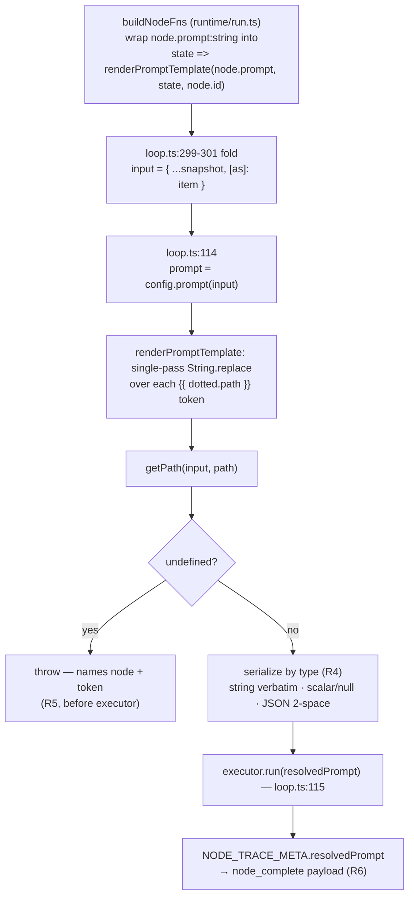

# Fan-out Branch Differentiation - Plan

## Goal Capsule

- **Objective:** Let a fan-out `agent` node authored in a JSON topology differentiate its
  branches, so N read-only readers each receive a prompt derived from their own `as`-bound
  item instead of byte-identical text. Delivered as **prompt templating over the node's input
  snapshot**, available on any `agent` node (fan-out branches additionally see their `as`
  binding). Per-branch cwd is explicitly out of scope for this work.
- **Product authority:** issue graph-bro#6 (this capability), issue graph-bro#1 (engine
  capabilities surfaced by the mining use case; boundary invariant), issue sensei#30 (driving
  consumer, hard blocking dependency), `STRATEGY.md` (Engine + Agent-legible observability
  tracks), `CONTEXT.md` (ubiquitous language).
- **Open blockers:** none. This extends the merged/merging engine slice-1 (see
  `docs/plans/2026-07-24-001-feat-engine-slice-1-plan.md`); it does not depend on any unbuilt
  capability.
- **Execution profile:** Standard depth, four dependency-ordered units. Test runner is
  **vitest** (`npm test`); typecheck/build is `npm run build` (tsc strict). No lint tooling in
  this repo. Tail ownership: standalone `ce-work` or `/goal`.
- **Stop conditions:** all four units green under `npm test`; `npm run build` clean; the
  showcase example runs and the boundary grep passes. Surface — do not guess — if the engine
  slice-1 source is not yet present in `src/` (see Planning Contract § source location).

---

## Product Contract

_Product Contract preserved except two factual corrections in Non-Goals: the `append`→`dedup` swap
is the integration test fixture's (the example already joins with `dedup`), and the two deferrals
are not-yet-filed follow-up issues. R1–R8, F1–F2, AE1–AE5, and all Key Decisions are unchanged; the
R8 test-vs-example split is clarified in KTD-8 / U3 / U4 — not a change to product scope._

### Summary

Fan-out `agent` branches cannot tell each other apart today: the `for_each` edge binds each
item into the branch snapshot (`activation.binding = { key: as, value: item }`), the loop folds
it into the `input` passed to the node fn, but the agent executor only reads a **static**
`prompt` string and never consults that input. N branches therefore run with identical prompt,
identical cwd, and no signal of which item is theirs. This capability makes the `prompt` string
a template resolved against the node's input snapshot, so each branch's prompt embeds its bound
item. The primitive is domain-agnostic and preserves the read-only + clean-repo invariants
per branch.

### Problem Frame

This is the first real engine capability the mining use case surfaces, exactly as graph-bro#1
anticipated: a read-only fan-out where every branch reads a *different* slice of input. It does
not work end-to-end from a JSON topology today because branches are indistinguishable. The
driving consumer, sensei#30 (full-mode mining), needs each read-only reader branch to inspect a
different batch of transcripts and takes a hard blocking dependency on this capability. The gap
is already documented in the suite: `test/integration/fanout-join.test.ts` uses an `append`
reducer specifically because "the real runtime's `node.prompt` is a static string … so every
branch's stub response is identical," proving arrival by count rather than by distinct value.

### Requirements

- **R1 — Templated agent prompt.** An `agent` node's `prompt` may contain interpolation tokens
  that reference values in the node's input snapshot. At execution the tokens are replaced with
  the resolved values before the prompt reaches the executor. A prompt with no tokens behaves
  exactly as today.
- **R2 — Resolution against the input snapshot, any agent node.** Tokens resolve against the
  same `input` the node fn already receives — for a fan-out branch that is
  `{ ...snapshot, [as]: item }`; for any other agent node it is the plain state snapshot.
  Templating is a general agent-node capability, not fan-out-special-cased: a prompt may
  reference an upstream node's output as readily as a fan-out branch references its `as` item.
- **R3 — Dotted-path access.** A token may address a nested field of the bound value using the
  engine's existing path convention (the same `getPath` semantics `for_each` already uses), so
  an object-valued item can be projected to the field a branch actually needs.
- **R4 — Non-string values are serialized.** A token resolving to a string inlines verbatim (no
  surrounding quotes); `number`/`boolean`/`null` inline as their JSON scalar form (`5`, `true`,
  `null`); an object or array is `JSON.stringify`-serialized **pretty-printed at 2-space indent**
  (legible to the reading agent; token cost is trivial).
- **R5 — Unresolvable reference fails loud, resolved before the executor runs.** *Absence* — the
  path resolver (`getPath`) yielding `undefined`, whether from a missing key, a literally-`undefined`
  value, or descent into a non-object — fails the branch loudly with an error naming the node and the
  unresolved token, rather than silently interpolating empty text. A path that is **present** but
  holds `null`, `""`, or `[]` is a *value*, not an absence: it serializes per R4. Resolution runs at
  the `config.prompt(state)` evaluation (`loop.ts:114`), which precedes `executor.run`, so an
  unresolvable token errors **before** the executor is ever invoked for that branch. This matches the
  engine's fail-loud stance (unregistered reducer write conflicts fail loudly, R5/§16). Consequence
  under fan-out: because fail-fast is the sole branch-failure policy (ADR-0006), one branch's
  unresolvable token aborts the **whole** run, not just that branch — the consumer must trust its own
  batch shape.
- **R6 — Trace records the resolved prompt.** The per-node trace records each branch's
  *resolved* prompt, not the template, so the agent-legible record (R12) shows the actual
  instruction each branch ran with. This is what makes differentiation observable after the
  fact.
- **R7 — Boundary invariant preserved.** The capability is domain-agnostic: no consumer
  name/domain appears in shipped `src/` or `examples/`. The read-only allowlist and the
  per-branch `assertRepoClean()` backstop continue to apply unchanged to every branch (cwd
  stays `process.cwd()` for all branches in this work, so clean-repo semantics do not move).
- **R8 — Showcase demonstrates distinct outputs; the test proves them.** Distinctness is *asserted
  deterministically* in the integration test via a **prompt-echoing stub executor + `dedup`** join:
  distinct resolved prompts necessarily yield distinct stub outputs, so `dedup` proving distinctness
  is airtight and never flakes on agent nondeterminism. Separately, `examples/fanout-read-join` is
  **rewritten in place** — its static reader prompt becomes templated over the `as` item (its join is
  already `dedup`) — to *demonstrate* N branches producing distinct outputs against a real agent
  (illustrative, never a gated assertion on exact output equality).

### Flows

**F1 — Differentiated fan-out read (happy path).**
1. A `set` (or prior) node populates a state list (e.g. `batch.items`).
2. A `for_each` edge fans out over that list into a read-only `agent` node, binding each item as `as`.
3. Each branch resolves its templated `prompt` against its own `input` snapshot → a prompt that names its item.
4. Each branch runs read-only; the clean-repo backstop asserts per branch on completion.
5. A join barrier collects branch outputs; a `dedup` reducer merges to distinct values.
6. The trace shows each branch's resolved prompt and distinct output.

**F2 — Unresolvable token (failure path).**
1. A branch's template references a path absent from its item.
2. Resolution fails loud before the executor is invoked; the branch errors naming node + token.
3. Fail-fast branch policy (ADR-0006) governs what happens to the run from there.

### Acceptance Examples

- **AE1 — Distinct branch prompts.** Given a `for_each` fan-out over a 3-item list into a
  read-only `agent` whose `prompt` references its `as` item, when the run executes against a
  prompt-echoing stub executor, then the three branches invoke the executor with three *distinct*
  resolved prompts (not one repeated string), and a `dedup` join yields three distinct outputs.
  (Distinctness of *prompts* is deterministic string resolution; the echoing stub makes distinctness
  of *outputs* deterministic too — see R8.)
- **AE2 — Non-fan-out templating.** Given a single `agent` node whose `prompt` references an
  upstream node's output key, when the run executes, then the resolved prompt contains that
  upstream value.
- **AE3 — Unresolvable token fails loud.** Given a branch template referencing a missing path,
  when the branch activates, then it fails with an error naming the node and the unresolved
  token, and the executor is never called for that branch.
- **AE4 — Read-only still holds per branch.** Given the differentiated fan-out of AE1, when any
  branch would mutate the repo, then `assertRepoClean()` fails that branch exactly as today —
  differentiation does not weaken the invariant.
- **AE5 — Untemplated prompt unchanged.** Given an `agent` node whose `prompt` contains no
  tokens, when the run executes, then behavior is byte-identical to today.

### Key Decisions

- **Ship prompt templating; defer per-branch cwd.** graph-bro#6 offered templating (general)
  and per-branch cwd (fits a directory-per-branch item). The driving consumer needs each branch
  to read a *batch* (a list), not operate inside one directory, so templating covers it and cwd
  is unnecessary now. (session-settled: user-delegated — "whatever the issue needs"; resolved to
  templating because the issue recommends it and the consumer's batch shape is data, not a
  directory. Per-branch cwd is a later issue if a directory-per-branch case appears.)
- **Resolve against the input snapshot, available on any agent node.** Templating interpolates
  over the `input` the node fn already receives rather than a fan-out-only special case.
  (session-settled: user-approved — chosen over restricting resolution to the `as` binding: the
  snapshot already contains the binding, so a restriction would add gating logic for a narrower
  capability at no benefit.)
- **Unresolvable references fail loud.** Chosen over silent empty-string interpolation, to match
  the engine's fail-loud convention. (assumption grounded in R5/§16; confirm at planning if a
  lenient mode is ever wanted.)
- **Trace stores the resolved prompt, not the template.** So differentiation is observable from
  the trace alone, serving the Agent-legible observability track.

### Non-Goals / Out of Scope

- **Per-branch cwd** — deferred to a later issue; every branch keeps `process.cwd()`.
- **Changes to fan-out concurrency, join/barrier, or reducers** — the `dedup` reducer already
  exists; only the integration test fixture's reducer choice changes (`append` → `dedup`). The
  showcase example already joins with `dedup` and is unaffected.
- **A general expression/templating language** — this is value interpolation over the snapshot
  with dotted-path access, not conditionals, loops, or computation inside the template.
- **Escaping literal delimiters** — no escape mechanism ships this slice; a prompt needing the
  literal delimiter sequence is a documented known limitation (a follow-up issue, not yet filed),
  given trusted single-author data. Resolution is single-pass, so a substituted value containing the delimiter is
  never re-interpreted.
- **Compile/lint-time token validation** — deferred to a follow-up issue; unresolved tokens fail
  loud at activation only (see Resolved).
- **Consumer domain in shipped code** — sensei's transcript/mining specifics stay in sensei.

### Assumptions

- The latent seam `AgentNodeConfig.prompt: string | ((state) => string)` (`loop.ts:109`) and the
  per-branch `input` fold (`loop.ts:299`) are the intended integration points; a compiled
  template resolver satisfies the function branch. (Confirmed by recon: `makeAgentNodeFn`
  evaluates `config.prompt(state)` at `loop.ts:114` **before** `executor.run` at `loop.ts:115`,
  and the fold at `loop.ts:299-301` merges the `as` item into `input` before `fn(input)`; the
  wrap point is `buildNodeFns` in `src/runtime/run.ts` — see Planning Contract.)
- The token grammar itself (delimiter, exact syntax) is a planning/implementation decision, not
  fixed here; graph-bro#6 floated `{{ <as-name>.<path> }}` as a candidate. (Resolved to
  `{{ dotted.path }}` — see KTD-1.)

### Resolved (grill 2026-07-24)

- **Detection timing — activation-time only this slice.** Unresolved-token failure surfaces at
  activation (R5), not at compile/lint time. Static root-name token linting would catch only
  root-name typos (deep paths and per-item shape are inherently runtime) and requires a
  "what state keys can exist at node X" reachability analysis larger than the templating primitive
  itself — a pure quality-of-life add behind no capability. **Deferred to a follow-up issue**, not
  built here.
- **Trust/escaping — single-pass, trusted, no escape hatch.** Tokens resolve **single-pass**: a
  substituted value is never re-scanned, so a resolved value that happens to contain the delimiter
  lands as literal text. Fan-out data is **trusted** (the consumer authors both template and data —
  a single-author boundary, not an untrusted perimeter), so **no value-escaping mechanism** ships
  this slice. A prompt needing *literal* delimiters is a **documented known limitation** with a
  follow-up issue, not a surprise. (Single-pass is correct semantics regardless of trust; an escape
  grammar is speculative complexity until a real prompt needs it.)

### How This Work Fits Together

- **graph-bro#1** named this exact shape (read-only fan-out, each branch reads a different
  slice) as the first capability the mining use case would surface. This capability closes that
  gap for the JSON-authored path.
- **sensei#30** is the driving consumer and takes a hard blocking dependency: its read-only
  reader branches each inspect a different transcript batch via a templated prompt. graph-bro
  ships the generic primitive; sensei supplies the domain.
- **Engine slice-1** (`docs/plans/2026-07-24-001-...`) built the fan-out/join/read-only/trace
  substrate this extends. This work activates a seam that slice left latent
  (`prompt: (state) => string`) rather than adding a new subsystem.

---

## Planning Contract

**Source location (non-derivable, load-bearing).** The engine slice-1 source this work extends is
**not on `main`'s `src/` yet** — `main` is docs-only. Slice-1 lives on branch
`feat/graph-bro-1-engine-slice-1` (worktree `.claude/worktrees/feat+graph-bro-1-engine-slice-1/`),
and lands on `main` via that branch. This plan uses repo-relative `src/…` / `test/…` / `examples/…`
paths that resolve once slice-1 is on `main`; branch graph-bro#6 off fresh `main` after slice-1
merges. Until then, the anchors below resolve inside the slice-1 worktree.

### High-Level Technical Design

The change is small and lives entirely on the existing execution path — no new subsystem. A JSON
topology's `agent.prompt` stays a plain string (`schema.ts` unchanged). `buildNodeFns`
(`src/runtime/run.ts`) wraps that string into a resolver function, taking the function branch of
the pre-existing `AgentNodeConfig.prompt: string | ((state) => string)` seam. `makeAgentNodeFn`
already evaluates `config.prompt(state)` at `loop.ts:114`, where `state` is the per-branch `input`
already folded at `loop.ts:299-301` — so resolution sees the branch's `as` item with no change to
the loop. Resolution precedes `executor.run` at `loop.ts:115`, so the fail-loud property (R5) is
inherent to call order, not new control flow.

The diagram is authoritative alongside the prose: the single branch gate (`undefined` → throw vs.
serialize) is the whole of R4/R5, and the ordering (`throw` sits before `executor.run`) is why
R5's fail-before-executor holds without a new guard.

### Key Technical Decisions

- **KTD-1. Token grammar is `{{ dotted.path }}`.** Double-brace delimiters, surrounding
  whitespace trimmed, a single dotted path inside; no filters, conditionals, or computation.
  (session-settled: user-approved — chosen over `${…}` / `%…%`: `{{ }}` is mustache-familiar and
  does not collide with shell or JS template-literal syntax; it is the candidate graph-bro#6
  floated.) A well-formed `{{ path }}` is *always* a token — there is no escape to emit it
  literally (the documented known limitation). A `{{` with no closing `}}` is not a token and
  stays literal.
- **KTD-2. Wrap the raw string prompt into a resolver in `buildNodeFns`, unconditionally.**
  (session-settled: user-approved — chosen over gating on token-presence, and over a
  schema/compile change: the `string | ((state) => string)` seam and `makeAgentNodeFn`'s
  `typeof config.prompt === "function"` branch already exist; wrapping there needs **zero** change
  to `schema.ts`, `compile.ts`, or `loop.ts` control flow.) An untemplated string round-trips
  byte-identical through the resolver (AE5), so no token-detection branch is needed.
- **KTD-3. Resolve against the folded per-branch `input`, reusing `loop.ts:299-301`.** No fan-out
  special-casing — the resolver is handed whatever `input` the node fn receives, which already
  carries the `as` binding for a branch or the plain snapshot otherwise. (Inherits the Product
  Contract Key Decision "Resolve against the input snapshot, available on any agent node" —
  session-settled: user-approved.)
- **KTD-4. Fail loud on `getPath` → `undefined`, at `config.prompt(state)` evaluation.** The
  error names the node id and the offending token. Because `getPath` already returns `undefined`
  for a missing key, a `undefined` value, or descent into a non-object (`state.ts:37-42`), a
  single `undefined` check is the complete absence test. Resolution is at `loop.ts:114`, before
  `executor.run` at `loop.ts:115`, so the executor is never reached for a failing branch (R5,
  AE3). (Inherits Product Contract "Unresolvable references fail loud.")
- **KTD-5. R4 serialization, in this order:** `undefined` → throw (KTD-4); `string` → verbatim;
  `null` → `"null"`; `number`/`boolean` → `String(v)`; object/array → `JSON.stringify(v, null, 2)`.
  `null` is checked **before** the object branch because `typeof null === "object"`. Present
  falsy values (`""`, `0`, `false`, `[]`) serialize — only `undefined` throws.
- **KTD-6. Single-pass resolution via one `String.replace` over the original template.** The
  replace callback resolves each token against the original `input`; substituted text is inserted
  into the result and never re-scanned by the same pass. This *is* the single-pass, no-escape
  semantics — inherent to one `.replace` call, no extra machinery. (Inherits Product Contract
  "single-pass, trusted, no escape hatch.")
- **KTD-7. Trace the resolved prompt via the existing out-of-band `NODE_TRACE_META` channel.**
  The resolved prompt rides the same non-enumerable meta property that cost/tokens/model already
  use (ADR-0009), added to the `node_complete` `payload` (which is free-form `z.unknown()`) — no
  new `events` column. (session-settled: user-approved — chosen over a dedicated schema column:
  the channel and the free-form payload already exist.) On the fail path resolution throws before
  any meta is built; the `node_error` payload carries the node + token message (AE3), which is the
  observable record for a failed branch.
- **KTD-8. Prove differentiation with a prompt-echoing stub; the example is illustrative only.**
  The deterministic proof (R8) uses `StubExecutor`'s existing `responder` param
  (`new StubExecutor((prompt) => ({ text: prompt, isError: false }))`) — **no new fixture** — plus
  a `dedup` join, so distinct resolved prompts necessarily yield distinct outputs. The example's
  real-agent run stays illustrative (no exact-output assertion). Clarifies R8: the `append`→`dedup`
  swap applies to the **integration test fixture**; the example already joins with `dedup` and only
  its prompt becomes templated.

### Sequencing

`U1 → U2 → {U3, U4}`. U1 (the pure resolver) is built **test-first** — the serialization matrix
and fail-loud paths are the correctness core. U2 wires it in and traces the resolved prompt. U3
and U4 are independent of each other; both depend on U2.

---

## Implementation Units

### U1. Prompt-template resolver primitive

- **Goal:** A pure `renderPromptTemplate(template, input, nodeId)` that single-pass-interpolates
  `{{ dotted.path }}` tokens against an input snapshot, serializes by type (R4), and throws
  loud on an unresolvable path (R5) with a message naming the node and token.
- **Requirements:** R1, R3, R4, R5 (resolver side); KTD-1, KTD-4, KTD-5, KTD-6.
- **Dependencies:** none (reuses `getPath` from `src/engine/state.ts`).
- **Files:** `src/engine/prompt-template.ts`, `test/engine/prompt-template.test.ts`
- **Approach:** Export `renderPromptTemplate(template: string, input: EngineState, nodeId: string): string`.
  One `String.replace(/\{\{\s*([^}]+?)\s*\}\}/g, (_, path) => …)` pass. Per token: `getPath(input, path.trim())`;
  if `undefined` → throw a typed error (e.g. `UnresolvedPromptTokenError`, or a plain `Error`
  following the engine's `StateConflictError` style) with a message like
  `agent node '<nodeId>': unresolved prompt token '{{ <path> }}' — path not present in input snapshot`;
  else serialize per KTD-5. A template with no matching token returns unchanged. Do not import the
  executor, the loop, or the store — this module is pure and side-effect-free.
- **Execution note:** Build test-first; the R4 serialization matrix and the R5 fail-loud branch
  are the load-bearing behavior and the airtight proof of the primitive.
- **Patterns to follow:** `getPath` (`src/engine/state.ts:37-42`); the engine's typed loud-fail
  convention (`StateConflictError` in `src/engine/reducers.ts`); zod-everywhere is not needed here
  (pure string function, no external contract).
- **Test scenarios:**
  - Happy path: `"read {{ item }}"` with `input.item = "one"` → `"read one"` (string verbatim, no quotes).
  - `Covers AE5.` A template with no tokens returns byte-identical to the input string.
  - Dotted path (R3): `"{{ item.id }}"` with `input.item = { id: 42 }` → `"42"`.
  - R4 scalars: number `5` → `5`; boolean `true` → `true`; `null` → `null` (each verbatim, no quotes).
  - R4 object/array: an object value → `JSON.stringify(v, null, 2)` (pretty, 2-space); an array likewise.
  - Present falsy values are values, not absence: `""` → empty verbatim; `0` → `0`; `false` → `false`; `[]` → `[]` (serialized), none throw.
  - `Covers AE3 (resolver side).` Missing key → throws naming node + token; descent into a non-object (`"{{ a.b }}"` with `input.a = "x"`) → throws; a literally-`undefined` value → throws.
  - Multiple tokens in one template all resolve in a single pass.
  - Single-pass (KTD-6): an `input` value that itself contains `{{ x }}` is inlined literally and **not** re-interpreted.
  - Whitespace inside braces (`{{  item.id  }}`) is trimmed before path resolution.
- **Verification:** `npm test` green for `test/engine/prompt-template.test.ts`; the fail-loud cases throw (do not return) and name both node and token.

### U2. Wire the resolver into the runtime node builder and trace the resolved prompt

- **Goal:** An `agent` node's string prompt is resolved against its per-branch `input` before the
  executor runs, and the resolved prompt is recorded in the node trace.
- **Requirements:** R1, R2, R3, R5 (integration), R6; KTD-2, KTD-3, KTD-7.
- **Dependencies:** U1.
- **Files:** `src/runtime/run.ts` (wrap in `buildNodeFns`; carry `resolvedPrompt` from meta into
  the `node_complete` payload in `withTracing`), `src/engine/loop.ts` (extend the `NodeTraceMeta`
  type with `resolvedPrompt?: string` and set it in `makeAgentNodeFn`), `test/runtime/run.test.ts`
- **Approach:** In `buildNodeFns` (`src/runtime/run.ts:92-109`), change `prompt: node.prompt` to
  `prompt: (state) => renderPromptTemplate(node.prompt, state, node.id)`. In `makeAgentNodeFn`
  (`src/engine/loop.ts:112-140`), add `resolvedPrompt: prompt` to the `NodeTraceMeta` object built
  after the executor returns, and add `resolvedPrompt?: string` to the `NodeTraceMeta` type. In
  `withTracing` (`src/runtime/run.ts`), include `meta.resolvedPrompt` in the `node_complete`
  payload (e.g. `payload: { type: "node_complete", update, prompt: meta.resolvedPrompt }`). No
  change to `loop.ts` control flow: resolution at `loop.ts:114` already precedes `executor.run`
  at `:115`, so a throwing resolver never reaches the executor (R5).
- **Patterns to follow:** the existing `NODE_TRACE_META` out-of-band attachment for cost/tokens
  (`src/engine/loop.ts:126-137`); `buildNodeFns`' existing agent-vs-set branch.
- **Test scenarios:**
  - `Covers AE1 (wiring).` `buildNodeFns` on a topology whose agent `prompt` is `"read {{ item }}"`, invoked via the built node fn with `input = { ...snapshot, item: "one" }` and a `StubExecutor`, calls the stub with prompt `"read one"`.
  - `Covers AE2.` A single agent node whose prompt references an upstream output key resolves that key's value into the prompt handed to the stub.
  - `Covers AE3 / R5.` A prompt with an unresolvable token makes the built node fn throw (naming node + token) and `StubExecutor.run` is **never called** (assert `stub.calls` is empty).
  - `Covers AE5.` An untemplated prompt is passed to the stub byte-identical.
  - `Covers R6.` The `EngineUpdate` returned by the agent node carries `resolvedPrompt` on its non-enumerable `NODE_TRACE_META` (assert the meta field equals the resolved string).
- **Verification:** `npm test` green for `test/runtime/run.test.ts`; the executor is provably not invoked when resolution fails; `npm run build` clean (the `NodeTraceMeta` type change typechecks).

### U3. Rewrite the fan-out/join integration test: echoing stub + dedup + distinctness

- **Goal:** Deterministically prove distinct branches produce distinct resolved prompts and
  distinct outputs, retiring the `append`-by-count workaround.
- **Requirements:** R8 (proof side); verifies AE1, AE2, AE3, AE5 at the integration level.
- **Dependencies:** U2.
- **Files:** `test/integration/fanout-join.test.ts`
- **Approach:** In the `fanOutJoinTopology` fixture, template the reader prompt (e.g.
  `"Read item {{ item }} and report."`), swap the join reducer from `append` to `dedup`, and
  remove the now-obsolete static-prompt comment. Construct a prompt-echoing stub —
  `new StubExecutor((prompt) => ({ text: prompt, isError: false }))` (the existing `responder`
  param; no fixture change). Assert the `dedup`-joined `results` holds N **distinct** entries and
  each contains its item (distinctness survived `dedup` because the prompts differ). Add: an AE2
  case (a single agent node referencing an upstream key resolves it); an AE3 case (an unresolvable
  token halts the run before the executor — assert failure and that the echoing stub recorded no
  call for that branch); an AE5 case (an untemplated topology behaves byte-identically). AE4
  (read-only per branch) is **not** re-proven here — it is preserved by leaving
  `read-only-policy.ts` and the git backstop untouched, and is guarded by the existing read-only /
  boundary tests (see Verification Contract Gate 5).
- **Patterns to follow:** the existing `fanOutJoinTopology` + `buildNodeFns` + `runLoop` plumbing
  in this file; `StubExecutor`'s `responder` constructor param (`test/fixtures/stub-executor.ts`).
- **Test scenarios:**
  - `Covers AE1.` Fan-out over N items (e.g. 3, or 17) with a templated reader prompt and an echoing stub → N distinct resolved prompts; the `dedup` join yields N distinct outputs (not one collapsed value); the join fires exactly once after all N arrive.
  - `Covers AE2.` A non-fan-out agent node referencing an upstream output key resolves that value into its prompt.
  - `Covers AE3.` One branch's template references a missing path → the run halts (fail-fast, ADR-0006) and the executor recorded no call for that branch.
  - `Covers AE5.` An untemplated reader prompt still runs; every branch's output equals the echoed static prompt (byte-identical behavior).
- **Verification:** `npm test` green for `test/integration/fanout-join.test.ts`; the `dedup` result length equals N (distinctness proven), not 1.

### U4. Template the showcase example prompt and update its README

- **Goal:** Demonstrate distinct branch outputs against a real agent by templating the example's
  reader prompt over its `as` item; keep the example generic (boundary invariant).
- **Requirements:** R7, R8 (demonstration side).
- **Dependencies:** U2.
- **Files:** `examples/fanout-read-join/topology.json`, `examples/fanout-read-join/README.md`
- **Approach:** Change the `reader` node's `prompt` to reference its item, e.g.
  `"Read the item \"{{ item }}\" and report back what you find. Do not modify anything."`. Leave
  the join reducer as `dedup` (already present) and the items generic (`["one", "two", "three"]`).
  Update `README.md` to explain that each branch's prompt is templated over its `as` item, so the
  branches run genuinely distinct instructions and `dedup` collapses only true duplicates. No
  consumer name or domain term appears anywhere (R7).
- **Patterns to follow:** the existing example shape and README structure; `CONTEXT.md` glossary
  terms (**prompt template**, **interpolation token**, **resolved prompt**) — use them verbatim in
  the README.
- **Test scenarios:** `Test expectation: none` — the example is an illustrative showcase and docs
  (R8 is explicit that the example is never a gated exact-output assertion). It is guarded by two
  existing tests, not new ones: the smoke test (`test/smoke/example-graph.test.ts`) compiles and
  runs it, and the boundary-invariant grep (`test/boundary-invariant.test.ts`) enforces R7. The
  templated prompt is still a plain string, so `schema.ts` accepts it unchanged.
- **Verification:** the example topology compiles and runs under the existing smoke path (stub or
  gated-live); the boundary-invariant grep finds no consumer term; `npm test` stays green.

---

## Verification Contract

- **Gate 1 — resolver unit green:** `npm test` passes `test/engine/prompt-template.test.ts` covering R1/R3/R4/R5 — string-verbatim, dotted-path, scalar/`null`/object serialization, present-falsy-is-a-value, fail-loud on `undefined`, single-pass, and untemplated passthrough (AE5).
- **Gate 2 — differentiation proven:** the rewritten `test/integration/fanout-join.test.ts` (echoing stub + `dedup`) asserts N distinct resolved prompts yield N distinct joined outputs (AE1); non-fan-out templating resolves an upstream key (AE2); an untemplated prompt is byte-identical (AE5).
- **Gate 3 — fail-loud before the executor:** an unresolvable token throws naming node + token and `executor.run` is never called — asserted at the U2 wiring level and again at U3 integration (AE3 / R5).
- **Gate 4 — resolved prompt traced:** the node trace records each branch's resolved prompt via `NODE_TRACE_META` → `node_complete` payload (R6); the U2 test asserts the meta field.
- **Gate 5 — invariants preserved:** `src/executor/read-only-policy.ts` and the git backstop are untouched; the existing read-only and boundary tests stay green (AE4, R7), and the boundary-invariant grep finds no consumer name/domain term after the example rewrite.
- **Gate 6 — build green:** `npm run build` (tsc strict) passes with the `NodeTraceMeta` type change.

---

## Definition of Done

- U1–U4 implemented; every per-unit test scenario present and green (U4 is documented `Test expectation: none`, guarded by existing smoke + boundary tests).
- `npm test` and `npm run build` both green; Gates 1–6 pass.
- The showcase example compiles and runs under the existing smoke path; the boundary grep passes.
- The two deferrals — compile/lint-time token validation, and literal-delimiter escaping — are captured in Scope Boundaries as not-yet-filed follow-up issues. File them as tracked issues on `FlorianRiquelme/graph-bro`, or, if filing is declined, the plan's Scope Boundaries stands as the record.
- `CONTEXT.md` glossary (**prompt template**, **interpolation token**, **resolved prompt**) remains accurate — already present from the grill; no new domain term is introduced.
- Abandoned or experimental code from the run is removed; no launch-blocking open question remains.

---

## Risks & Dependencies

- **Resolution must use the post-fold `input`, not the bare snapshot.** If the resolver were wired against the pre-fold state, branches would not see their `as` item and would not differentiate — the silent failure this whole capability exists to prevent. Mitigation: `makeAgentNodeFn` is invoked with the folded `input` as `state` (`loop.ts:299-301` → `fn(input)`), and `config.prompt(state)` is called with exactly that object; U2 and U3 tests assert the resolved prompt contains the branch's item.
- **Behavior change for any prompt bearing `{{ }}`.** A prompt that previously contained a literal `{{ … }}` would now interpolate. Accepted: no shipped or example topology contains one, data is trusted single-author (Product Contract), and the literal-delimiter limitation is documented with a follow-up issue.
- **Dependency on engine slice-1 landing on `main`.** All paths resolve only once slice-1's `src/` is on `main`; until then they live in the slice-1 worktree (see Planning Contract § source location). Branch graph-bro#6 off fresh `main` after slice-1 merges.
