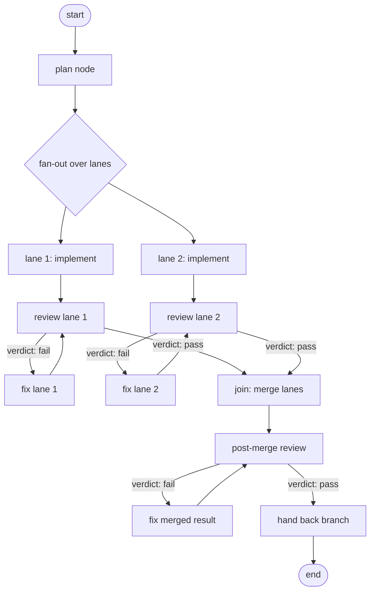

# Engine Slice 2: Write Nodes, Conditional Routing, Self-Correcting Loops - Plan

## Goal Capsule

- **Objective:** Ship the Engine track's headline primitive — a run that writes to a repo, judges its own output, routes on that judgment, and corrects itself without a human between start and result.
- **Product authority:** graph-bro#14 (origin), `STRATEGY.md` (Engine track), and this document. Where they disagree, this document is current: it settles decisions #14 left open.
- **Open blockers:** two Outstanding Questions marked `Resolve Before Planning` — unappliable-merge behavior, and where a pre-fan-out planning node's writes live.

---

## Product Contract

### Summary

graph-bro gains write-capable agent nodes, a `when` DSL that executes at run time, and a loop that re-enters on a machine-readable review verdict.
A run fans work out across isolated lanes, each looping until its own review passes, merges the lanes, reviews the merged result, and hands back committed work on a run-owned branch.

### Problem Frame

Slice 1 shipped an engine that reads: fan-out, join, dedup, crash-safe resume, detached CLI — all of it read-only by construction.
Two compile-time walls block everything past that.
`src/topology/schema.ts` pins agent nodes to `read_only: z.literal(true)`, so a node that mutates a repo is rejected before a run id exists.
The `when` DSL is parsed and linted but never evaluated; its only consumer outside the schema is `src/topology/lint.ts`.
Nothing routes on state, so no run can react to its own output.

The cost of that gap is the target problem in `STRATEGY.md`, unchanged: the operator is the message bus.
A single-shot run produces work and stops, which means every run's output waits on human attention before it can move.
Running many workstreams at once is capped by how fast one person can context-switch between them, not by what the agents can do.

The comparison that matters is a coding session with subagents, which is what the operator does today.
That baseline already parallelizes within one feature, and graph-bro does not beat it on single-feature wall-clock.
It loses on everything else: a session cannot be walked away from, cannot review and correct its own output, dies with its work when it dies, and serializes across features because the operator holds each thread.

### Key Decisions

- **The graph covers the headless-able portion of the operator's workflow, not just execution.** A run spans planning through review→fix, because a graph that only executes is a session the operator already has. The dividing line is not stage count: any stage that resolves its own questions from repo context belongs here, and any stage that needs an answer from the operator belongs to the Human-checkpoint track. (session-settled: user-directed — chosen over an implement→review→fix-only driver: an execute-only graph delivers no unlock over a `goal` session.)

- **Write work fans out.** N lanes run concurrently on one feature. (session-settled: user-directed — chosen over single-track writes: a graph slower than hand-dispatching subagents does not get reached for, and an unused engine has no other virtues.)

- **Each lane gets its own worktree; lanes reconcile through git.** Shared working trees lose work silently — a reported run of five agents against one checkout lost roughly a quarter of intended changes while the build stayed green. Worktrees convert that into ordinary merge conflicts, which are loud. Path-scoped write permissions were considered as an alternative and rejected: a write node needs Bash to run tests, and shell access defeats path allowlists.

- **Isolation is built on `git worktree` directly, not on an existing sandbox layer.** Dagger's container-use implements nearly this design, but it is an MCP server the agent calls, which inverts ADR-0007's premise that the orchestrator enforces constraints because the agent cannot be trusted to. Isolation an agent opts into is isolation an agent can skip. Its remaining value over `git worktree` is containerization, which the solo-operator trust model does not require, and it would make Docker a hard dependency against ADR-0004's no-daemon posture.

- **The engine performs every commit; agent nodes get no git-mutating tools.** This keeps the write node's allowlist small enough to audit in one screen, and produces a per-attempt commit history that answers "which attempt fixed it" from `git log` alone. (session-settled: user-approved — chosen over agents committing their own work: commit granularity would become whatever the model chose, and the tool policy would widen.)

- **Committing is bounded to a throwaway worktree on a run-owned branch.** graph-bro never commits into existing history and imposes no history shape on it. Squash, rebase, and cherry-pick stay the operator's, done with their own tools — no graph-bro setting exists for them, because `git merge --squash` already does.

- **Push and PR-opening are declared capabilities, off by default.** `STRATEGY.md` makes autonomy earned through the calibration track's override rate, not granted. A run that pushes unattended before any calibration data exists takes reach it has not earned. (session-settled: user-approved — chosen over pushing by default: the operator affirmed trust must be earned.)

- **The loop bound is separate from `max_steps`.** `max_steps` is a runaway backstop; a graph can exhaust it for reasons unrelated to loop divergence. Without a distinct attempt cap, converged and bound-hit are indistinguishable in the trace, which R25 requires.

- **A review panel is not an engine requirement.** Several review nodes into a join with a reducer is already expressible with slice-1 primitives. Split-verdict handling is a reducer choice the topology author makes. The driver uses one review node per lane; nothing ships to support panels and nothing prevents them.

- **`on_error` routing defers again.** ADR-0006's fail-fast plus a retained workspace is a coherent failure story: the run halts loudly, evidence stays on disk, `resume` exists. ADR-0006 frames fail-fast as slice-1's decision with alternatives deferred, not as a permanent absolute — this milestone extends the deferral rather than closing it.

### Actors

- A1. **Operator** — the solo human. Starts a run, is absent until it finishes, reviews the handback with ordinary git.
- A2. **Engine** — the detached runtime. Owns workspaces, commits, routing, loop bounds, and the trace. The only component that enforces constraints.
- A3. **Write node** — a CLI-agent node that mutates files inside its lane's workspace. Runs headless with no human able to approve anything.
- A4. **Review node** — a CLI-agent node that reads a lane's work, or the merged result, and emits a structured verdict.
- A5. **Consumer repo** — the external repository whose topology started the run and whose code the run changes.

### The run shape

Each lane loops independently against its own workspace and its own attempt bound.
The join fires only when every lane has converged.
The post-merge cycle is the same loop primitive one level up.

### Requirements

**Conditional routing and loops**

- R1. A plain edge carrying a `when` rule is traversed only when that rule evaluates true against current shared state.
- R2. A review node's verdict is a structured, machine-readable value that a `when` rule can test — not prose the engine has to interpret.
- R3. A fix node receives the review's findings as its input.
- R4. A run can loop: a fix→review cycle re-enters a node whose barrier re-arms.
- R5. A loop terminates either by converging or by hitting an attempt bound that is semantically distinct from `max_steps`.
- R6. Hitting the attempt bound produces a named terminal state that the trace distinguishes from step-budget exhaustion. Never a hang, never a silent give-up.

**Write capability and enforcement**

- R7. A topology can declare an agent node write-capable.
- R8. The engine enforces a declared tool policy for every write node — an allowlist, not unrestricted access.
- R9. Agent nodes receive no git-mutating tools; read-only git access is permitted.
- R10. A write node that escapes its workspace fails loudly and is named in the trace, as the read-only tree-clean assertion does for read-only nodes.

**Lane isolation and merge**

- R11. Each write lane executes in its own isolated workspace. Lanes never share a working tree.
- R12. Write lanes fan out: one feature splits across N lanes running concurrently, bounded by the existing fan-out concurrency cap.
- R13. Concurrent runs do not collide with each other, including concurrent runs against the same consumer repo.
- R14. Lane results merge into a single result at the join.
- R15. A merge that cannot be applied fails visibly and names the conflicting lanes.
- R16. A post-merge review node reviews the merged result, and the loop can re-enter on its verdict.

**Delivery and blast radius**

- R17. A completed run hands back committed work on a run-owned branch the operator reviews with ordinary git.
- R18. The engine performs all commits.
- R19. The run never modifies the consumer's checked-out working tree.
- R20. graph-bro never commits into the consumer's existing history and imposes no history shape on it.
- R21. Pushing and opening a PR are capabilities the topology must declare; both are off by default.
- R22. A failed or killed run leaves the consumer repo clean.
- R23. A failed run's workspaces are retained for forensics, not cleaned up.

**Observability**

- R24. The trace answers, from the consumer repo, what the run did: each attempt, each verdict, and which branch the router took and why.
- R25. The trace states why each loop stopped — converged or bound hit — and the two are distinguishable.
- R26. Cost per attempt is visible, so a run that burns four attempts reads as a cost event.

**Showcase**

- R27. graph-bro ships one generic example demonstrating conditional routing and a self-correcting loop, naming no consumer, as `examples/fanout-read-join/` does for slice 1.

### Key Flows

- F1. Lane converges
  - **Trigger:** A lane's implement node completes.
  - **Actors:** A2, A3, A4
  - **Steps:** Engine commits the attempt in the lane's workspace; review node reads the lane and emits a verdict; the `when` rule on the pass edge evaluates true; the lane reports to the join barrier.
  - **Outcome:** Lane arrives at the join with committed, reviewed work.
  - **Covered by:** R1, R2, R11, R18

- F2. Lane self-corrects, then hits its bound
  - **Trigger:** A lane's review node emits a failing verdict.
  - **Actors:** A2, A3, A4
  - **Steps:** Findings route to the fix node as input; fix node writes in the same workspace; engine commits the attempt; review re-arms and re-runs; the cycle repeats until the verdict passes or the attempt bound is reached.
  - **Outcome:** Either the lane converges, or the run halts in the bound-hit terminal state with every attempt visible in the trace.
  - **Covered by:** R3, R4, R5, R6, R24, R25

- F3. Merge and post-merge correction
  - **Trigger:** Every lane has converged and reported to the join.
  - **Actors:** A2, A4
  - **Steps:** Engine merges the lanes; post-merge review reads the combined result; a failing verdict routes to a fix node operating on the merged result; the cycle repeats under its own bound.
  - **Outcome:** A merged, reviewed result on a run-owned branch — or a visible failure naming what could not be reconciled.
  - **Covered by:** R14, R15, R16

- F4. Run fails, operator investigates
  - **Trigger:** A node errors, a bound is hit, or the run is killed.
  - **Actors:** A1, A2
  - **Steps:** Engine halts fail-fast; workspaces stay on disk; the consumer's own working tree is untouched; the operator reads the trace and inspects the retained workspaces.
  - **Outcome:** The failure is diagnosable after the fact without re-running anything.
  - **Covered by:** R19, R22, R23, R24

### Acceptance Examples

- AE1. **Covers R1.** Given a topology with two `when`-guarded edges out of one node, when shared state satisfies exactly one rule, then only that edge's target activates.
- AE2. **Covers R5, R6.** Given a loop whose review never passes, when the attempt bound is reached, then the run halts in a terminal state distinguishable in the trace from `max_steps` exhaustion.
- AE3. **Covers R11, R12.** Given a topology fanning write work across three lanes, when all three run concurrently, then each writes in a distinct workspace and no lane observes another's files.
- AE4. **Covers R10.** Given a write node that mutates a path outside its workspace, when the node completes, then the run fails loudly and the trace names that node.
- AE5. **Covers R16.** Given every lane converged and the merge applied, when the post-merge review emits a failing verdict, then a fix node runs against the merged result and the post-merge review re-runs.
- AE6. **Covers R21.** Given a topology that does not declare the push capability, when the run completes, then nothing is pushed and no PR is opened.
- AE7. **Covers R19, R22, R23.** Given a run killed mid-write, when the operator inspects the consumer repo, then its working tree is clean and the run's workspaces are still present.
- AE8. **Covers R9.** Given a write node's spawned tool policy, when it is inspected, then it contains no git-mutating capability.
- AE9. **Covers R27.** Given graph-bro's shipped engine and example graphs, when searched for any consumer name or consumer-domain term, then none appears.

### Scope Boundaries

- **The front half of the operator's workflow** — ideation, brainstorming, and grilling. Each needs answers from the operator, which means the batched-interview primitive owned by the Human-checkpoint track. Nothing in this milestone may bake in an interrupt-shaped primitive that would fight the batch-shaped constraint that track carries.
- **Human-in-the-loop of any kind.** This milestone is unattended between start and results; review is an agent node.
- **Calibration** — override mining, facts, graduation to headless. Shares the trace, proceeds independently.
- **Topology map** (graph-bro#10) — separate and independently valuable.
- **`on_error` routing** — deferred again, per Key Decisions.
- **Review panels** — expressible with existing primitives; nothing ships to support or prevent them.
- **Container-based isolation** — rejected in favor of `git worktree`, per Key Decisions.
- **Design and ADRs** — this artifact is requirements only. A later session determines the how.

### Dependencies and Assumptions

- Slice 1's join barrier already re-arms (`src/engine/barrier.ts`), so R4's re-entry extends existing machinery rather than inventing it.
- Slice 1's fan-out concurrency cap (ADR-0011, default K=5) bounds live workspaces, so R12 does not imply unbounded worktree creation.
- Slice 1's prompt-template interpolation is the expected carrier for R3; the requirement is that findings reach the fixer, not that a specific mechanism does it.
- Cost capture (ADR-0009) is implemented end-to-end today, so R26 is an aggregation concern rather than new instrumentation.
- The boundary invariant is scoped to the shipped engine and example graphs, matching slice 1's acceptance test. ADRs naming the validating consumer as the driver of a decision are inside that line.
- The solo-operator trust model from KTD-8 continues to hold: read and write scoping means no-mutation-outside-workspace, not repo-scoped reads.
- Consumer repos are git repositories. Worktree-based isolation has no fallback for non-git consumers.

### Outstanding Questions

**Resolve before planning**

- What happens when the merge at the join cannot be applied — does the run fail and hand back N unmerged lane branches, or does a lane get sent back to rebase and re-enter its loop? R15 requires the failure be visible; it does not settle whether recovery is attempted.
- Where a pre-fan-out planning node's writes live, given that no lane workspace exists yet, and what produces the lane split itself. Both plausibly belong to the same node, which would make write capability something other than a fan-out-lane-only property.

**Deferred to planning**

- Where the attempt bound is declared — on the edge, the node, or the topology.
- Workspace creation and teardown mechanics, naming, and the retention policy for forensic workspaces.
- Whether a write node's tool allowlist is a fixed engine-owned set or declared per node in the topology.
- What the machine-readable verdict's shape is, and how a review node is constrained to produce it.
- How the engine attributes a commit to an attempt in the trace.

### Sources

- graph-bro#14 — origin issue, R1-R12 and the open-questions list this document supersedes.
- `docs/plans/2026-07-24-001-feat-engine-slice-1-plan.md` — the deferral record. KTD-7 (routing), KTD-8 (read-only command shape and the stated write-node inversion), KTD-10 (the tree-clean backstop that inverts here), KTD-12 (per-instance identity through the barrier).
- `src/topology/schema.ts` — `read_only: z.literal(true)` and the `WhenRule` grammar; both compile walls.
- `src/topology/lint.ts` — the only consumer of `edge.when` today, which is what makes the DSL lint-only.
- `src/engine/barrier.ts` — `reset()` and `armSource()`, the re-arm machinery R4 builds on.
- `src/executor/read-only-policy.ts` — the allowlist and tree-clean assertion that R8 and R10 invert.
- `docs/adr/0006-fail-fast-branch-failure.md`, `docs/adr/0007-readonly-enforcement-permission-mode.md`, `docs/adr/0009-capture-cost-data-from-inception.md`, `docs/adr/0011-bounded-fanout-concurrency.md`.
- Dagger container-use — worktree-plus-branch-per-agent isolation with auto-commit and git-native review; the design this milestone mirrors without taking the dependency.
- Reported failure data on shared-working-tree parallel agents: roughly a quarter of intended changes silently lost across five concurrent agents on one checkout, with the build still passing. The evidence behind the isolation decision.
