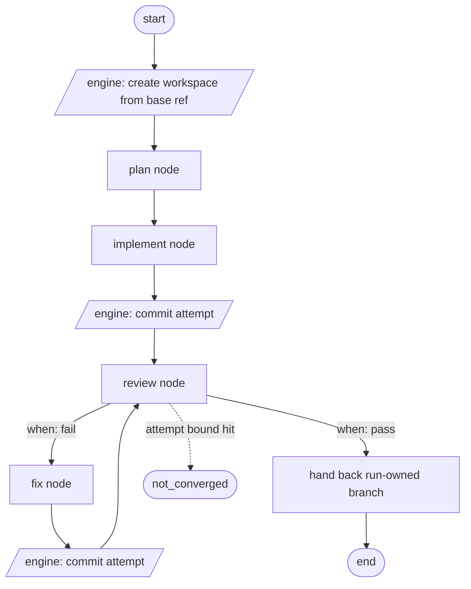
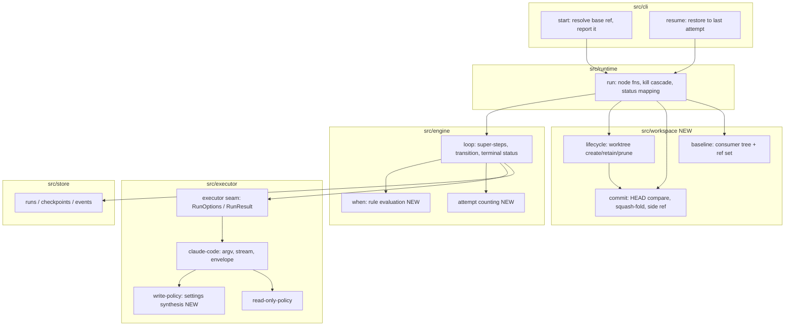
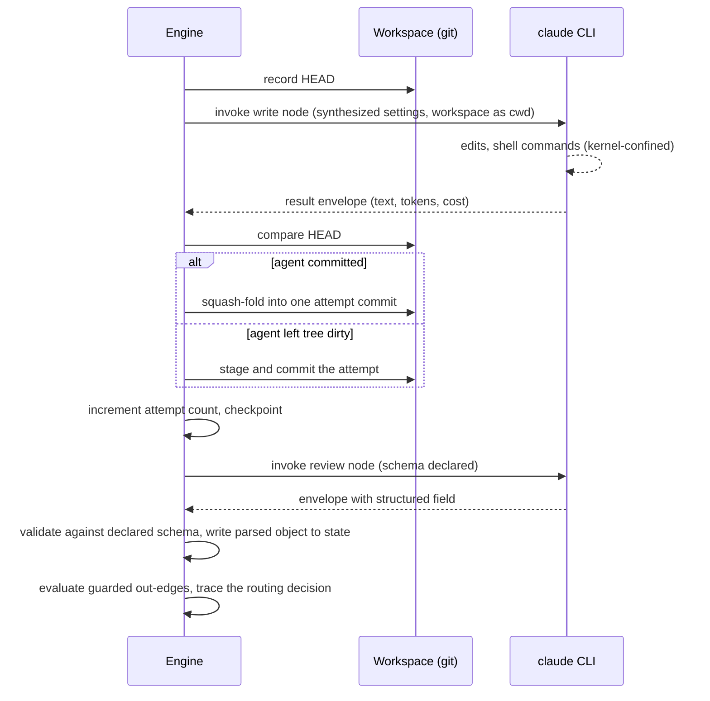
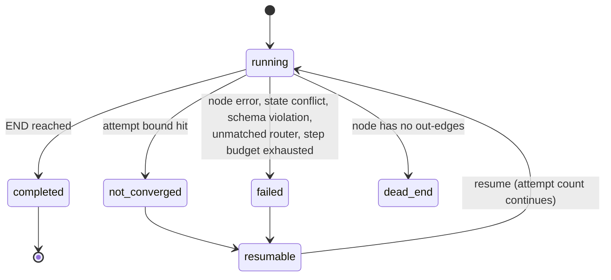

# Engine Slice 2: Write Nodes, Conditional Routing, Self-Correcting Loops - Plan

## Goal Capsule

- **Objective:** Ship the Engine track's headline primitive — a run that writes to a repo, judges its own output, routes on that judgment, and corrects itself without a human between start and result.
- **Product authority:** graph-bro#14 (origin), `STRATEGY.md` (Engine track), and this document. Where they disagree, this document is current: it settles decisions #14 left open.
- **Provenance:** brainstormed 2026-07-25, then grilled the same day against the slice-1 source and the installed `claude` CLI (v2.1.220). The grill narrowed scope to single-track, corrected two rationales that were factually wrong, and closed both of the questions that previously blocked planning.
- **Open blockers:** none for the ten units. The four questions the grill deferred to planning are settled in the Planning Contract against the installed CLI or a live git probe. Three decisions surfaced by the deepening pass are recorded under Outstanding Questions; one of them — how a workspace becomes runnable — blocks the milestone acceptance bar, not the units.
- **Execution profile:** ten implementation units in four phases, dependency-ordered. Phases A and B are pure engine work provable with the existing fake-CLI harness; phases C and D need real-filesystem tests against the real CLI.
- **Stop conditions:** stop and surface rather than guessing when a unit's behavior contradicts a Key Technical Decision, or when any enforcement claim in U6 cannot be demonstrated to hold against the real CLI. The enforcement design was already wrong once — an earlier version of KTD-3 was falsified by probe — so treat an enforcement test that will not pass as a design signal, not an implementation detail. Everything else the plan leaves open is an implementer judgment call.
- **Tail ownership:** the implementer owns build, test, and commits per unit. The milestone acceptance bar (a live unattended run) is an operator action after the units land, not a unit.

---

## Product Contract

### Summary

graph-bro gains write-capable agent nodes, a `when` DSL that executes at run time, and a loop that re-enters on a machine-readable, schema-validated node output.
A run executes entirely inside an isolated, run-owned workspace branched from a declared base ref, loops until its own review passes or its attempt bound is hit, and hands back committed work on a run-owned branch.

Write work is **single-track** in this milestone. Fanning write work across N concurrent lanes is deferred to a follow-up slice.

### Problem Frame

Slice 1 shipped an engine that reads: fan-out, join, dedup, crash-safe resume, detached CLI — all of it read-only by construction.
Two compile-time walls block everything past that.
`src/topology/schema.ts` pins agent nodes to `read_only: z.literal(true)`, so a node that mutates a repo is rejected before a run id exists.
The `when` DSL is parsed and linted but never evaluated; its only consumer outside the schema is `src/topology/lint.ts`.
Nothing routes on state, so no run can react to its own output.

The cost of that gap is the target problem in `STRATEGY.md`, unchanged: the operator is the message bus.
A single-shot run produces work and stops, which means every run's output waits on human attention before it can move.
Running many workstreams at once is capped by how fast one person can context-switch between them, not by what the agents can do.

The comparison that matters is a coding session with subagents, which is what the operator does today.
That baseline already parallelizes within one feature, and **single-track graph-bro is slower than it on any single feature**.
That is accepted, not worked around, and it is explicitly not part of this milestone's acceptance bar.
The four wins that do not require beating it on wall-clock are the whole point: a session cannot be walked away from, cannot review and correct its own output, dies with its work when it dies, and serializes across features because the operator holds each thread.
None of those four need concurrent write lanes.

### Key Decisions

- **The graph covers the headless-able portion of the operator's workflow, not just execution.** A run spans planning through review→fix, because a graph that only executes is a session the operator already has. The dividing line is not stage count: any stage that resolves its own questions from repo context belongs here, and any stage that needs an answer from the operator belongs to the Human-checkpoint track. (session-settled: user-directed — chosen over an implement→review→fix-only driver: an execute-only graph delivers no unlock over a `goal` session.)

- **Write work is single-track; fan-out write lanes defer to slice 2b.** (grill-settled: user-approved — reverses the brainstorm's "write work fans out.") The brainstorm assumed per-lane loops extend existing machinery, on the grounds that the join barrier already re-arms. The slice-1 source says otherwise: `loop.ts:231` gives every plain-edge target the activation id `{nodeId: edge.to, instanceId: edge.to}`, so per-instance identity — and the `as` binding — die at the first plain edge after a fan-out, collapsing N lanes into one activation via `pushUnique`. State is one flat dict, so N lanes writing their own verdict to one `output_key` raises `StateConflictError` (`reducers.ts:92`). And `commitPendingWrite` only fires for activations carrying an `itemKey` (`loop.ts:308`), so nothing after a fan-out target gets per-instance durability. Lanes therefore require **subgraph instancing and per-instance state scoping** — a new engine primitive, not an extension. Deferring it removes the merge-conflict question and N-way isolation from this milestone without touching any of the four wins above.

- **A write node's blast radius is an OS-enforced boundary, not a post-hoc check.** The engine synthesizes per-node settings JSON — `sandbox.enabled`, `allowUnsandboxedCommands: false`, filesystem writes scoped to the workspace, network denied by default — and passes it via `--settings`. The consumer-checkout-clean assertion remains as a secondary backstop. This is the two-layer shape ADR-0007 already ratified (permission-mode primary, tree-clean backstop secondary) with a stronger primary, and it is the direct application of the standing convention that a headless invocation's constraints must be enforced by the orchestrator. It is also what makes "a write node cannot escape its workspace" a satisfiable requirement at all: there is no `git status --porcelain` equivalent for *everywhere else on the filesystem*, so without an OS boundary the requirement could only be asserted, never met.

- **The brainstorm's rejection of path-scoped write permissions was factually wrong and is withdrawn.** It read: "a write node needs Bash to run tests, and shell access defeats path allowlists." Claude Code's Bash sandbox exists precisely to close that hole — it applies at the OS level to the Bash tool specifically. Isolation is still built on a run-owned workspace, but on its real merits (handback shape, concurrent-run safety, resumability), not on that argument.

- **Isolation is built on git directly, not on an existing sandbox layer.** Dagger's container-use implements nearly this design, but it is an MCP server the agent calls, which inverts ADR-0007's premise that the orchestrator enforces constraints because the agent cannot be trusted to. Isolation an agent opts into is isolation an agent can skip. Its remaining value is containerization, which the solo-operator trust model does not require, and it would make Docker a hard dependency against ADR-0004's no-daemon posture.

- **Every node runs inside the workspace, and the workspace is created from a declared base ref.** (grill-settled: user-approved — chosen over running read-only nodes in the consumer's checkout.) If only write nodes were isolated, a planning or review node would read the operator's working tree *as it happens to be at launch*, including unrelated uncommitted work — making the run a function of desk state and misfiring slice 1's read-only backstop on a dirty tree the node never touched. A declared base ref (defaulting to the current branch tip) additionally lets a run start against `main` while the operator's checkout sits elsewhere mid-task, which the walk-away premise requires. This is also what makes "the run never modifies the consumer's working tree" **structural** rather than policed: nothing in the run ever has that path as its cwd.

- **The engine owns commit granularity: exactly one commit per attempt, whatever the agent does.** (grill-settled: user-approved — replaces "agent nodes get no git-mutating tools.") A tool allowlist cannot deliver this: `--disallowedTools "Bash(git commit:*)"` matches on the command string and is defeated by `sh -c`, a script, or a test runner's git hook, so the brainstorm's R9 read as a guarantee it could not make. Under the sandbox an agent's commit is already *contained* — it lands in the run's own workspace — so what the rule actually protects is per-attempt history, and that is better secured by an engine-side HEAD comparison before and after each write node, squash-folding whatever the agent committed. Detection cannot be talked around; an allowlist can. Folding rather than failing is chosen because failing an unattended run over something harmless the engine could absorb defeats the point of it being unattended.

- **Every attempt is committed, including the failing one.** (grill-settled: user-approved.) This resolves the collision between retaining a workspace for forensics and re-entering it on resume: resume commits the failed attempt to a side ref, hard-resets the workspace to the last good commit, and re-runs deterministically. Nothing is lost and the failure state is reachable from `git log` rather than from a temp directory the operator has to remember not to disturb — strictly better evidence than "the workspace is retained," and it makes write runs resumable, which is where slice 1's crash-safety earns the most.

- **Node output schemas are declared by the topology, never by the engine.** (grill-settled: user-approved.) `--json-schema` makes structured output a flag rather than a parsing problem, but an engine shipping a built-in `VerdictSchema` would know that its consumers do code review — the same category of leak as naming a consumer. Instead an agent node may declare an `output_schema`; the engine validates against it and writes the *parsed object* to `output_key`. `when` rules then address it by dotted path via the existing `getPath` traversal, and the existing prompt-template primitive carries findings to the fixer with no new mechanism. The generalization is worth more than a verdict type: any node can return structured data.

- **A router that matches nothing fails loudly.** (grill-settled: user-approved.) Today an empty frontier yields `dead_end` (`loop.ts:379`), which was unambiguous only because nothing was conditional. Once routing executes, an unexpected output value — a third enum member, a typo'd `"passed"` — silently exits the run through a status indistinguishable from a graph that finished, which is exactly the silent give-up this milestone forbids. Compile-time exhaustiveness was considered and demoted to a lint warning: requiring a default edge forces authors to write filler edges into END, and exiting through a filler edge is worse than failing with the unexpected value named.

- **The attempt bound is declared on the re-entered node, and is separate from `max_steps`.** `max_steps` is a runaway backstop; a graph can exhaust it for reasons unrelated to loop divergence. Placing the bound on the node rather than the back-edge means the engine counts activations instead of detecting cycles, makes the attempt counter one identifier shared by the bound, the commit message, and the trace, and dissolves the question of how two back-edges into one node interact. The cost is that a node on two loops gets one bound — acceptable, and cheaper than cycle analysis.

- **Hitting the attempt bound is its own run status, not a failure.** `failed` and `not_converged` call for different operator actions: the first means something broke and the branch may be worthless, the second means the run did its work, committed every attempt, and the reviewer still objects — a branch worth reading, and a labeled instance of the agent being unable to satisfy its own reviewer, which is the most valuable signal the calibration track will ever receive. The cost is near zero: `runs.status` is unconstrained `TEXT` (`001_init.sql:7`) and `resume` gates on owner-pid liveness only, never on status.

- **No cost ceiling.** (grill-settled: user-directed.) Runs execute against a subscription, not metered billing, so a USD cap guards nothing the operator cares about. This also means the scarce resource is the usage window, not the bill — so per-attempt **tokens** are the number the trace surfaces, with reported USD alongside, and ADR-0009's "what would one session have cost" is a token comparison.

- **No push, no PR, no capability grammar.** (grill-settled: user-approved — replaces "push and PR-opening are declared capabilities, off by default.") `STRATEGY.md` makes autonomy earned through calibration override rate, and no calibration data exists — so a declared capability would ship off by construction and stay off for the entire milestone, with its acceptance test asserting that an unbuilt feature did not fire. Inventing a capability-declaration grammar for a single unused instance, in a slice already adding `output_schema`, `max_attempts`, a write flag, and network domains to the authoring surface, is the kind of speculation that produces a grammar to regret. The framing already exists in this document: squash and rebase stay the operator's because `git merge --squash` already does them. `git push` already does this. It is also a free reduction in attack surface — no push credential goes near a headless write agent in the slice where the enforcement is new and unvalidated.

- **Committing is bounded to a run-owned branch.** graph-bro never commits into existing history and imposes no history shape on it. Squash, rebase, and cherry-pick stay the operator's, done with their own tools.

- **A review panel is not an engine requirement.** Several review nodes into a join with a reducer is already expressible with slice-1 primitives. Split-verdict handling is a reducer choice the topology author makes. Nothing ships to support panels and nothing prevents them.

- **`on_error` routing defers again.** ADR-0006's fail-fast plus a retained workspace is a coherent failure story: the run halts loudly, evidence stays in git, `resume` exists. ADR-0006 frames fail-fast as slice-1's decision with alternatives deferred, not as a permanent absolute — this milestone extends the deferral rather than closing it.

### Actors

- A1. **Operator** — the solo human. Starts a run, is absent until it finishes, reviews the handback with ordinary git.
- A2. **Engine** — the detached runtime. Owns the workspace, commits, routing, loop bounds, and the trace. The only component that enforces constraints.
- A3. **Write node** — a CLI-agent node that mutates files inside the run's workspace. Runs headless with no human able to approve anything.
- A4. **Review node** — a CLI-agent node that reads the work and returns a structured, schema-validated output.
- A5. **Consumer repo** — the external repository whose topology started the run and whose code the run changes.

### The run shape

The loop re-enters `review`, whose `max_attempts` bounds it.
Every arrow into `review` is preceded by an engine commit, so the attempt count, the commit history, and the trace all key off the same number.

### Requirements

**Conditional routing and structured output**

- R1. A plain edge carrying a `when` rule is traversed only when that rule evaluates true against current shared state.
- R2. An agent node can declare an output schema. Its response is validated against that schema and the **parsed value** — not raw text — is what lands in state. A response that does not conform fails the run.
- R3. A node whose out-edges all carry `when` guards, none of which evaluate true, fails loudly, naming the node, each rule, and the values read. An empty frontier means "this node has no out-edges", never "no rule matched".
- R4. A fix node receives the review node's findings as its input.

**Loops and bounds**

- R5. A run can loop: a fix→review cycle re-enters a node.
- R6. A loop terminates either by converging or by hitting an attempt bound declared on the re-entered node, semantically distinct from `max_steps`.
- R7. Hitting the attempt bound produces a distinct terminal run status, distinguishable in the trace from step-budget exhaustion and from failure. Never a hang, never a silent give-up.

**Write capability and enforcement**

- R8. A topology can declare an agent node write-capable.
- R9. The engine enforces a declared tool policy for every write node — an allowlist, not unrestricted access.
- R10. A write node's filesystem writes are confined to the run's workspace by an OS-enforced boundary the agent cannot opt out of — not by tool policy alone.
- R11. Network access is denied to agent nodes unless the topology declares the domains a node may reach.
- R12. As a secondary backstop, the run asserts the consumer's checkout is untouched, and names the offending node if it is not.

**Workspace and blast radius**

- R13. Every node in a run executes inside a single run-owned workspace, isolated from the consumer's checkout.
- R14. The workspace is created from a declared base ref, defaulting to the current branch's tip. `start` reports the ref it resolved.
- R15. Concurrent runs do not collide with each other, including concurrent runs against the same consumer repo.
- R16. The run never modifies the consumer's checked-out working tree or index. Refs and workspace metadata are the run's declared footprint.
- R17. graph-bro never commits into the consumer's existing history and imposes no history shape on it.
- R18. The run never pushes and never opens a PR.
- R19. A failed or killed run leaves the consumer's working tree and index untouched.

**Commits, delivery, and recovery**

- R20. The engine owns commit granularity: exactly one commit per attempt, regardless of what the agent does inside the workspace. Agent-created commits are folded into the attempt's commit, not failed on.
- R21. Every attempt is committed, including a failing one, and stays reachable for forensics.
- R22. A completed run hands back committed work on a run-owned branch the operator reviews with ordinary git.
- R23. A run is resumable after a crash or kill: resume restores the workspace to the last committed attempt and re-enters deterministically.

**Observability**

- R24. The trace answers, from the consumer repo, what the run did: each attempt, each node's structured output, and which branch the router took — with the rule it evaluated and the values it read.
- R25. The trace states why the run stopped — converged, attempt bound hit, or failed — and the three are distinguishable.
- R26. Token usage per attempt is visible, with reported USD alongside, so a run that burns four attempts reads as a usage event.

**Showcase**

- R27. graph-bro ships one generic example demonstrating conditional routing and a self-correcting loop, naming no consumer, as `examples/fanout-read-join/` does for slice 1. Its smoke test proves the loop iterates at least once — an example that converges on the first attempt demonstrates routing, not self-correction.

### Key Flows

- F1. Run converges
  - **Trigger:** The implement node completes.
  - **Actors:** A2, A3, A4
  - **Steps:** Engine commits the attempt in the workspace; the review node returns a schema-validated structured output; the `when` rule on the pass edge evaluates true and the routing decision is traced; the run hands back its branch.
  - **Outcome:** Committed, reviewed work on a run-owned branch.
  - **Covered by:** R1, R2, R13, R20, R22, R24

- F2. Run self-corrects, then hits its bound
  - **Trigger:** The review node returns a failing structured output.
  - **Actors:** A2, A3, A4
  - **Steps:** Findings route to the fix node as input; the fix node writes in the workspace; the engine commits the attempt; review re-enters; the cycle repeats until the output routes to pass or the node's `max_attempts` is reached.
  - **Outcome:** Either convergence, or the run halts as `not_converged` with every attempt committed and visible in the trace.
  - **Covered by:** R4, R5, R6, R7, R21, R24, R25

- F3. Run dies mid-write, operator resumes
  - **Trigger:** The engine process is killed, or a node errors, mid-attempt.
  - **Actors:** A1, A2
  - **Steps:** Engine halts fail-fast; the partial attempt is committed to a side ref; the consumer's checkout is untouched throughout; the operator reads the trace, then resumes. Resume hard-resets the workspace to the last committed attempt and re-enters.
  - **Outcome:** The failure is diagnosable from `git log` without re-running anything, and the run continues from its last good attempt rather than from scratch.
  - **Covered by:** R16, R19, R21, R23, R25

- F4. Write node attempts to escape
  - **Trigger:** A write node issues a write outside the workspace, whether through a file tool or a shell command.
  - **Actors:** A2, A3
  - **Steps:** The OS-level boundary refuses the write; the run's secondary assertion confirms the consumer's checkout is untouched.
  - **Outcome:** The escape does not occur, rather than being detected after the fact.
  - **Covered by:** R10, R12, R13

### Acceptance Examples

- AE1. **Covers R1.** Given a topology with two `when`-guarded edges out of one node, when shared state satisfies exactly one rule, then only that edge's target activates.
- AE2. **Covers R2.** Given an agent node declaring an output schema, when the node returns a conforming response, then the parsed object — not its serialized text — is readable at the node's `output_key` by dotted path; and when it returns a non-conforming response, then the run fails naming the node and the violation.
- AE3. **Covers R3.** Given a node whose every out-edge carries a `when` guard, when state satisfies none of them, then the run fails naming the node, each rule, and the values read — and does not report `dead_end`.
- AE4. **Covers R6, R7.** Given a loop whose review never passes, when the re-entered node's attempt bound is reached, then the run halts in a status distinguishable in the trace from `max_steps` exhaustion and from failure.
- AE5. **Covers R10.** Given a write node that attempts to write outside the workspace via a shell command, when the node runs, then the write does not occur.
- AE12. **Covers R10.** Given a write node that attempts to write an absolute path outside the workspace via the CLI's file-editing tool rather than a shell command, when the node runs, then the write does not occur — and a write inside the workspace in the same run does occur.
- AE13. **Covers R10.** Given a write node that writes CLI configuration into its own workspace in order to gain a hook that executes outside the sandbox, when the node runs, then the configuration write is refused and the hook never executes.
- AE14. **Covers R16, R17.** Given a write node that attempts to move or delete a consumer ref other than the run branch, when the run ends, then the consumer's ref set outside the run branch and its side refs is unchanged.
- AE15. **Covers R10, R11.** Given the operator's own machine configuration declares MCP servers, when a write node runs, then no MCP tool is reachable to it.
- AE6. **Covers R11.** Given a write node whose topology declares no network domains, when the node attempts a network request, then it is refused.
- AE7. **Covers R13, R14, R16.** Given a run started from a consumer repo with a dirty working tree, when the run executes, then every node reads the declared base ref's committed content, and the consumer's working tree and index are byte-identical afterwards.
- AE8. **Covers R20.** Given a write node that creates its own commits inside the workspace, when the attempt completes, then the run branch contains exactly one commit for that attempt.
- AE9. **Covers R21, R23.** Given a run killed mid-attempt, when the operator inspects the run branch, then the partial attempt is reachable as a commit; and when the operator resumes, then the workspace re-enters from the last committed attempt.
- AE10. **Covers R18.** Given a completed run, when the consumer's remotes are inspected, then nothing was pushed and no PR was opened.
- AE11. **Covers R27.** Given graph-bro's shipped engine and example graphs, when searched for any consumer name or consumer-domain term, then none appears; and the example's smoke test asserts the loop ran more than one attempt.

### Milestone acceptance bar

The Acceptance Examples above are per-requirement. This is the milestone-level bar, and it is
deliberately a single falsifiable statement:

> **An unattended run against sensei#23 that takes at least one fix→review iteration and hands back a
> branch the operator would merge.**

sensei#24 is the mechanics smoke test on the way there — bounded, explicit acceptance criteria,
existing tests to update, tiny blast radius.

Two things this bar is shaped to avoid:

- **A run that converges on the first attempt proves routing, not self-correction**, and is
  indistinguishable from a graph with no loop in it. Requiring a real iteration is what makes the
  milestone's headline primitive actually execute against a live model. The risk this guards against
  is a reviewer that rubber-stamps rather than discriminates — no unit test surfaces that, only a real
  run does.
- **Speed is explicitly not a gate.** Single-track graph-bro is slower than a `goal` session on a
  single feature; that is stated in the Problem Frame and accepted. "Did I reach for it instead of a
  session" would fail for reasons that say nothing about whether this milestone works.

sensei#31 stays out: its open questions are human judgment, which is the Human-checkpoint track's
residue, and it needs triage first.

### Scope Boundaries

- **Fan-out write lanes** — N concurrent write lanes on one feature, the merge of their results, and post-merge review. Deferred to slice 2b, per Key Decisions: it requires subgraph instancing and per-instance state scoping, which are a new engine primitive rather than an extension of slice 1's fan-out.
- **Push, PR-opening, and any capability-declaration grammar** — dropped, per Key Decisions.
- **Cost ceilings and budget enforcement** — dropped; runs are subscription-backed.
- **The front half of the operator's workflow** — ideation, brainstorming, and grilling. Each needs answers from the operator, which means the batched-interview primitive owned by the Human-checkpoint track. Nothing in this milestone may bake in an interrupt-shaped primitive that would fight the batch-shaped constraint that track carries.
- **Human-in-the-loop of any kind.** This milestone is unattended between start and results; review is an agent node.
- **Calibration** — override mining, facts, graduation to headless. Shares the trace, proceeds independently.
- **Topology map** (graph-bro#10) — separate and independently valuable.
- **`on_error` routing** — deferred again, per Key Decisions.
- **Review panels** — expressible with existing primitives; nothing ships to support or prevent them.
- **Container-based isolation** — rejected in favor of git-native isolation, per Key Decisions.

#### Deferred to Follow-Up Work

- **Run reproducibility independent of the operator's own CLI configuration.** The operator's user-level hooks and instruction files load into every node invocation, because the CLI's isolation mode cannot be used (see KTD-4). Suppressing the remainder is a separate piece of work; this slice clears hooks and records the residue.
- **`lintJoinDesync` behavior once routing executes.** It currently advises a funnel node whenever a join source is only conditionally reached — advice that is wrong for a loop. Moot for single-track (no joins), and it belongs with slice 2b's lanes.

### Dependencies and Assumptions

- Claude Code v2.1.220 provides `--json-schema` (structured output via a `StructuredOutput` tool call), a settings-level Bash sandbox with filesystem and network policy, `--disallowedTools`, `--tools`, and `--settings`. R2, R10, and R11 depend on these; a backend without them cannot satisfy those requirements.
- The Bash sandbox applies **only to the Bash tool**. Read/Write/Edit and MCP tools are governed by the permission system instead. They are **not** confined by cwd: a probe wrote an absolute path outside the workspace through the file tool while the sandbox was active. Only a path-scoped permission rule confines them (KTD-3).
- A denied tool call in headless mode **does not abort the run**. A probe returned `is_error: false`, a completed status, the denial recorded under `permission_denials`, and the agent continuing to its next turn — matching what slice 1 recorded at `src/executor/read-only-policy.ts:5-12`. The auto-deny permission mode is therefore safe for unattended runs.
- The same Bash-only scope applies to the sandbox's **network** policy, so the CLI's built-in web tools and MCP servers are not covered by it. R11 needs those tools removed and user-scoped MCP servers suppressed (KTD-3).
- Deny rules bind in every permission mode, which makes them the only control that survives a permissive mode choice.
- The CLI reloads settings and merges hooks from every scope during a live session, so a directory the agent can write is a directory in which the agent can install configuration that executes outside the sandbox. KTD-3's layer 3 closes this.
- Slice 1's prompt-template interpolation is the carrier for R4, and structured output makes it sufficient: with a parsed object at `output_key`, a fix node's prompt reads `{{ verdict.findings }}` and needs no new mechanism.
- `mergeWrites` assigns write keys verbatim and flat, while read paths are dotted and traverse nesting — so a parsed object at a flat `output_key` is addressable by `when` rules and prompt tokens without change.
- `runs.status` is unconstrained `TEXT NOT NULL` (`001_init.sql:7`) and `resume` gates on owner-pid liveness and topology path only, never on status (`cli/resume.ts:34-45`) — so R7's distinct terminal status needs no migration and no resume change.
- Cost and token capture (ADR-0009) is implemented end-to-end today, so R26 is an aggregation concern rather than new instrumentation.
- The per-node hard timeout is **idle**-based, not wall-clock (`claude-code.ts:125` compares `Date.now() - lastLineAt`), so a long-running write node that streams continuously is not killed by the existing 10-minute bound.
- The boundary invariant is scoped to the shipped engine and example graphs, matching slice 1's acceptance test. ADRs naming the validating consumer as the driver of a decision are inside that line.
- The solo-operator trust model from KTD-8 continues to hold: read scoping means no-mutation-outside-workspace, not repo-scoped reads.
- Consumer repos are git repositories. Git-native isolation has no fallback for non-git consumers.
- Structured-output **retry exhaustion** is documented to surface as a distinct result subtype with the structured field absent. The probe confirmed the success shape; the exhaustion shape is documented but not live-verified. U1 keys on the absence of the structured field rather than on the subtype string, so the failure path holds either way.
- The sandbox implicitly permits writes to the process working directory and the system temp directory beyond the declared allowlist. Since the workspace *is* the working directory, this does not widen the blast radius toward the consumer's checkout.

### Outstanding Questions

All four questions the grill deferred to planning are resolved in the Planning Contract, each against
the installed CLI or a live git probe rather than by assumption: the structured-output envelope shape
(KTD-2), workspace mechanism (KTD-1), attempt count across resume (KTD-5), and settings synthesis and
delivery plus write-node tool policy (KTD-3, KTD-4).

**Surfaced during planning — decisions needed.** Each of these either widens scope or contradicts an
already-settled decision, so none is decided here.

- **How a workspace becomes runnable. Blocking for the milestone acceptance bar; not blocking for the units.** A worktree cut from a base ref holds committed content only — no installed dependencies, no local environment file, no build cache. A write node's job includes running tests, and R11 denies network by default, so a dependency install fails until the topology declares registry domains. Three options: copy or link the installed dependencies from the consumer's checkout, have the topology declare a setup command the engine runs before the first write node, or declare registry domains and pay a cold install per run. This is the most likely reason a first live run fails, and the showcase in U10 will not catch it because the fake backend never runs a tool.
- **Whether agent nodes may read outside the workspace.** Slice 1 ratified the opposite of a restriction here — its KTD-8 settled that read scoping means no-mutation-outside-workspace, not repo-scoped reads, and this document carries that forward as an assumption. With write capability, declared network domains, and a handback the operator merges, that decision now also governs whether a node can read credentials and commit them into the run branch, where no enforcement layer inspects commit content. Reversing a ratified slice-1 decision is out of this plan's authority.
- **Whether repo content flowing into a downstream node's prompt needs a control.** A review node reads the code under review and returns findings; those findings become the fix node's prompt input via the existing interpolation, which substitutes values verbatim. Two distinct exposures: a write-capable node receives text derived from repo content, and a file under review can assert its own verdict — which defeats the loop's only quality gate and lands squarely on the milestone bar's stated risk of a reviewer that rubber-stamps. Existing interpolation does not re-scan substituted text for tokens, so there is no second-order token injection; the exposure is semantic.

**Deferred, not blocking:** `lintJoinDesync`'s behavior once routing executes (see Deferred to
Follow-Up Work). It cannot fire in single-track topologies, which have no joins.

### Sources

- graph-bro#14 — origin issue, the R1-R12 and open-questions list this document supersedes.
- Grilling session, 2026-07-25 — the eleven decisions recorded above, and the source reads that produced them.
- `docs/plans/2026-07-24-001-feat-engine-slice-1-plan.md` — the deferral record. KTD-7 (routing), KTD-8 (read-only command shape and the stated write-node inversion), KTD-10 (the tree-clean backstop that inverts here), KTD-12 (per-instance identity through the barrier).
- `src/topology/schema.ts` — `read_only: z.literal(true)` and the `WhenRule` grammar; both compile walls.
- `src/engine/loop.ts` — `transition()` at :211-257 (plain-edge activation identity, the fan-out arm/arrive path), the `dead_end` return at :379, and the `itemKey`-gated pending-write commit at :308.
- `src/engine/reducers.ts` — `StateConflictError` at :92, the flat-state constraint behind the lane deferral.
- `src/engine/barrier.ts` — `reset()` and `armSource()`, the re-arm machinery R5 builds on.
- `src/executor/read-only-policy.ts` — the allowlist and tree-clean assertion that R9 and R12 invert.
- `src/executor/envelope.ts` — `result: z.string()`, the pin the `--json-schema` probe must check.
- `claude --help` (v2.1.220) and the Claude Code settings documentation — `--json-schema`, `--settings`, `--disallowedTools`, `--tools`, and the `sandbox` property's Bash-only scope.
- `docs/adr/0006-fail-fast-branch-failure.md`, `docs/adr/0007-readonly-enforcement-permission-mode.md`, `docs/adr/0009-capture-cost-data-from-inception.md`, `docs/adr/0010-single-claude-code-backend-behind-seam.md`.
- Dagger container-use — worktree-plus-branch-per-agent isolation with auto-commit and git-native review; the design this milestone mirrors without taking the dependency.
- Reported failure data on shared-working-tree parallel agents: roughly a quarter of intended changes silently lost across five concurrent agents on one checkout, with the build still passing. The evidence behind isolating at all; it applies to slice 2b's lanes as much as to this slice's single track.

### ADR candidates from the grill

Three decisions meet the bar of hard to reverse, surprising without context, and the result of a real trade-off:

1. **Sandbox-enforced write isolation.** Amends ADR-0007's enforcement story and widens ADR-0010's narrow executor seam from argv to synthesized settings JSON.
2. **Engine-owned commit granularity, with every attempt committed including failures.** Imposes a history shape on the run branch and is the forensics contract.
3. **Topology-declared output schemas rather than an engine-owned verdict type.** The non-obvious one: a future reader will ask why an engine built for review loops has no verdict type, and the answer is the boundary invariant.

All three are ratified as `docs/adr/0012-sandbox-enforced-write-isolation.md`,
`docs/adr/0013-engine-owned-commit-granularity.md`, and
`docs/adr/0014-topology-declared-output-schemas.md`.

The attempt bound's placement and the unmatched-router failure are settled above but do not clear the bar — they belong in the plan, not in `docs/adr/`.

---

## Planning Contract

### Product Contract preservation

Product Contract unchanged. Requirements, actors, flows, and acceptance examples carry forward with
their IDs intact. Two editorial updates, neither a product-scope change: the Outstanding Questions
subsection now records where each deferred question was settled, and two non-blocking items moved
into a `Deferred to Follow-Up Work` subsection under Scope Boundaries. Three assumptions were added
recording probe findings.

### Key Technical Decisions

- **KTD-1. The workspace is a `git worktree` under graph-bro's own home, one branch per run.** Settles the grill's worktree-vs-shared-clone question. A live probe against a deliberately dirty consumer checkout confirmed all three properties the requirements need: the worktree cut from a declared base ref saw only that ref's committed content, the consumer's working tree and index stayed byte-identical, and two worktrees coexisted on one consumer repo. The deciding factor over `git clone --shared` is handback: the run branch is already in the consumer's ref store, so `git log <run-branch>` works from the consumer with no push — which is what makes R22 and R18 compatible. A shared clone would need a local push to hand back and carries the source-gc hazard. Cost: a `.git/worktrees/<name>` admin entry in the consumer's `.git`, which needs pruning.

- **KTD-2. Structured output reads the envelope's dedicated structured field; the text result contract is untouched.** Settles the grill's critical-path question, and reverses its premise. A live probe against v2.1.220 shows `result` remains a JSON **string** in structured-output mode and the parsed object arrives on a **separate field alongside it**. `parseEnvelope` therefore does not throw and the feared silent-failure path at `claude-code.ts:110` does not exist. The envelope schema already passes unknown fields through, so R2 is an additive typing change plus a write of the parsed object to `output_key`, not surgery on the result contract.

- **KTD-3. Write-node enforcement is five layers, and the confining permission mode is what gives layers 2 and 3 any force.** (inherits the Product Contract decision on OS-enforced blast radius; ADR-0012.) An earlier version of this decision was **falsified by probe** and is recorded here because the failure is instructive: with the CLI's permissive permission mode and a bare write-tool allow rule, a write node wrote a file to an absolute path outside its workspace. The sandbox governs the Bash tool only, so the file tools had nothing above them, and a bare tool name carries no path scope. The rationale for choosing that permissive mode was also wrong — a denied tool call does not abort a headless run (see Dependencies and Assumptions), which slice 1 had already recorded at `src/executor/read-only-policy.ts:5-12`. The corrected stack, verified end to end by probe:

  1. The auto-deny permission mode, so anything not explicitly allowed is refused without blocking the run.
  2. Path-scoped allow rules confining the file tools to the workspace. The path scope is the load-bearing part; a bare tool name is the defect the probe found.
  3. Deny rules covering the workspace's own CLI-configuration paths and the built-in web tools. Deny rules bind in every mode, which is why this layer holds regardless of layer 1.
  4. The OS sandbox for the Bash tool's filesystem and network reach, with topology-declared domains feeding its network allowlist.
  5. Strict MCP configuration so user-scoped MCP servers do not load. Without it R11 is simply false: those servers run outside the sandbox and reach the network.

  The backstop is KTD-11's baseline comparison. **The layers are not independent** — layer 1's mode choice is what gives layers 2 and 3 force, and that dependency is exactly why the earlier four-layer design collapsed to a single covered tool. Layer 3 also closes an escape the earlier design missed entirely: the workspace is agent-writable by design, and the CLI merges configuration from the working directory during a live session, so without it an agent could install its own out-of-sandbox hook. The allowlist stays engine-fixed rather than per-node, consistent with the Product Contract's rejection of a capability grammar — but it is now a slice-2 surface rather than an inherited constant, because a review node needs diff and show commands the slice-1 allowlist does not carry.

- **KTD-4. Per-node settings are synthesized and delivered inline on the invocation; the operator's own configuration cannot be excluded.** Two probes closed this. The CLI's isolation mode does not read subscription credentials — it returns `Not logged in` — and relocating the CLI's configuration directory fails the same way. Settings delivery alone works. So the operator's user-level hooks, instruction files, and plugins load into every node invocation, and hooks **merge** across scopes rather than being replaced, which means settings delivery cannot unmerge them. Layer 5 of KTD-3 closes the MCP half of this. The hook half remains open and is recorded as a risk rather than a solved problem: the earlier claim that this slice "clears hooks through the synthesized settings" was wrong. (session-settled: user-approved — chosen over making operator-config independence a requirement in this slice: the auth constraint makes it separate work, not a flag. The user affirmed this when the leak was understood as a reproducibility gap; the deepening pass reclassified it as an enforcement gap, so the affirmation no longer covers the same question.)

- **KTD-5. Attempt counts persist in the checkpoint and continue across a resume.** Restarting the count would let a resume launder a run past its declared bound, which contradicts R7's purpose — the bound exists so a diverging loop stops. Continuing means a resumed run can hit `not_converged` immediately, which is correct: it already spent its attempts. The trade this accepts: a plain node's activation has no pending-write dedup (`src/engine/loop.ts:306-308` leaves durability to the next checkpoint), so a resumed run re-dispatches the checkpointed frontier and can spend an attempt on work that produced nothing — a repeatedly-killed run can exhaust its bound without ever diverging. Taken deliberately, because burning an attempt is recoverable by raising the bound and resuming, which is the sanctioned operator action for `not_converged`, while laundering past a bound is not recoverable at all. Settles the grill's resume-count question.

- **KTD-6. The unmatched router is its own engine error, detected per activation, and non-exhaustive routing is a lint warning.** (inherits the Product Contract decision; the warning is the demotion that decision names.) Detection must **not** test whether the frontier came back empty. `transition()` aggregates every activation's targets into one array (`src/engine/loop.ts:219-256`), so one activation routing successfully hides another that matched nothing — the silent give-up R3 exists to forbid. The condition is per activation: *this activation contributed no frontier entry and no barrier arrival, and its out-edge set is non-empty and entirely guarded.* Both exclusions are load-bearing — a join source contributes an arrival rather than an activation (`loop.ts:245-253`), and a fan-out over an empty list legitimately contributes nothing, so testing "all guards false" without them raises a spurious loud failure in both. The new case returns a failed result rather than throwing, matching how `dead_end` and `failed` already return while a stalled join throws.

- **KTD-7. The attempt commit boundary is the super-step preceding the bounded node's next activation, not "after each write node".** (inherits the Product Contract decision; ADR-0013.) The engine records workspace HEAD, compares after, and squash-folds whatever the agent committed into one commit. Defining the boundary by write node would break R20 the moment a loop body holds two of them — an implement node plus a docs node produces two commits for one attempt, desynchronising the single number the bound, the commit message, and the trace are supposed to share. Anchoring it to the bounded node's re-activation keeps "one commit per attempt" true for any loop-body shape. Engine commits run with hooks disabled: a consumer repo whose committed content supplies a hooks path would otherwise execute repo content inside the unsandboxed engine process on every attempt. The workspace also excludes the CLI's own scratch directory, which is load-bearing beyond commit hygiene — an untracked entry there would falsely trip slice 1's tree-clean assertion on the *read-only* nodes that now run in the workspace too.

- **KTD-8. The engine validates the returned structured value, in the engine module that writes it to state.** R2 and AE2 make the engine responsible for naming the node and the violation, and "the backend already validated it" is not a claim the engine can verify. Validation lives next to the `output_key` write (`src/engine/loop.ts:127`), not in the executor — putting it behind the seam would make every future backend re-implement it. A mature JSON Schema validator is added as a dependency, consistent with the standing preference for the broad ecosystem over a hand-rolled subset. The topology declares JSON Schema because that is the contract the backend consumes; zod continues to validate the topology document itself, including that `output_schema` is well-formed. This **supersedes ADR-0014's consequence** that a node's schema is authored as zod and emitted via conversion: a topology is a JSON file, so zod cannot be authored inside one, and zod converts to JSON Schema but cannot validate against an arbitrary one. ADR-0014 is amended rather than left standing.

- **KTD-9. The worktree is removed on a converged run and retained on `failed` or `not_converged`, with the run branch left free.** The branch is the handback, so a converged run needs no directory; a halted run needs the workspace for `resume` and for inspection. One consequence to handle rather than discover: while a worktree holds a branch, git refuses to check that branch out elsewhere or delete it — so the branch the operator most wants to pick up would be pinned by the directory retained for their benefit. The retained worktree therefore leaves its HEAD detached, and the halted-run output names the workspace path.

- **KTD-10. The engine never imports the workspace module, and the runtime owns workspace lifecycle.** `runLoop` currently performs no I/O of its own — executor, node functions, and persistence all arrive injected — and giving it a git import would force every loop test onto a real repository while inverting the module's dependency direction. The repo already has the right seam twice over: `withTracing` and `buildNodeFns` in `src/runtime/run.ts:55-111` compose per-node side effects, which is exactly what "commit after this write node returns" is. The attempt number the commit message needs reaches the decorator through an injected callback, mirroring how `persistence` is already optional. Lifecycle gets one owner — the runtime creates, restores, and disposes; the CLI only resolves-and-records at start and calls the same lifecycle object on resume.

- **KTD-11. The consumer backstop compares against a baseline captured at run start, and covers refs as well as the working tree.** Asserting the checkout is *clean* would contradict AE7, which starts a run from a deliberately dirty consumer on purpose — a clean-tree assertion fires on every such run and would be disabled within a week. The engine records porcelain output and tracked-file content hashes at start, alongside the base ref, and compares after. It also compares the ref set: a linked worktree writes into the consumer's real object store and ref store on every commit, so `git status` cannot see a moved or deleted ref, and R16 and R17 are otherwise unenforced. Ref comparison is one command.

- **KTD-12. The seam carries intent, not backend settings.** Widening ADR-0010's executor seam to carry Claude-Code-shaped settings JSON would end substitutability outright. The seam instead gains a workspace root, permitted domains, a declared output schema, and a named capability discriminant replacing today's `readOnly: boolean` (`src/executor/executor.ts:20`), which is no longer sufficient as a mode. Settings synthesis stays behind `claude-code.ts` as a backend implementation detail. One genuine narrowing does belong on the seam and is stated rather than hidden: a backend must be able to answer whether an OS boundary is available, because a write run refuses to start without one. ADR-0012's consequence is amended to match.

### High-Level Technical Design

Three shapes carry what prose alone leaves ambiguous: where the new components sit relative to slice 1's, what one attempt does across the engine/CLI/git boundary, and how the run's terminal statuses relate.

**Component topology.** New components are marked `NEW`; everything else exists.

Note the one dependency rule this encodes: `src/engine` never imports `src/workspace` (KTD-10). Commits
are composed onto write nodes by the runtime's existing node-decorator seam, so the loop stays free of
I/O and its tests stay free of real repositories.

**One attempt, end to end.** The commit boundaries are what make the attempt count, the history, and the trace share one number.

**Terminal statuses.** `not_converged` is the new one; the other three are slice 1's.

**Enforcement layers for a write node.** Read this table with KTD-3's warning in mind: the layers are
**not** independent. Layer 1's mode is what gives layers 2 and 3 force, and step-budget exhaustion
below is where `max_steps` actually lands today.

| Layer | Mechanism | Covers | Does not cover |
|---|---|---|---|
| 1 | Auto-deny permission mode | Anything not explicitly allowed, without blocking the run | Whatever an allow rule permits |
| 2 | Path-scoped allow rules for the file tools | File-tool writes outside the workspace | Shell commands |
| 3 | Deny rules: workspace CLI-config paths, web tools | Agent-installed out-of-sandbox hooks; web egress | Shell egress |
| 4 | OS sandbox scoped to the workspace | Shell writes outside the workspace; shell network egress | The CLI's own tools; reads |
| 5 | Strict MCP configuration | User-scoped MCP servers, which run unsandboxed | — |
| Backstop | Baseline comparison of consumer tree and ref set | Detecting a breach after the fact, naming the node | Preventing it |

### Sequencing

Four phases. Phases A and B are provable with the existing fake-CLI harness and touch no filesystem
beyond a temp database; C and D need real git repositories and real sandbox behavior. A and B are
independent of C, so they can land in either order — but C depends on A for the executor seam's shape.

- **Phase A — Foundations.** U1, U2. The seam and the authoring surface.
- **Phase B — Routing and loops.** U3, U4. The engine primitives, provable without any write capability.
- **Phase C — Workspace and enforcement.** U5, U6, U7. Where the OS boundary and git isolation land.
- **Phase D — Delivery, recovery, observability, showcase.** U8, U9, U10.

### Risks and Dependencies

- **The operator's own CLI configuration is inside every run, and hooks cannot be cleared.** Per KTD-4 neither the isolation mode nor a relocated configuration directory works, and hooks merge across scopes rather than being replaced — so settings delivery cannot remove them. A user-level hook runs outside the sandbox with the engine's environment; one that waits on input would hang an unattended node, and one that reads a file from the repo root would ingest content the workspace's own agent can write. Layer 5 of KTD-3 closes the MCP half. The hook half is unmitigated. This is the largest remaining gap between "the engine enforces constraints" and what holds today, and it is an enforcement gap rather than the reproducibility gap it was first taken for.
- **The node subprocess inherits the engine's environment.** `src/executor/claude-code.ts:80-83` spawns without an explicit environment and `src/executor/subprocess.ts:15` documents inheritance, so every variable in the operator's shell is readable by an unattended write node. The sandbox constrains filesystem and network, not environment inspection. U6 synthesizes a minimal environment instead of inheriting; this is one line of code and worth not leaving to judgment.
- **A detached child outlives the kill cascade.** `src/executor/subprocess.ts:42` signals the process group, so a child that leaves the group survives node completion and can write after the attempt commit — breaking R20's one-commit-per-attempt and holding the worktree against KTD-9's removal. It stays sandbox-confined, so the blast radius is still the workspace. U7 re-checks quiescence after committing and traces a warning naming the node.
- **The workspace must not sit under the run store's directory.** The SQLite store at `~/.graph-bro` is the only record of what a run did, including the evidence the backstop produces. A write scope expressed as that directory rather than the exact workspace path would let a node rewrite its own trace. U5 places workspaces in a sibling root.
- **Symlinks can make the boundary fail open.** Committed content can include a symlink pointing outside the workspace, and on macOS the temp and home paths are themselves commonly symlinked — so a scope synthesized from an unresolved path can silently match nothing. U6 canonicalises the workspace path before synthesizing settings, and carries a negative-control test that catches fail-open.
- **The idle timeout has no wall-clock companion.** The hard timeout compares against last output (`src/executor/claude-code.ts:125`), so a wedged-but-chatty write node never trips it and, with no cost ceiling by decision, nothing else bounds it until the step budget does.
- **Structured-output retry exhaustion is documented, not observed.** The success shape was probed; the exhaustion shape was not. U1 keys the failure path on the structured field's absence rather than on a subtype string, so it holds either way, but the exact operator-facing message may need adjustment once seen live.
- **Sandbox platform support is narrower than the engine's.** The OS boundary is native on macOS and needs extra packages on Linux; it does not exist on native Windows. R10 is unsatisfiable where the sandbox is unavailable, so a write run must refuse to start rather than run unconfined.
- **The worktree admin name derives from the workspace directory's basename.** Two workspaces sharing a basename get silently de-duplicated names by git, which would make the admin entry unpredictable to prune. U5 names the directory by run id.
- **`--disallowedTools` pattern matching is defeatable** by `sh -c`, a wrapper script, or a git hook. This is why KTD-7 detects commits rather than forbidding them, and why the kernel is the primary layer. Do not reintroduce a pattern-matched git-command denial as if it were enforcement.
- **Sandbox writes to the working directory and system temp are implicitly permitted** beyond the declared allowlist. Harmless here — the workspace is the working directory — but it means the allowlist is not the complete write surface.

### System-Wide Impact

- **The executor seam widens, but in intent rather than in backend vocabulary.** ADR-0010's seam carried argv; it now carries a workspace root, permitted domains, a declared output schema, and a capability discriminant replacing today's read-only boolean. Settings synthesis stays behind the Claude Code adapter (KTD-12). The one real narrowing: a backend must be able to answer whether an OS boundary is available, because a write run refuses to start without one.
- **The consumer's `.git` is writable from the workspace.** A linked worktree writes objects, the run branch's ref, and its own admin files on every commit — all outside the workspace directory. That is how handback works without a push, and it is also why the backstop has to compare the ref set rather than the working tree alone (KTD-11).
- **Every node's cwd changes.** Read-only nodes previously ran in the consumer's checkout and now run in the workspace, so slice 1's tree-clean assertion now describes the workspace. KTD-7's exclusion is what keeps that assertion from false-tripping.
- **The consumer repo gains a footprint it did not have.** Worktree admin entries and run branches accumulate in the consumer's `.git`. R16 holds — the working tree and index are untouched — but "graph-bro leaves nothing behind" is no longer true, and the operator sees run branches in `git branch`.
- **A new terminal status reaches every status consumer.** `status`, `result`, and the trace all need to render `not_converged` without treating it as failure.

---

## Implementation Units

| U-ID | Title | Files touched (primary) | Depends on |
|---|---|---|---|
| U1 | Structured output through the executor seam | `src/executor/{envelope,executor,claude-code}.ts`, `src/engine/output-schema.ts` | — |
| U2 | Topology surface for write, schema, attempts, base ref | `src/topology/{schema,compile}.ts` | — |
| U3 | `when` evaluation, routing trace, loud unmatched router | `src/engine/when.ts`, `src/engine/loop.ts`, `src/topology/lint.ts` | U2 |
| U4 | Attempt bound and the `not_converged` status | `src/engine/loop.ts`, `src/runtime/run.ts` | U2, U3 |
| U5 | Workspace lifecycle | `src/workspace/lifecycle.ts`, `src/cli/start.ts`, `src/store/` | U2 |
| U6 | Write-node execution policy and enforcement | `src/executor/{write-policy,read-only-policy,claude-code}.ts`, `src/workspace/baseline.ts` | U1, U2, U5 |
| U7 | Engine-owned attempt commits | `src/workspace/commit.ts`, `src/runtime/run.ts` | U5, U6 |
| U8 | Resume for write runs | `src/cli/resume.ts`, `src/runtime/run.ts`, `src/workspace/` | U4, U7 |
| U9 | Trace and reporting | `src/store/trace.ts`, `src/cli/{result,status}.ts` | U3, U4, U7 |
| U10 | Showcase example and smoke test | `examples/review-fix-loop/`, `test/smoke/` | U1–U9 |

### Phase A — Foundations

### U1. Structured output through the executor seam

**Goal:** An agent node can declare an output schema and receive a validated, parsed object back through the executor seam.

**Requirements:** R2 (AE2). Implements KTD-2 and KTD-8.

**Dependencies:** none.

**Files:**
- `src/executor/envelope.ts` — type the structured field the probe found; keep `result: z.string()` as-is.
- `src/executor/executor.ts` — `RunOptions` gains the declared schema; `RunResult` gains the parsed structured value; the read-only boolean becomes a named capability discriminant (KTD-12).
- `src/executor/claude-code.ts` — forward the schema on the invocation; surface the structured field.
- `src/engine/output-schema.ts` — new: validate the structured value against the declared schema and produce the violation message.
- `src/engine/loop.ts` — validate before writing the parsed object to `output_key` (at `:127`).
- `test/executor/envelope.test.ts`, `test/executor/claude-code.test.ts`, `test/engine/output-schema.test.ts`
- `test/fixtures/fake-claude.mjs` — a mode emitting a structured-output envelope, and one omitting the structured field.
- `package.json` — the JSON Schema validator dependency (KTD-8).

**Approach:** The probe finding is the design: the envelope already passes unknown fields through, so typing the structured field is additive and the existing parse path is untouched. Validation lives in the engine next to the state write, not behind the seam, so a future backend does not re-implement it (KTD-8). Keep the failure path keyed on the structured field's absence rather than on a subtype string — the retry-exhaustion subtype is documented but unobserved.

**Patterns to follow:** `src/executor/read-only-policy.ts` for a policy module owned by the executor; the existing `.passthrough()` envelope style; the probe-finding-as-comment convention slice 1 used at `src/executor/read-only-policy.ts:5-12`.

**Execution note:** record the probe's observed envelope shape as a comment next to the structured field, the way slice 1 recorded its read-only tool probe. The next reader will otherwise re-ask the question this plan spent a live run answering.

**Test scenarios:**
- Covers AE2. A node declaring a schema whose response conforms: the parsed object is returned as a value, and it is not a string.
- Covers AE2. A response that does not conform: the run fails, and the message names both the node and the schema violation.
- An envelope arriving without the structured field while a schema was declared: treated as a failure, not as an empty success.
- An envelope arriving without the structured field when **no** schema was declared: unchanged slice-1 behavior, text result returned.
- A structured value that is a nested object: survives the seam without being serialized.
- Token, cost, and session fields are still read correctly from a structured-output envelope.

**Verification:** The executor suite passes, including a case proving a nested object crosses the seam intact and a case proving a non-conforming response fails with a node-naming message.

---

### U2. Topology surface for write, schema, attempts, and base ref

**Goal:** A topology can declare a write-capable node, an output schema, an attempt bound, permitted network domains, and the run's base ref.

**Requirements:** R8, R2, R6, R11, R14.

**Dependencies:** none.

**Files:**
- `src/topology/schema.ts` — replace the `read_only` literal pin with a boolean; add the optional output schema, attempt bound, and network domains to the agent node; add the graph-level base ref.
- `src/topology/compile.ts` — carry the new fields into the compiled shape and validate their combinations.
- `test/topology/schema.test.ts`, `test/topology/compile.test.ts`

**Approach:** The compile-time wall is one literal; the rest of the unit is additive optional fields. Compile-time validation should reject the combinations that cannot mean anything — network domains or an output schema on a non-agent node, an attempt bound that is not positive — so authoring errors surface before a run id exists, matching how slice 1 gates prompt tokens. Reject a write-capable node reachable from a fan-out edge, naming slice 2b: single-track is a scope decision, not an engine constraint, and nothing else stops an author from putting N concurrent write nodes in one worktree — which is precisely the silent-loss failure mode this milestone cites as its reason to isolate at all. This is the cheapest possible enforcement of the plan's own deferral. Use the vocabulary already coined in `CONTEXT.md` rather than inventing synonyms.

**Patterns to follow:** the discriminated-union node schema and the existing `CompileResult` ok/errors shape in `src/topology/compile.ts`; slice 1's fail-before-a-run-id-exists posture in `src/cli/start.ts`.

**Test scenarios:**
- A write-capable agent node compiles.
- A read-only agent node still compiles unchanged, and topologies written for slice 1 are accepted without edits.
- An output schema that is not a well-formed schema object is rejected at compile time, naming the node.
- An attempt bound of zero or a negative number is rejected.
- Network domains declared on a non-agent node are rejected.
- A write-capable node reachable from a fan-out edge is rejected, with a message naming slice 2b.
- A read-only node reachable from a fan-out edge still compiles — the restriction is on write capability, not on fan-out.
- A graph with no declared base ref compiles, leaving the default to be resolved at start.

**Verification:** The topology suite passes, and the slice-1 example topology still compiles untouched.

---

### Phase B — Routing and loops

### U3. `when` evaluation, routing trace, and the loud unmatched router

**Goal:** Guarded edges are traversed only when their rule holds, the decision is traced, and a node whose every guard fails stops the run loudly.

**Requirements:** R1 (AE1), R3 (AE3), R24. Implements KTD-6.

**Dependencies:** U2.

**Files:**
- `src/engine/when.ts` — new: evaluate every rule variant in the existing grammar against shared state.
- `src/engine/loop.ts` — evaluate guards during transition; distinguish the unmatched-router case from an empty frontier and from a stalled join.
- `src/topology/lint.ts` — a warning for a node whose guarded out-edges are not exhaustive.
- `test/engine/when.test.ts` — new.
- `test/engine/loop.test.ts`, `test/topology/lint.test.ts`

**Approach:** The rule grammar already exists and is already parsed — this unit supplies the missing evaluator and wires it into the one place plain edges are followed. Read state through the existing dotted-path traversal so a parsed object at a flat output key is addressable without new machinery. Detect the unmatched router **per activation**, not by testing the aggregated frontier for emptiness — see KTD-6 for why the obvious check is wrong and for the two exclusions (a join source contributes an arrival, an empty fan-out contributes nothing) that a naive condition would trip over. The lint warning is the demoted form of compile-time exhaustiveness, per the Product Contract decision — a warning, never an error, because forcing filler edges into END is worse than failing at run time with the value named.

**Patterns to follow:** the existing dotted-path read helper in `src/engine/state.ts`; the recursive grammar already declared in `src/topology/schema.ts`; the warning shape `lintJoinDesync` returns.

**Test scenarios:**
- Covers AE1. Two guarded out-edges, state satisfying exactly one: only that target activates.
- Covers AE3. Every out-edge guarded, none satisfied: the run fails, naming the node, each rule, and the values read — and does not report the no-out-edges status.
- Every rule variant in the grammar evaluates correctly, including the nested boolean combinators and negation.
- A guard reading a dotted path into a parsed object written by a structured-output node resolves.
- A guard reading a path that does not exist in state evaluates false rather than throwing.
- An unguarded plain edge is still traversed unconditionally — slice-1 behavior is unchanged.
- A node with a mix of guarded and unguarded out-edges: the unguarded one always fires, so the unmatched-router case cannot trigger.
- A node with no out-edges still reports the existing terminal status, not the new error.
- A stalled join still reports the existing join error, not the new one.
- One activation routing successfully while a second matches none of its guards: the run still fails, naming the second node. The aggregated frontier is non-empty in this case, which is why the naive emptiness check would miss it.
- A node that is both a join source and has guarded plain out-edges, none satisfied: contributes a barrier arrival, so no spurious unmatched-router failure.
- A node with a fan-out edge over an empty list: contributes nothing, and does not trigger the unmatched-router failure.
- The exhaustiveness lint warns on a fully-guarded node and stays silent when an unguarded edge is present.
- Each routing decision is traced with the rule and the values read.

**Verification:** The engine and topology suites pass. All three empty-frontier outcomes are covered by distinct assertions so a future change cannot collapse them.

---

### U4. Attempt bound and the `not_converged` status

**Goal:** A loop terminates on its own bound with a status that reads as "did the work, reviewer still objects" rather than as failure.

**Requirements:** R5, R6 (AE4), R7 (AE4), R25. Implements KTD-5.

**Dependencies:** U2, U3.

**Files:**
- `src/engine/loop.ts` — count activations of a bounded node; add the new terminal status; keep it distinct from step-budget exhaustion.
- `src/runtime/run.ts` — map the new status to the run row and to a process exit code.
- `test/engine/loop.test.ts`, `test/runtime/run.test.ts`

**Approach:** Count activations of the bounded node rather than detecting cycles, per the Product Contract decision — this makes the counter one number shared by the bound, the commit message, and the trace, and it means two back-edges into one node need no special handling. Persist the count in the checkpoint so KTD-5's continue-across-resume holds. The status column is unconstrained text, so no migration is needed. The exit code should distinguish this from a converged run without implying a crash.

**Patterns to follow:** the existing step counter and terminal-status returns in `src/engine/loop.ts`; the status-to-exit-code mapping in `src/runtime/run.ts`.

**Test scenarios:**
- Covers AE4. A loop whose review never passes halts at the bound, in a status distinguishable from step-budget exhaustion and from failure.
- A loop that converges before its bound reports the converged status, and the attempt count reflects the attempts actually taken.
- The step budget and the attempt bound are independent: exhausting the step budget inside a bounded loop reports the step-budget outcome, not the bound.
- Two back-edges into one bounded node share the one bound.
- The attempt count is present in the checkpoint after each attempt.
- A bounded node reached exactly once, with no loop, does not trip the bound.
- An unbounded node in a loop is governed only by the step budget — slice-1 behavior.

**Verification:** The engine and runtime suites pass, with the new status asserted end-to-end from loop return through the run row.

---

### Phase C — Workspace and enforcement

### U5. Workspace lifecycle

**Goal:** Every run executes in a worktree cut from a declared base ref, leaving the consumer's working tree and index untouched.

**Requirements:** R13, R14, R15, R16 (AE7), R19. Implements KTD-1, KTD-9, and KTD-7's exclusion.

**Dependencies:** U2.

**Files:**
- `src/workspace/lifecycle.ts` — new: resolve the base ref, create the worktree and run branch, write the exclusion, retain or remove per terminal status, prune the admin entry.
- `src/cli/start.ts` — resolve and report the base ref before spawning.
- `src/runtime/run.ts` — create the workspace at boot; use it as every node's working directory.
- `src/store/` — a migration recording the resolved base ref, workspace path, and run branch on the run row.
- `test/workspace/lifecycle.test.ts` — new.
- `test/integration/workspace-isolation.test.ts` — new.

**Approach:** Name the workspace directory by run id — the worktree admin name derives from the directory basename, and two runs sharing a basename get silently de-duplicated names that are then unpredictable to prune. Place workspaces in a root that is a **sibling of** the run store, never inside its directory: the store is the only record of what a run did, so a write scope covering it would let a node rewrite its own trace. Resolve the base ref to a commit SHA at start and create the worktree from the recorded SHA, not from the symbolic ref — a moving branch tip between start and boot is the same class of window graph-bro#12 already cost this project. Capture the consumer baseline (porcelain output plus tracked-file hashes, plus the ref set) here, since KTD-11's backstop compares against it. Write the CLI's scratch directory into the worktree's exclude file at creation: this keeps attempt commits clean *and* prevents slice 1's tree-clean assertion from false-tripping now that read-only nodes also run here. Retain the worktree on a halted run with its HEAD detached so the run branch stays checkout-able, and remove it on a converged one, per KTD-9.

**Patterns to follow:** the existing `~/.graph-bro` home and `GRAPH_BRO_HOME` override in `src/store/db.ts`; the idempotent numbered-migration convention in `src/store/`; the throwaway-git-repo helper in `test/fixtures/cli-harness.ts`.

**Execution note:** prove this against real git repositories rather than a mock. The isolation guarantee is the whole point of the unit, and a stubbed git cannot demonstrate it.

**Test scenarios:**
- Covers AE7. A run started from a consumer with a dirty working tree: the workspace contains the base ref's committed content only, and the consumer's working tree and index are byte-identical afterwards — asserted on both porcelain status and file bytes.
- Covers AE7. The default base ref resolves to the current branch tip, and start reports the ref it resolved.
- An explicitly declared base ref is used even when the consumer's checkout is on a different branch.
- A declared base ref that does not exist fails before a run id is minted.
- Covers R15. Two concurrent runs against one consumer repo each get their own workspace and branch, and neither sees the other's writes.
- The workspace directory name is derived from the run id, and the admin entry is prunable by that name.
- The CLI's scratch directory does not appear in the workspace's git status.
- A converged run's worktree is removed and its branch survives and is readable from the consumer.
- A halted run's worktree is retained, and the run branch can still be checked out elsewhere while it exists.
- The base ref is recorded as a commit SHA, and a branch tip that moves between start and engine boot does not change the workspace's content.
- The workspace root is not inside the run store's directory, and a write node cannot modify the store or its sidecar files.
- Covers R19. A killed run leaves the consumer's working tree and index untouched.
- A non-git consumer directory fails with a clear message rather than proceeding unisolated.

**Verification:** The workspace and isolation suites pass against real git repositories, with the dirty-tree case asserting byte equality rather than only porcelain equality.

---

### U6. Write-node execution policy and enforcement

**Goal:** A write node can edit files and run commands inside its workspace, and cannot write outside it or reach the network undeclared.

**Requirements:** R8, R9, R10 (AE5), R11 (AE6), R12 (F4). Implements KTD-3 and KTD-4.

**Dependencies:** U1, U2, U5.

**Files:**
- `src/executor/write-policy.ts` — new: synthesize the per-node settings, the path-scoped allow rules, the deny rules, and the minimal environment.
- `src/executor/read-only-policy.ts` — widen the allowlist so a review node can diff and show.
- `src/executor/claude-code.ts` — branch between the read-only and write policies; pass an explicit environment rather than inheriting.
- `src/executor/executor.ts` — carry the workspace path and declared domains through the seam.
- `src/workspace/baseline.ts` — new: the consumer tree and ref-set assertion (it belongs here, not in the executor, which has no other reason to know the consumer's path).
- `test/executor/write-policy.test.ts` — new.
- `test/integration/sandbox-enforcement.test.ts` — new.

**Approach:** Build KTD-3's five layers. The single most important thing this unit must not get wrong: **path-scope the file-tool allow rules.** A bare tool name is not path-scoped, and a probe of the earlier design wrote an absolute path outside the workspace through the file tool while the sandbox was active. Use the auto-deny permission mode — a probe confirmed a denied call does not abort a headless run, contradicting the rationale an earlier version of this plan carried. Canonicalise the workspace path before synthesizing any scope or deny rule, or a symlinked ancestor makes the boundary silently match nothing. Suppress user-scoped MCP servers, without which R11 is false. Synthesize a minimal environment rather than inheriting the engine's. Refuse to start a write run where the OS boundary is unavailable rather than running unconfined. Widen the read-only allowlist too: a review node's whole job is judging a diff, and the slice-1 allowlist carries only status and log — the milestone bar runs straight into this, and the fake backend will not catch it because it never runs a tool.

**Patterns to follow:** `src/executor/read-only-policy.ts` — mirror its shape (exported policy constant plus an assertion helper) and its recorded-probe comment convention, but **not** its flag choice: its allowlist is a permission allowlist, which is the wrong instrument for path confinement.

**Execution note:** the escape cases must be proven against the real CLI and a real filesystem, not a fake. A stub cannot demonstrate that the boundary refused a write, which is the only thing R10 actually claims. Each escape test needs a negative control — an in-workspace write that succeeds in the same run — or a scope misconfigured to block everything would pass.

**Execution note:** the escape cases must be proven against the real CLI and a real filesystem, not a fake. A stub cannot demonstrate that the kernel refused a write, which is the only thing R10 actually claims.

**Test scenarios:**
- Covers AE5. A write node attempting a shell redirect to a path outside the workspace: the file does not exist afterwards.
- Covers AE5. The same attempt wrapped in a nested shell invocation: still no file, proving the boundary is not pattern-matched.
- Covers AE12. A write node attempting an absolute path outside the workspace **via the file-editing tool**: the file does not exist. This is the case that falsified the earlier design — it must be present.
- Covers AE12. Negative control, same run: a write inside the workspace succeeds, so a scope that blocks everything cannot pass the escape tests.
- Covers AE12. A write node attempting to write into the consumer's real checkout by absolute path: refused.
- Covers AE13. A write node attempting to write CLI configuration into its own workspace: refused, and no hook executes.
- Covers AE15. No MCP tool is reachable to a write node, with user-scoped MCP servers present on the machine.
- Covers AE6. A write node with no declared domains attempting a network request: refused.
- A write node with a declared domain reaches it, and a second undeclared domain is still refused.
- A symlink inside the workspace pointing outside it: a write through the link is refused.
- A workspace whose ancestor path is a symlink: the boundary still enforces — the fail-open negative control.
- The node subprocess does not see a planted secret from the engine's environment.
- Covers AE7/R12. The backstop passes when the consumer's checkout is dirty at start and unchanged at the end, and names the offending node when tracked content changed.
- Covers AE14. The backstop names the offending node when a consumer ref other than the run branch moved or was deleted.
- A read-only node can diff and show inside the workspace, and its tree-clean assertion still applies.
- A platform where the OS boundary is unavailable: a write run refuses to start, with a message naming the reason.

**Verification:** The enforcement suite passes with the escape cases asserting on filesystem state — the absence of the file — rather than on a returned error string, and each escape case paired with its in-run negative control. The file-tool escape case and the self-written-configuration case both pass, since those are the two the earlier design missed.

---

### U7. Engine-owned attempt commits

**Goal:** Each attempt produces exactly one commit on the run branch, whatever the agent did inside the workspace.

**Requirements:** R20 (AE8), R21, R17. Implements KTD-7.

**Dependencies:** U5, U6.

**Files:**
- `src/workspace/commit.ts` — new: record and compare HEAD, squash-fold agent commits, commit an attempt, write a failing attempt to a side ref.
- `src/runtime/run.ts` — compose the commit onto write nodes through the existing node-decorator seam, and expose the attempt count to it via an injected callback.
- `test/workspace/commit.test.ts` — new.

**Approach:** Compare workspace HEAD before and after and fold whatever appeared into one commit, per the Product Contract decision — detection cannot be talked around, whereas a command allowlist can. Fold rather than fail: halting an unattended run over something harmless defeats the point. Anchor the commit to the attempt boundary defined in KTD-7 — the super-step preceding the bounded node's next activation — not to each write node, or a loop body with two write nodes silently produces two commits for one attempt. Run engine commits with hooks disabled, so a consumer repo whose committed content supplies a hooks path cannot execute repo content inside the unsandboxed engine process. Re-check that the workspace is quiescent after committing and trace a warning naming the node if not, since a detached child can outlive the node. **Note the ownership constraint from KTD-10:** this unit touches no file under `src/engine` — commits compose in the runtime, so the loop keeps its no-I/O property and loop tests keep working without real repositories.

**Patterns to follow:** `withTracing` and `buildNodeFns` in `src/runtime/run.ts:55-111` — the existing decorator seam this unit extends; the git-invocation style in `src/executor/read-only-policy.ts`.

**Test scenarios:**
- Covers AE8. A write node that creates three of its own commits: the run branch gains exactly one commit for that attempt.
- A write node that leaves the tree dirty without committing: the attempt is still committed exactly once.
- A write node that changes nothing: no empty attempt commit is created, and the run proceeds.
- Covers R21. A failing attempt is committed and remains reachable from a ref afterwards.
- The commit message carries the attempt number, matching the counter in the trace.
- Two consecutive attempts produce two commits in order on the run branch.
- Covers R17. The consumer's pre-existing branches and history are unchanged after the run.
- The CLI's scratch directory is not present in any attempt commit.
- Covers AE8. A loop body containing two write nodes still produces exactly one commit for the attempt — the case that a per-write-node boundary would get wrong.
- A consumer repo whose committed content supplies a hooks path: the hook does not execute during an engine commit.
- A write node that leaves a detached background writer behind: exactly one attempt commit, and the stray writer is reported rather than silently absorbed.
- The engine loop module is unchanged by this unit, and loop tests still run without a real repository.

**Verification:** The commit suite passes with per-attempt commit counts asserted from git history on a real repository.

---

### Phase D — Delivery, recovery, observability, showcase

### U8. Resume for write runs

**Goal:** A killed write run resumes from its last committed attempt and re-enters deterministically.

**Requirements:** R23 (AE9), R21, R19, F3. Implements KTD-5's continue-across-resume.

**Dependencies:** U4, U7.

**Files:**
- `src/cli/resume.ts` — restore the workspace before re-entering.
- `src/runtime/run.ts` — rehydrate the attempt count from the checkpoint.
- `src/workspace/commit.ts`, `src/workspace/lifecycle.ts` — the side-ref write and the reset to the last good commit.
- `test/integration/write-crash-resume.test.ts` — new.

**Approach:** Resume writes the partial attempt to a side ref, hard-resets the workspace to the last committed attempt, then re-enters — the sequence the Product Contract decision names, which is what makes retaining a workspace and re-entering it compatible. Continue the attempt count rather than restarting it, per KTD-5, so resume cannot launder a run past its bound. Leave the existing owner-pid eligibility gate alone; it never consults status, so the new terminal status is resumable without change.

**Patterns to follow:** the ownership claim-before-spawn race guard in `src/cli/resume.ts`; the crash-resume integration test in `test/integration/crash-resume.test.ts`.

**Test scenarios:**
- Covers AE9. A run killed mid-attempt: the partial attempt is reachable as a commit, and resume re-enters from the last committed attempt.
- The workspace tree after resume matches the last committed attempt exactly.
- The attempt count continues across resume rather than restarting.
- A run resumed after exhausting its attempts halts immediately in the bound status rather than gaining fresh attempts.
- Raising the attempt bound and resuming a bound-halted run lets it continue — the sanctioned operator action for that status (KTD-5).
- A run killed twice mid-attempt: the attempt count reflects the attempts spent, including one that produced no work, per KTD-5's accepted trade.
- Covers R19. The consumer's working tree and index are untouched across the kill and the resume.
- A run halted at its bound is resumable — the eligibility gate does not consult status.
- Resuming a run whose workspace was removed by hand fails with a clear message rather than re-running from scratch.

**Verification:** The crash-resume integration suite passes, asserting both the workspace tree state and the continued attempt count after resume.

---

### U9. Trace and reporting

**Goal:** The trace answers what the run did, why it stopped, and what it cost, per attempt.

**Requirements:** R24, R25, R26.

**Dependencies:** U3, U4, U7.

**Files:**
- `src/store/trace.ts` — the new payload shapes for routing decisions and attempt commits.
- `src/cli/result.ts`, `src/cli/status.ts` — surface the stop reason and the per-attempt aggregation.
- `src/engine/loop.ts` — emit the new events.
- `test/store/trace.test.ts`, `test/cli/cli.test.ts`

**Approach:** Token and cost capture already exists end-to-end, so this is aggregation and two new payload types rather than new instrumentation. Group by the attempt counter U4 maintains, so the trace, the commit history, and the bound all key off one number. Surface tokens as the primary figure with reported USD alongside, per the Product Contract's no-cost-ceiling decision: the scarce resource is the usage window.

**Patterns to follow:** the open `payload` discriminator already used for node lifecycle events in `src/store/trace.ts`; the cursor-paged event listing behind `tail`.

**Test scenarios:**
- Covers R24. A routing decision is traceable with the rule evaluated and the values read.
- Covers R24. Each node's structured output is readable from the trace.
- Covers R25. Each of the three stop reasons — converged, bound hit, failed — is distinguishable in the trace and in the reported result.
- Covers R26. Per-attempt token usage is visible, with reported USD alongside, and a four-attempt run shows four attributions.
- The new terminal status renders in status and result output without being reported as a failure.
- A slice-1 read-only run's trace output is unchanged.

**Verification:** The trace and CLI suites pass, with a multi-attempt run asserting per-attempt token attribution.

---

### U10. Showcase example and smoke test

**Goal:** One shipped example demonstrates conditional routing and a self-correcting loop, naming no consumer, with a smoke test proving the loop iterated.

**Requirements:** R27 (AE11).

**Dependencies:** U1 through U9.

**Files:**
- `examples/review-fix-loop/topology.json` — new.
- `examples/review-fix-loop/README.md` — new.
- `test/smoke/review-fix-loop.test.ts` — new.
- `test/fixtures/fake-claude.mjs` — a scripted sequence that fails review once, then passes.

**Approach:** Mirror the slice-1 example's structure so the pair reads as a set — a shape walkthrough naming each node and the mechanic it demonstrates, then a run-it section. Script the fake CLI to fail review on the first attempt and pass on the second: an example that converges immediately demonstrates routing, not self-correction, which is the distinction R27 exists to enforce. Keep every name generic — the boundary-invariant test greps the shipped example directories.

**Patterns to follow:** `examples/fanout-read-join/` for both files; `test/smoke/example-graph.test.ts` for driving the real built CLI against the fake backend with a temp home and a direct database poll.

**Test scenarios:**
- Covers AE11. The example runs end to end through the built CLI and reaches the converged status.
- Covers AE11. The smoke test asserts more than one attempt ran — a first-attempt convergence fails the test.
- The run branch carries one commit per attempt.
- Covers AE11. The boundary-invariant test still passes with the new example present.
- The example's declared output schema validates the scripted review responses.

**Verification:** The smoke suite passes, the loop-iterated assertion is present and fails if the fake backend is rescripted to converge immediately, and the boundary-invariant test passes.

---

## Verification Contract

CI runs exactly two commands, and the build is the typecheck — there is no separate lint or coverage gate:

- `npm run build` — TypeScript compilation. Also the prerequisite for any suite that spawns the built CLI.
- `npm test` — the full vitest run.

Gates specific to this plan:

- **The boundary invariant must pass.** `test/boundary-invariant.test.ts` greps the shipped engine and example directories for consumer names and consumer-domain terms. U10 adds a new example directory inside that scope.
- **Enforcement is proven on filesystem state, not on error strings.** The escape cases in U6 assert that the out-of-workspace file does not exist. An assertion on a returned message would pass against a backend that reported a refusal while writing the file.
- **Isolation is proven with byte equality.** The dirty-tree case in U5 compares the consumer's file bytes, not only porcelain output — porcelain equality alone would miss a same-status content change.
- **The three empty-frontier outcomes stay distinct.** U3 carries separate assertions for no-out-edges, stalled join, and all-guards-false so a later refactor cannot collapse them into one status.
- **Every enforcement test carries a negative control.** An escape assertion is paired with an in-workspace write that succeeds in the same run. Without it, a scope misconfigured to block everything passes the whole enforcement suite — and a boundary that blocks the agent's legitimate work would be discovered only on the first live run.
- **Layer independence is asserted, not assumed.** KTD-3's layers 2 and 3 depend on layer 1's mode choice. At least one test must pin the permission mode, since a future change to it silently removes file-tool confinement — the exact failure a probe found in the earlier design.
- **The engine keeps its no-I/O property.** `src/engine` does not import `src/workspace` (KTD-10), and engine tests continue to run without real git repositories.
- **Slice-1 behavior is unregressed.** The slice-1 example topology compiles untouched, and a read-only run's trace output is unchanged.

The milestone acceptance bar in the Product Contract — an unattended run against sensei#23 taking at
least one fix→review iteration — is an operator action after these units land, not a unit and not a
CI gate. sensei#24 is the mechanics smoke test on the way to it.

---

## Definition of Done

**Global**

- All ten units land with their test scenarios implemented, `npm run build` and `npm test` green.
- Every acceptance example AE1 through AE15 is enforced by at least one named test.
- The three ratified ADRs (0012, 0013, 0014) match what shipped. Two amendments are already known at plan time and are not optional: ADR-0012's enforcement consequence (the stack is five layers keyed on the permission mode, and the seam carries intent rather than settings — KTD-3, KTD-12) and ADR-0014's zod-authoring consequence (superseded by KTD-8).
- The three decisions recorded under Outstanding Questions are either resolved or explicitly carried forward. Shipping the units without settling workspace runnability is acceptable; declaring the milestone acceptance bar met without settling it is not.
- `CONTEXT.md` vocabulary is used in code and docs — attempt, attempt bound, routing decision, workspace, base ref, sandbox, write-capable node, output schema — with no synonyms introduced.
- The probe findings this plan rests on are recorded as comments next to the code that depends on them: the structured-output envelope shape in U1, and in U6 both the file-tool escape that falsified the earlier design and the denial-does-not-abort behavior that permits the confining permission mode.
- No abandoned-attempt code remains. A long autonomous run accumulates dead ends; anything left from an approach that did not pan out is removed before done, not left in the diff.
- Slice-1 topologies and the slice-1 example still work without edits.

**Per unit**

- Its test scenarios exist as tests, and each cited acceptance example is asserted rather than described.
- Its files list matches what actually changed, or the unit is updated to reflect reality.
- The unit's verification line holds when run in isolation, not only as part of the full suite.

**Explicitly not required for done**

- Beating a subagent session on wall-clock. Single-track graph-bro is slower on a single feature; that is accepted in the Problem Frame.
- Fan-out write lanes, push, PR-opening, cost ceilings, `on_error` routing, or human checkpoints — all out of scope per the Product Contract.

---

## Deferred / Open Questions

### From 2026-07-25 review

Findings from the document-review pass, deferred rather than applied. Each is a change to *this
document*, to make before implementation starts. Severity and the confidence anchor are the
reviewer's. Items marked **probe-verified** were confirmed against the real source or the installed
CLI in the review session — do not re-derive them, and do not treat them as claims needing a second
opinion.

**Blockers — a unit cannot be built as currently written**

1. **The `when` grammar destroys four of its nine variants at parse time.** (P1, confidence 100, **probe-verified**.) `WhenRuleSchema` in `src/topology/schema.ts:31-43` is a `z.union` whose `{key, equals: z.unknown()}` member matches first for the `truthy`, `falsy`, `not_equals`, and `contains` shapes; zod's default strip mode then discards the operator key. Probed against the repo's zod: `{key:"v.ok",truthy:true}` → `{"key":"v.ok"}`, `{key:"v.status",not_equals:"pass"}` → `{"key":"v.status"}`, `{key:"v.findings",contains:"x"}` → `{"key":"v.findings"}` — mutually indistinguishable, and the loss also occurs inside `all`/`any`/`not` nesting. Only `equals` and `exists` survive. U3's Approach therefore rests on a false premise ("the grammar already exists and is already parsed — this unit supplies the missing evaluator"): four of nine guard forms cannot be evaluated at all. **Fix:** add `src/topology/schema.ts` to U2's Files and make the leaf variants unambiguously resolvable (require the operator key per leaf, or restructure leaves as `{key, op, value?}`). Add a U2 scenario asserting all nine variants round-trip through `compile()` with the operator intact, and make U3's every-variant scenario read rules off the compiled topology rather than hand-built literals so the parse loss cannot hide.
2. **The commit decorator cannot express KTD-7's super-step boundary.** (P2, confidence 75.) The runtime's only composition seam is per-node-invocation (`buildNodeFns` / `withTracing`, `src/runtime/run.ts:55-111`), and KTD-10 forbids the loop from importing the workspace module — so decorating *write* nodes fires twice per attempt in a two-write-node loop body, which is exactly the outcome KTD-7 forbids and U7's own scenario tests against. **Fix:** compose the commit onto the **bounded** node as a before-invocation hook ("commit whatever the workspace holds, then run the bounded node") — that is expressible in the existing seam and is literally KTD-7's definition. This exposes a real gap to close in the same edit: state what commits the **final** attempt of a run that converges or fails without ever re-activating the bounded node, since R21 promises every attempt is committed but the boundary only fires on re-entry and U8's side-ref write only fires on resume.
3. **The read-only tree-clean assertion will false-trip on a prior write node's uncommitted work.** (P2, confidence 75.) `assertRepoClean` fires unconditionally for read-only nodes (`src/executor/claude-code.ts:152`, `src/executor/read-only-policy.ts:37-42`) and throws on any non-empty porcelain output. Now that every node shares the workspace, a read-only node activating after a write node but before the attempt commit fails the run naming a node that touched nothing — in exactly the multi-stage graph the Product Contract's first Key Decision mandates. The System-Wide Impact claim that KTD-7's exclusion prevents false-tripping is wrong: that exclusion covers only the CLI's scratch directory. **Fix:** scope the read-only backstop to a per-node baseline diff, mirroring what KTD-11 already does for the consumer, and correct the System-Wide Impact bullet. Add a U6 scenario: a read-only node activating over an earlier write node's uncommitted changes passes its backstop.

**Corrections to text that is now wrong**

4. **Scope Boundaries still claims this slice clears hooks.** (P1, confidence 100.) The `Deferred to Follow-Up Work` bullet reads "this slice clears hooks and records the residue", which the corrected KTD-4 and the Risks section explicitly retract — hooks merge across scopes and cannot be unmerged by settings delivery. A reader checking only Scope Boundaries concludes hook exposure is handled. **Fix:** rewrite that bullet to match KTD-4: user-scoped MCP servers are suppressed by KTD-3's layer 5, hook exposure is an open unmitigated risk, and drop "this slice clears hooks."
5. **The base ref is recorded after the engine is spawned.** (P1, confidence 75, **probe-verified**.) `src/cli/start.ts` calls `spawnDetachedEngine` at line 68 and `createRun` only at line 76, so no run row exists when the child boots — and U5 introduces exactly the read of that row which slice 1 never performed. Produces an intermittent failure keyed on Node startup timing. **Fix:** pass the resolved base-ref SHA to the engine on argv the way the topology path and input snapshot already are, keeping the run-row column as the record for `status`/`result` rather than the transport. Commit to one option in U5's Approach.
6. **U7's dependency row omits U4.** (P2, confidence 75.) The Unit Index lists U7 as depending on U5 and U6, but U7's own Approach needs the attempt counter and the bounded-node identity that U4 creates — and Sequencing explicitly permits landing Phase C before Phase B. **Fix:** change U7's depends-on to U4, U5, U6 and correct the Sequencing paragraph.
7. **Per-attempt token attribution has no grouping key.** (P1, confidence 75.) The only cost-bearing events are `node_complete` rows from `withTracing` (`src/runtime/run.ts:63-74`), which pass no step or attempt, so `step` is written NULL — R26's per-attempt figure and U9's four-attribution assertion cannot be computed. U9's Files list omits `src/runtime/run.ts`, where the stamping must happen. **Fix:** add that file to U9, thread the attempt number into `withTracing` (the attempt callback U7 already injects is the natural carrier), and soften the Dependencies line: token *capture* exists, per-attempt *attribution* does not.
8. **KTD-6's unmatched-router condition false-fires on frontier dedup.** (P2, confidence 75.) `pushUnique` dedups on `instanceId` and every plain-edge target gets `instanceId: edge.to` (`src/engine/loop.ts:219-231`), so in a diamond where A→C and B→C both carry *satisfied* guards, B's push is swallowed, B contributed no frontier entry, and the condition fires — failing the run naming an innocent node, the inverse of R3's purpose. **Fix:** restate the condition in terms of guard evaluation rather than frontier contribution — track per activation whether any guarded out-edge evaluated true, and fail only when that count is zero, keeping the barrier-arrival and empty-fan-out exclusions. Add the diamond scenario to U3.
9. **A detached retained worktree blocks resume from advancing the run branch.** (P2, confidence 75.) KTD-9 detaches the retained worktree's HEAD so the operator can check the branch out elsewhere; if they do, resume cannot re-attach, and committing on a detached HEAD silently loses every post-resume attempt from the handback. **Fix:** add the re-attach step to U8's Approach, aborting with a message naming the holding worktree rather than falling back to a detached commit. Add the scenario.
10. **AE10 is enforced by no unit's test scenarios.** (P1, confidence 100.) Definition of Done requires all fifteen acceptance examples to be covered by a named test; AE10 (nothing pushed, no PR opened) is cited nowhere. **Fix:** attach it to whichever unit owns handback verification.
11. **The fake CLI fixture cannot script attempts or produce commits.** (P3, confidence 75.) `test/fixtures/fake-claude.mjs` reads one `FAKE_CLAUDE_MODE` per invocation with no cross-invocation state, so it cannot fail review on attempt one and pass on attempt two; and it writes nothing, so the workspace is never dirty and "one commit per attempt" asserts zero commits. Both U10 scenarios are unwritable as scoped. **Fix:** specify an invocation-counter state file and a mode that writes into its cwd, and name both in U10's Files.

**FYI — advisory, no decision needed**

12. **U2's fan-out reachability check needs a traversal that does not exist.** (P3, confidence 50.) `compile.ts` builds no adjacency structure today, so "reachable from a fan-out edge" leaves the implementer to choose the boundary — direct target only, transitively through plain edges, whether a join terminates reachability. Worth committing to one definition in U2's Approach so it is a plan decision rather than an implementer's.

**Carried questions, not yet findings**

- `not_converged` needs an exit-code value. `src/runtime/run.ts` maps any non-completed status to 1 today; the plan asks for something that does not imply a crash but names no value. No migration needed — the status column is unconstrained text.
- U1 turns `RunOptions.readOnly` into a capability discriminant, which breaks `buildNodeFns` at `src/runtime/run.ts:102`. The typechecker catches it, but U1's Files list should name that file.
- KTD-10's premise that the loop "performs no I/O of its own" is loose — it already imports checkpoint, pending-write, and event writers from the store. The dependency rule the Verification Contract gates on (engine does not import workspace) is unaffected, but the stated reason is not the property the engine actually has.
- Does `checkPromptTokens` need to change now that an `output_key` holds a parsed object? Root-key checking still passes; a token reading a missing path *inside* the object still fails at activation time.
- Confirm no single-track showcase topology trips `lintJoinDesync`, which fires on any guarded plain edge into a join source and prints to stderr on every run.
