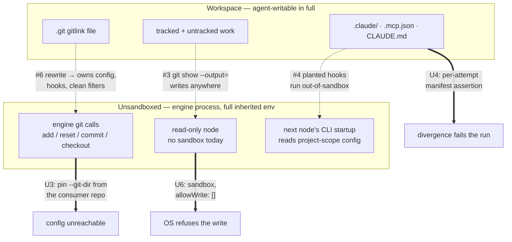
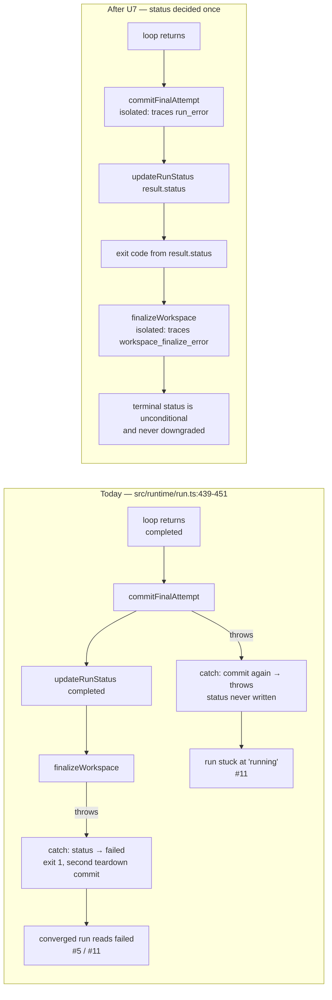
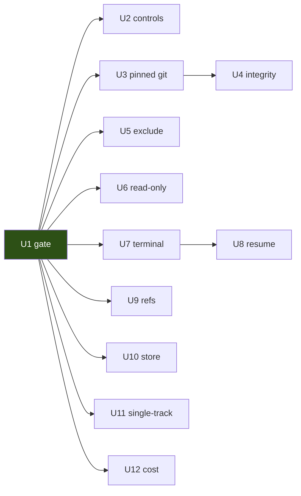

# Engine Slice 2 Review Findings: Fix Set - Plan

## Goal Capsule

- **Objective:** Make PR #15 describe shippable work — a green, meaningful verification gate, and the twenty-one review findings closed.
- **Product authority:** the code review's `final-findings.json` (21 findings, all independently validated, none suppressed) is the requirement set. `docs/plans/2026-07-25-001-feat-engine-slice-2-plan.md` supplies the R-IDs and contracts the findings breach. Where they disagree, this document is current.
- **Provenance:** reviewed 2026-07-25 against `bb6fba1`; every finding reproduced by an independent validator in scratch repos before it reached this plan. The findings' own suggested fixes are inputs, not instructions — U11 corrects one that would reject the milestone's own showcase.
- **Open blockers:** none. Four questions carried from the slice-2 plan stay deferred; one of them turns out to be already closed in code (see Deferred / Open Questions).
- **Execution profile:** twelve units in four phases, dependency-ordered. Phase A restores a trustworthy gate and must land first — every later unit's verification reads off it. Phases B–D are provable with the existing fake-CLI harness except U2 and U6's live case, whose proof costs model quota.
- **Stop conditions:** stop and surface rather than guessing when a fix cannot be demonstrated to close its finding, or when the OS sandbox refuses a shape U6 assumes it accepts. The enforcement design was falsified by probe once already in slice 2 — an enforcement test that will not pass is a design signal, not an implementation detail.
- **Tail ownership:** the implementer owns build, test, and commits per unit, and owns getting CI green on the PR. The live unattended run stays an operator action after the units land; U2 and U3 are what unblock it.

---

## Product Contract

### Summary

Close the twenty-one findings from the code review of PR #15, restoring a `npm test` gate that passes without a `claude` binary and a CI run that actually exercises the write path.
The fix set spans five subsystems: the verification gate, the sandbox boundary's unsandboxed consumers, the terminal-path and resume state machine, engine git against a real operator repo, and the store upgrade path.

### Problem Frame

Slice 2 shipped write-capable nodes, conditional routing, and self-correcting loops, and its plan declared `npm run build` + `npm test` the merge gate. That gate is red on CI — 24 failures across 6 files — for two structural reasons, and its most load-bearing suite cannot prove what it claims.

`vitest.config.ts` pulls `test/integration/sandbox-enforcement.test.ts` into the default run with no env gate, so `npm test` requires a `claude` binary and an authenticated login and spends real API money on any contributor's machine. Separately, `checkOsBoundary` refuses every write run on an ubuntu runner without `bwrap`/`socat`, so the commit, resume, and routing suites time out and the write path has no CI coverage at all. With the gate red for structural reasons, a future regression in the other 319 tests is indistinguishable from the existing red.

Underneath that, three classes of defect run deeper than the gate. The sandbox grants a node write access to the whole workspace including `.git` and `.claude`, and three things outside the sandbox trust that content: the engine's own git process, the next node's CLI startup, and read-only nodes, which get no OS confinement at all. The terminal path in `src/runtime/run.ts` has windows where a converged run reads as `failed`, and where a run gets no terminal status at all. And `resume` spends a fresh attempt on a bound-halted run — masked by a test whose assertion cannot fail.

### Requirements

**Verification gate**

- R1. `npm test` passes on a clean checkout of a supported platform with no `claude` binary and no authenticated login. (#1)
- R2. CI exercises the write path: the commit, resume, routing, and workspace-isolation suites run on the runner rather than timing out. (#7)
- R3. The live-CLI enforcement suite runs only on explicit opt-in, and is loudly skipped — naming the missing prerequisite — rather than silently absent. (#1)
- R4. Every escape case the enforcement suite asserts is paired with an in-workspace control proving the same tool worked in the same invocation. (#16)
- R5. No test in the blocking gate depends on a race between a spawned process and the assertion under test. (#20)

**Sandbox boundary** — restores slice-2 R10

- R6. Every git command the engine runs against a workspace resolves its administrative directory and configuration from a path the sandboxed node cannot write. (#6)
- R7. Engine-owned attempt commits do not depend on the operator's signing configuration. (#14)
- R8. An attempt boundary fails the run, naming the node, when the workspace's CLI-configuration surface or its gitlink has changed since workspace creation. (#4, #6)
- R9. A read-only node's filesystem writes are confined by the same OS-enforced boundary a write node gets. (#3)
- R10. Starting a run modifies no file in the consumer's repository outside the ref store. (#15, restores slice-2 R16)

**Terminal path and resume** — restores slice-2 R21/R23

- R11. A run's terminal status is written once, decided by the loop's result, and never rewritten by a cleanup or teardown step. (#5, #11)
- R12. Every path leaving the engine's `main()` after workspace creation disposes of the workspace. (#10)
- R13. Resuming a bound-halted run spends no fresh attempt and adds no commit. (#9)
- R14. A resumed run is observably distinguishable from the terminated process that preceded it. (#2)
- R15. Resume fails loudly, naming the mismatch, when the checkpoint's attempt count disagrees with the attempt commits present in the workspace. (#17)
- R16. graph-bro's own refs are never counted as the consumer's, and each preserved interrupted attempt stays independently reachable. (#13, #19, restores slice-2 R15/R19)

**Store upgrade path**

- R17. A migration either applies completely and is recorded, or leaves the schema untouched. (#12)
- R18. Resuming a run started before the workspace columns existed fails loudly on stderr before ownership is claimed. (#8)

**Authoring guard and reporting**

- R19. A topology that would dispatch a write-capable node concurrently with another agent node is rejected; one that provably would not is accepted. (#18)
- R20. Every agent invocation's cost is attributed to an attempt `graph-bro result` reports. (#21, restores slice-2 R26)

### Scope Boundaries

The twenty-one findings are the scope. Two additions and one correction depart from that, each named at its unit:

- U6 also adds `--strict-mcp-config` and the minimal environment to read-only nodes. Beyond the findings — it closes the `project-standards` reviewer's residual risk, in the same file and the same shape as #3's fix. Cut it if you want the fix set held strictly to the twenty-one.
- U11 does not implement #18's suggested fix as worded. The wording rejects the shipped showcase; see KTD-10.
- U4's integrity assertion covers the backstop half of both #4 and #6, so those two findings each split across two units.

Out of scope, unchanged from slice 2: fan-out write lanes, push, PR-opening, cost ceilings, `on_error` routing, human checkpoints.

#### Deferred to Follow-Up Work

- The sandbox-side half of #4 — narrowing `sandbox.filesystem.allowWrite` to exclude the CLI-config surface, or using a sandbox deny-write list. Depends on settings shape the installed CLI may not expose. U4 ships the engine-owned backstop, which needs no CLI cooperation.
- The four carried questions from the slice-2 plan (see Deferred / Open Questions).

### Dependencies and Assumptions

- CI runs `ubuntu-latest`; `bubblewrap` and `socat` install from apt without a container change.
- The installed CLI accepts a sandbox block with an empty `filesystem.allowWrite` array as "no writable paths". U6 must probe this before relying on it — the fallback is a minimal-scope placeholder path with no matching files.
- The operator's machine has `commit.gpgsign=true` with `gpg.format=ssh`, globally and in this repo. Verified 2026-07-25. Every test scratch repo sets it `false`, so the suite structurally cannot observe #14.
- Baseline: `npx vitest run --exclude 'test/integration/sandbox-enforcement.test.ts'` is green on darwin — 33 files, 319 tests, 27s. Verified 2026-07-25.
- The engine takes the consumer repo path from its own working directory, so a `resume` invoked from a different directory than `start` already misresolves it. U3 makes that constraint load-bearing on every git call rather than only on workspace disposal. Pre-existing; not fixed here.

### Sources

- `final-findings.json` from code-review run `20260725-190724-f4d02c25` against `bb6fba1` — 21 findings, hydrated evidence, zero suppressed, zero pre-existing. Ephemeral; the findings are restated here because that artifact will not survive.
- CI run 30166908041 — the 24-failure / 6-file breakdown behind R1 and R2.
- `docs/adr/0012-sandbox-enforced-write-isolation.md` — its rationale that read-only enforcement can fall back on detection because "clean is checkable in one command" is what #3 falsifies.
- `docs/adr/0013-engine-owned-commit-granularity.md` — the one-commit-per-attempt contract #9 and #19 breach.
- `examples/review-fix-loop/topology.json` — the shipped showcase whose `review` node has two out-edges into a write-capable target, which is what makes #18's wording wrong.

---

## Planning Contract

### Key Technical Decisions

- KTD-1. The fixes land on `feat/graph-bro-14-engine-slice-2`; PR #15 stays open until CI is green. (session-settled: user-approved — chosen over a follow-up branch stacked on it: slice-2 R10, R12, R15, R16/R17, R21, R23 and R26 are only partly met plus its Verification Contract is unmet, so PR #15 as it stands does not describe shippable work, and stacking would leave a known-red PR as the reviewable unit.)
- KTD-2. The live-CLI enforcement suite is gated out of the blocking gate behind an explicit opt-in env var, loudly skipped rather than silently absent. (session-settled: user-directed — chosen over leaving it in `npm test`: it spends live model quota on every contributor's run and cannot pass without an authenticated login.)
- KTD-3. That suite binds to an on-demand pre-release job, not a schedule. (session-settled: user-approved — chosen over a nightly: a nightly spends live quota unattended on a single-operator project, and the suite's value lands at release boundaries.)
- KTD-4. CI installs `bubblewrap` and `socat` rather than setting `GRAPH_BRO_TEST_PLATFORM`. (session-settled: user-directed — chosen over the platform override: the override runs the write path unsandboxed in the only automated environment there is.)
- KTD-5. #16's in-workspace controls land before the pre-release job is wired to fire. (session-settled: user-directed — chosen over wiring the job first: five escape cases pass today when the model declines, so a job firing on the current assertions reports a boundary that may be absent.)
- KTD-6. One helper carries every engine git invocation against a workspace, pinning `--git-dir` and `--work-tree` and neutralizing repo-supplied execution on each call (`core.hooksPath=/dev/null`, `core.fsmonitor=`, `commit.gpgsign=false`, `tag.gpgsign=false`). #6 and #14 are one defect class: the engine's git trusting configuration the agent controls. Explicit `--git-dir` defeats the gitlink rewrite, which keeps config — and therefore any `filter.*.clean` driver — inside the consumer's admin dir the sandbox cannot write.
- KTD-7. The workspace's administrative directory is resolved **from the consumer repo**, never by reading anything inside the workspace. The consumer repo is not agent-writable, which is the whole premise of the isolation; a path read from `<workspace>/.git` is exactly what #6 shows an agent can rewrite. No new run-row column, so no fourth migration.
- KTD-8. One engine-owned per-attempt integrity assertion covers the workspace-config and gitlink classes together. It records a manifest at workspace creation — presence and content hash of `.claude`, `.mcp.json`, `CLAUDE.md`, plus the gitlink file's recorded `gitdir:` target — and re-checks it at every attempt boundary and on every terminal path, failing the run and naming the node on divergence. Chosen over narrowing the sandbox write scope because it needs no CLI cooperation; the sandbox-side narrowing stays deferred.
- KTD-9. Read-only nodes get the same OS sandbox as write nodes with an empty filesystem write scope. `assertRepoClean` runs `git status --porcelain` scoped to the node's cwd, so it cannot see a write that lands outside the working tree via `git show --output=../escaped`; and a Bash allowlist string cannot express "this flag of this allowed command is forbidden". Consequence: the OS-boundary precheck extends from write-bearing runs to any run with an agent node, so a read-only run on Linux now requires `bubblewrap` and `socat`. Accepted — macOS is always available, and U1 makes CI satisfy it.
- KTD-10. The single-track write guard keys on **simultaneous dispatch**, not out-edge count, and its real enforcement is at run time. #18's suggested wording — reject a source with more than one out-edge when any target is write-capable — rejects `examples/review-fix-loop`, whose `review` node routes to `fix` (write-capable) and to `END`. Guards are evaluated independently in `transition()`, so the hazard is two edges satisfiable in the *same* super-step, which the loop knows exactly and the compiler can only approximate. Runtime rule: a frontier holding a write-capable activation must hold no other agent activation. Compile-time rule, retained as an authoring-time courtesy: reject a source with two or more out-edges whose targets include a write-capable node unless the out-edges are provably mutually exclusive — all guarded on one key with distinct `equals` literals.
- KTD-11. Resume reconciles the checkpoint's attempt counts against the attempt commits in the workspace and refuses loudly on a mismatch, rather than rolling the frontier back to re-run the predecessor. Chosen over the rollback arm of #17's fix: the slice-2 plan's own stop condition is to surface rather than guess, and a rollback re-runs a write node against a tree the checkpoint already records as consumed.
- KTD-12. The terminal block writes the run's status before disposing of the workspace, and isolates every teardown and cleanup call so it can add a trace event but never change the outcome. A terminal status is worth more than a teardown commit — a run whose commit failed should read `failed` with the git error in its trace, never `running` forever.
- KTD-13. Partial-attempt refs are namespaced per preserved attempt; `partialAttemptRef` returns the namespace prefix and callers enumerate it with `for-each-ref`. `refs/graph-bro/partial-attempt/*` sits outside `refs/heads/`, so git keeps no reflog and a displaced commit is immediately gc-eligible.
- KTD-14. Each migration's DDL and its ledger insert run inside one `better-sqlite3` transaction. `db.exec()` is not transactional across statements — a 3-statement exec whose second statement fails leaves the first committed and the migration unrecorded, and the retry then throws `duplicate column name` on every future `openDb()`.

### High-Level Technical Design

#### The trust boundary, and the three things that cross it

The sandbox confines the node. It does not confine what reads the node's output. Findings #3, #4 and #6 are three routes across that line.



#### Terminal path: what the fix changes

Today's success path runs `commitFinalAttempt` → `updateRunStatus` → `finalizeWorkspace` inside one try, with a catch that repeats the commit and rewrites the status. Three outcomes are wrong.



#### Resume: where the attempt count and git disagree

`runLoop` increments and checkpoints a bounded node's attempt before dispatching it, while the commit capturing the predecessor's edits fires only when the bounded node actually runs. Two distinct bugs live in that window.

```mermaid
sequenceDiagram
    participant L as runLoop
    participant CP as checkpoint
    participant WS as workspace git

    Note over L: bound check — loop.ts:390-397
    L->>L: nextCount > bound?
    L-->>CP: #9 — returns BEFORE writeCheckpoint,<br/>so the durable point is the predecessor
    Note over L,WS: resume re-dispatches the predecessor:<br/>real agent call, real mutation, extra commit
    L->>CP: U8 fix — checkpoint the refused frontier,<br/>so resume re-enters at the bound check

    Note over L: dispatch path — loop.ts:398-416
    L->>CP: attempt N recorded, "about to dispatch"
    L->>WS: withAttemptCommit fires only on actual dispatch
    Note over CP,WS: #17 — kill in this window:<br/>checkpoint says N, git shows N-1
    WS->>WS: preserveInterruptedAttempt hard-resets,<br/>discarding the predecessor's edits
    L->>L: U8 fix — reconcile checkpoint vs.<br/>committed attempts; refuse loudly on mismatch
```

### Sequencing

Phase A is a hard prerequisite: until the gate is green and CI covers the write path, no later unit's verification means anything. Within Phase B, U3 precedes U4 — U4's gitlink assertion checks a path U3 establishes. Phases C and D are independent of each other and of B.



### Risks and Dependencies

- **U6 rests on unverified CLI behavior.** An empty `allowWrite` array may not mean "no writable paths", and a sandboxed read-only node may need write access to its own scratch paths to start at all. Probe before building; the fallback is a placeholder path matching nothing. If the CLI refuses both shapes, stop and surface — do not ship read-only nodes with `failIfUnavailable: false`, which would silently restore the hole.
- **U6 narrows where read-only runs work.** A pure read-only topology on Linux without `bubblewrap`/`socat` stops running. This is a real regression in reach, accepted for the boundary it buys.
- **U8's fix to #2 makes #9 fail loudly.** That is the intended outcome. Do not treat the new red as a regression — fix #2 and #9 in the same unit.
- **U10 touches the migration runner every CLI invocation calls.** A defect here bricks stores rather than failing one run. The unit's own tests must cover the half-apply path directly, not by inference.
- **The live milestone bar stays unproven until an operator runs it.** U3 (signing) and U2 (controls) are what unblock it. Nothing in this plan asserts the bar is met.

### System-Wide Impact

- **ADR-0012 needs a consequence correction.** Its rationale holds that read-only enforcement can fall back on detection because "clean is checkable in one command" — #3 shows `--output=<file>` writes outside the working tree, where `git status --porcelain` cannot see it. The read-only path acquires the same OS-boundary dependency the ADR currently attributes to write nodes only.
- **CONTEXT.md's "single-track" sense sharpens.** After U11 the constraint is "at most one write-capable node dispatched per super-step", not "no write-capable fan-out target". Update the glossary entry if the term is stated there.
- **The OS-boundary precheck moves from write-bearing runs to any agent-bearing run** (U6). This is operator-visible: a read-only run that worked yesterday on a bare Linux box now refuses to start, naming the missing commands.
- **Every attempt commit gains four `-c` overrides** (U3). Consumer repos relying on engine commits inheriting their signing config would break — nothing does today, and ADR-0013 already frames attempt commits as internal bookkeeping on a throwaway branch.

---

## Implementation Units

### Unit Index

| U-ID | Title | Primary files | Depends on |
|---|---|---|---|
| U1 | Green blocking gate; CI covers the write path | `.github/workflows/ci.yml`, `package.json`, `test/integration/sandbox-enforcement.test.ts`, `test/workspace/commit.test.ts` | — |
| U2 | Enforcement suite proves the boundary held | `test/integration/sandbox-enforcement.test.ts`, `.github/workflows/pre-release.yml` | U1 |
| U3 | Pin every engine git invocation | `src/workspace/commit.ts`, `src/workspace/lifecycle.ts` | U1 |
| U4 | Per-attempt workspace integrity assertion | `src/workspace/integrity.ts`, `src/runtime/run.ts` | U3 |
| U5 | Stop writing the consumer's shared exclude file | `src/workspace/lifecycle.ts` | U1 |
| U6 | Confine read-only nodes at the OS layer | `src/executor/read-only-policy.ts`, `src/executor/claude-code.ts`, `src/runtime/run.ts` | U1 |
| U7 | Terminal status written once, never downgraded | `src/runtime/run.ts` | U1 |
| U8 | Resume spends no extra attempt; reconciles against git | `src/engine/loop.ts`, `src/cli/resume.ts`, `src/runtime/run.ts` | U7 |
| U9 | graph-bro's own ref namespace | `src/workspace/baseline.ts`, `src/workspace/commit.ts` | U1 |
| U10 | Transactional migrations; pre-upgrade resume guard | `src/store/db.ts`, `src/cli/resume.ts` | U1 |
| U11 | Single-track guard keys on simultaneous dispatch | `src/topology/compile.ts`, `src/engine/loop.ts` | U1 |
| U12 | Per-attempt cost attribution | `src/runtime/run.ts`, `test/cli/cli.test.ts` | U1 |

### Phase A — Restore a trustworthy gate

### U1. Green blocking gate; CI covers the write path

**Goal:** `npm test` passes on a checkout with no `claude` binary, and CI exercises the write path instead of timing out.

**Requirements:** R1, R2, R3, R5. Implements KTD-2, KTD-4.

**Dependencies:** none. Must land first.

**Files:**
- `.github/workflows/ci.yml` — install `bubblewrap` and `socat` before `npm test`
- `package.json` — add the opt-in `test:e2e` script
- `test/integration/sandbox-enforcement.test.ts` — gate both describe blocks on the opt-in env var
- `test/workspace/commit.test.ts` — fix the quiescence-warning race in the `commitAttempt` describe, at the spawn site preceding the commit under test

**Approach:** Gate the two `describe` blocks in the enforcement suite on an explicit opt-in env var, with a `console.warn` naming the missing prerequisite so the skip is visible rather than silent. Add a script that sets the var and runs that file alone. In CI, install the two sandbox dependencies before `npm test`; the write-path suites use the fake backend, so this costs nothing and needs no credentials. Do not reach for `GRAPH_BRO_TEST_PLATFORM` (KTD-4).

The quiescence-warning test spawns a background writer and then commits, asserting the workspace is still dirty — but `spawn` returns before the child boots, so on a 2-fork runner the commit wins the race and `quiescenceWarning` is `undefined`. Block until the straggler has actually produced its first write before calling `commitAttempt`.

**Execution note:** verify the gate from the outside before touching anything else — confirm the current CI failure set matches the 24/6 breakdown, so the delta this unit produces is attributable.

**Patterns to follow:** `vitest.config.ts`'s existing CI-vs-local branch is the precedent for treating the runner as a distinct environment rather than papering over it.

**Test scenarios:**
- `npx vitest run` completes green with `claude` absent from `PATH`, and the enforcement suite reports as skipped with a warning naming the prerequisite.
- The opt-in script selects only the enforcement file; the env var is set for that invocation and unset afterwards.
- The quiescence test passes with the fork pool capped at 2 (`CI=1`), repeated enough times to show the race is gone rather than reordered.
- Covers R2: on the CI runner, `workspace-isolation`, `write-crash-resume`, and the cli trace tests pass rather than timing out.

**Verification:** `npm run build && npm test` green locally on darwin with `claude` unavailable; the PR's CI run green on ubuntu. The 319-test baseline does not shrink.

---

### U2. Enforcement suite proves the boundary held

**Goal:** every escape case discriminates a working boundary from a model that declined, and the suite is bound to a job that fires.

**Requirements:** R4. Implements KTD-3, KTD-5.

**Dependencies:** U1.

**Files:**
- `test/integration/sandbox-enforcement.test.ts` — add in-workspace controls to the five bare cases
- `.github/workflows/pre-release.yml` — the on-demand job that runs the opt-in suite

**Approach:** Five cases assert only that a file is absent, paired with nothing the agent must have successfully done: the shell-redirect case, the consumer-checkout write, the `.claude/settings.local.json` case, the in-workspace symlink, and the planted-secret echo. Each passes when the model refuses, mis-parses, or never issues the tool call — and none of them distinguishes a working deny rule from a block-everything misconfiguration. Give each the in-workspace control the absolute-path case already carries: the same tool, in the same invocation, writing a file inside the workspace that the test then reads back. For the shell-redirect case the control must go through Bash, since that is the tool under test.

Wire the job to run on demand at a release boundary, not on a schedule (KTD-3). It must install the sandbox dependencies and carry an authenticated login; document that it spends live model quota.

**Execution note:** these assertions cannot be proven without live quota. Land the controls first and verify them in one deliberate opt-in run; only then point the job at the suite (KTD-5).

**Patterns to follow:** the absolute-path case's control — assert the escape's absence and the control's content in the same test — is the shape to replicate. Keep prompts phrased as ordinary tasks; an adversarially-phrased prompt tests the model's judgment, not the boundary.

**Test scenarios:**
- Each of the five cases fails when its in-workspace control file is missing, proving the control is load-bearing.
- Dropping `Bash` from the write allowlist turns the shell-redirect case red rather than leaving it green.
- Breaking the path-scoped file-tool allow rule so no write succeeds anywhere turns all five red.
- Covers R4: one opt-in run against the real CLI passes with every control satisfied.

**Verification:** the two mutation checks above (drop `Bash`; break the allow rule) each produce red, reverted afterwards. One live opt-in run green. The pre-release job runs the suite and is not attached to any push or pull-request trigger.

---

### Phase B — Close the routes around the sandbox

### U3. Pin every engine git invocation

**Goal:** no engine git command against a workspace reads configuration, hooks, or filters the sandboxed node can write.

**Requirements:** R6, R7. Implements KTD-6, KTD-7.

**Dependencies:** U1.

**Files:**
- `src/workspace/commit.ts` — the shared `git()` helper, `commitAttempt`, `preserveInterruptedAttempt`
- `src/workspace/lifecycle.ts` — `reattachToRunBranch`, `finalizeWorkspace`
- `test/workspace/commit.test.ts`, `test/workspace/lifecycle.test.ts`

**Approach:** Route every workspace-directed git call through one helper that pins the administrative directory and the work tree explicitly and neutralizes repo-supplied execution on each invocation. Today only the `commit` call carries `core.hooksPath=/dev/null`, and that does not stop clean/smudge filters at all: `git add -A` executes a `filter.<x>.clean` driver and `git checkout --detach HEAD` executes `post-checkout`, both from the unsandboxed engine process with its full inherited environment.

Resolve the admin dir from the consumer repo, never from inside the workspace (KTD-7) — the gitlink file is exactly what an agent can rewrite. The mechanism is an implementer choice between asking the consumer repo for its worktree list and deriving the path from the consumer's common git dir plus the run id; the constraint is that no input to it comes from within the workspace.

Add the signing overrides to the same helper (#14). The operator's `commit.gpgsign=true` with `gpg.format=ssh` makes every attempt commit attempt a signature from a detached, tty-less process, which either blocks on approval or dies — and because `commitAttempt` throws, it fails the whole run. Every test scratch repo sets `commit.gpgsign false`, so the suite reproduces a different commit context than production; the new tests must not.

**Execution note:** add a scratch-repo test that leaves signing enabled before changing the helper — it should fail, proving the gap the existing harness hides.

**Test scenarios:**
- Covers R7: an attempt commit succeeds in a scratch repo with `commit.gpgsign=true` and a `gpg.format` that would fail, and the resulting commit carries no signature.
- Covers R6: with a `filter.evil.clean` driver and a `.gitattributes` entry planted in the workspace, `commitAttempt` does not execute the driver.
- Covers R6: with `.git/hooks/post-checkout` planted after an in-workspace `git init`, `finalizeWorkspace`'s detach does not execute it.
- A workspace whose `.git` gitlink has been replaced still resolves the real admin dir, so the attempt commit lands on the run branch rather than in the agent's substitute repository.
- The existing squash-fold, no-op, and quiescence behaviors are unchanged — the helper is a pass-through for everything else.

**Verification:** the four hostile-workspace tests pass; `test/workspace/commit.test.ts` and `test/workspace/lifecycle.test.ts` otherwise unchanged in outcome. No `execFileSync("git", ...)` against a workspace path remains outside the helper.

---

### U4. Per-attempt workspace integrity assertion

**Goal:** an attempt boundary refuses to proceed when the workspace's CLI-config surface or gitlink changed since creation.

**Requirements:** R8. Implements KTD-8.

**Dependencies:** U3.

**Files:**
- `src/workspace/integrity.ts` — new: manifest capture and assertion
- `src/runtime/run.ts` — call it from the attempt-commit hook and every terminal path
- `test/workspace/integrity.test.ts` — new

**Approach:** A write node is granted bare `Bash` and the sandbox permits writes anywhere under the workspace, so `echo '{"hooks":...}' > .claude/settings.local.json` is unimpeded — and the deny rule that closes this for the file-editing tools does not bind Bash. Every node shares one workspace and each node is a fresh process with cwd set to it, so a planted project-scope settings file is read at the *next* node's startup. A read-only node picking it up is worse: it runs with the engine's full environment.

Capture a manifest at workspace creation — presence and content hash of `.claude`, `.mcp.json`, `CLAUDE.md`, plus the gitlink file's recorded `gitdir:` target — and re-check it at each attempt boundary and on every terminal path. Divergence fails the run, naming the node. This is the fail-closed backstop the engine fully controls; the sandbox-scope narrowing that would prevent the write in the first place stays deferred (Scope Boundaries).

The manifest must survive the process, or `resume` has nothing to compare against — `resume` calls `reuseWorkspace`, not `createWorkspace`, so re-capturing at resume would baseline a workspace that may already be compromised and the assertion would pass forever after. Record the manifest as a trace event at workspace creation and read it back on resume; the trace is already the run's durable record and this needs no new column.

Place the check alongside the attempt commit in the runtime, not in `src/engine` — the engine must not import the workspace module.

**Execution note:** the assertion must run *before* the attempt commit folds the planted file into history, or the failure names a commit rather than a node.

**Patterns to follow:** `src/workspace/baseline.ts`'s capture-then-assert pair, and its error class naming the offending node, is the shape. `withConsumerBaseline` in `src/runtime/run.ts` is the wrapper precedent.

**Test scenarios:**
- Covers R8: a node that creates `.claude/settings.local.json` fails the run, and the error names that node.
- A node that modifies an existing `CLAUDE.md` fails; a node that modifies ordinary tracked files does not.
- A node that replaces the `.git` gitlink fails, naming the gitlink mismatch distinctly from a config change.
- A run whose nodes touch nothing in the manifest completes with no integrity event.
- The assertion fires on the terminal path of a run that never re-activates the bounded node.
- A resumed run compares against the manifest recorded at creation, not one re-captured at resume: a workspace whose config was planted before the kill still fails after the resume.

**Verification:** `test/workspace/integrity.test.ts` green; the review-fix-loop smoke test still converges, proving the assertion does not false-fire on ordinary write work.

---

### U5. Stop writing the consumer's shared exclude file

**Goal:** starting a run leaves the consumer's repository byte-identical outside the ref store.

**Requirements:** R10.

**Dependencies:** U1.

**Files:**
- `src/workspace/lifecycle.ts` — `excludeScratchDirectory`
- `test/integration/workspace-isolation.test.ts`, `test/workspace/lifecycle.test.ts`

**Approach:** `git rev-parse --git-path info/exclude` run inside a linked worktree resolves to the **common** git dir — `info/` is shared, and only `info/sparse-checkout` is per-worktree — so starting any run appends `/.claude/` to the consumer's own `.git/info/exclude`, permanently. From then on the consumer's `git status` and `git add -A` silently ignore an untracked `.claude/` directory in their main working tree, with nothing in the run's output mentioning it. The comment at the call site asserts the opposite rationale.

Resolve the worktree-local admin dir instead and append there, creating `info/` if absent. Git honours a linked worktree's own exclude file, so the workspace still ignores the scratch directory while the consumer's copy is never touched. The consumer-baseline backstop cannot catch this — it captures its baseline after workspace creation, and compares only porcelain, diff, and refs, none of which include the exclude file.

**Test scenarios:**
- Covers R10: the consumer's `.git/info/exclude` is byte-identical before and after a full run, including when the file did not exist beforehand.
- The workspace still ignores `/.claude/` — a scratch directory created there does not appear in the workspace's own `git status`.
- A second run against the same consumer repo does not accumulate duplicate lines in either location.
- The existing idempotence check (the line is not appended twice) still holds against the worktree-local file.

**Verification:** the byte-identical assertion added to `test/integration/workspace-isolation.test.ts` passes, and fails when reverted to the shared path.

---

### U6. Confine read-only nodes at the OS layer

**Goal:** a read-only node cannot write outside the workspace, including through a legitimate flag of an allowed command.

**Requirements:** R9. Implements KTD-9.

**Dependencies:** U1.

**Files:**
- `src/executor/read-only-policy.ts` — the read-only settings block
- `src/executor/claude-code.ts` — build settings for `read_only`; apply `--strict-mcp-config` and the minimal environment
- `src/runtime/run.ts` — extend the OS-boundary precheck to any agent-bearing run
- `test/executor/read-only-policy.test.ts`, `test/executor/write-policy.test.ts`

**Approach:** A read-only node — the shape a review node uses — is granted `Bash(git diff *)` and `Bash(git show *)`, both of which accept `--output=<file>`, verified writing a file outside the git working tree. Read-only capability gets no OS sandbox at all today, and `assertRepoClean` runs porcelain scoped to the node's cwd, so it cannot see a write landed via an absolute or `../` path. The allowlist string cannot express the constraint; only the OS layer can.

Build a settings block for `read_only` with no writable paths and no allowed network domains, mirroring the write policy's shape. Extend the boundary precheck from write-bearing runs to any run with an agent node, so a run refuses to start rather than discovering the gap mid-run.

Beyond the twenty-one findings, in the same file and shape: read-only nodes also load the operator's user-scope MCP servers and inherit the engine's full environment. Add `--strict-mcp-config` and the minimal environment so read-only confinement matches write confinement. Cut this half if the fix set is being held strictly to the findings.

Considered and not chosen: drop the two wildcard git entries from the read-only allowlist and hand a review node its diff as prompt content instead. That closes `--output=` without the new platform dependency, but it changes the review node's authoring model, caps the diff at prompt size, and leaves the class open — any future allowlist entry can smuggle a write through a legitimate flag. The OS layer closes the class.

**Still open after this unit:** an empty write scope does not restrict reads. `Read`, `Grep`, and `Glob` remain unscoped for read-only nodes — the caveat already recorded on the read-only allowlist — so a read-only node can still read any file the operator can. U6 closes the write escape only; do not read it as making read-only nodes confined.

**Execution note:** probe the CLI's acceptance of an empty write scope before building on it, and probe whether a sandboxed read-only node starts at all. If neither an empty array nor a placeholder path works, stop and surface — do not relax `failIfUnavailable`.

**Patterns to follow:** `buildWritePolicy` in `src/executor/write-policy.ts` — same settings shape, empty write scope. Its `canonicalWorkspacePath` contract (canonicalise at the call site, keep the builder pure) applies equally.

**Test scenarios:**
- Covers R9: the read-only settings block declares no writable paths and no allowed domains, and is passed for `read_only` capability.
- A read-only node's spawn receives `--strict-mcp-config` and the minimal environment, matching the write node's treatment.
- The boundary precheck refuses a read-only-only topology when the sandbox is unavailable, naming the missing commands, and the run records `failed` with that reason.
- A read-only node still reads, greps, and runs the allowed git commands successfully — the confinement does not break the review node's job.
- Live, opt-in: `git show --output=` targeting a path outside the workspace produces no file, paired with an in-workspace control proving the same command worked.

**Verification:** unit tests green; the review-fix-loop smoke test still converges, proving a confined review node can still judge a diff. The live escape case added to the opt-in suite passes in one deliberate run.

---

### Phase C — Terminal path and resume

### U7. Terminal status written once, never downgraded

**Goal:** a run's recorded outcome is decided by the loop's result and cannot be changed by teardown or cleanup.

**Requirements:** R11, R12. Implements KTD-12.

**Dependencies:** U1.

**Files:**
- `src/runtime/run.ts` — the terminal try/catch and the prompt-token gate's failure branch
- `test/runtime/run.test.ts`, `test/integration/workspace-isolation.test.ts`

**Approach:** Three defects share one block. A fully converged run reads as `failed` when the post-success workspace disposal throws, because it runs unprotected as the last statement of the success try and the outer catch rewrites the already-correct status and exit code. A run whose teardown commit throws gets no terminal status at all — the catch calls the same commit again, it throws again, and the status write never executes, leaving `running` forever with a dead owner pid. And the prompt-token gate, which runs after the workspace has been created or re-attached, returns without disposing of it, leaving the run branch pinned and the worktree admin entry uncleaned.

Order the terminal block so the status write is unconditional: isolate the teardown commit so a failure traces an error rather than pre-empting the status, write the status and exit code, then dispose of the workspace in its own isolated call that can only trace `workspace_finalize_error`. Add the missing disposal to the token-gate branch, matching every other post-creation failure path.

Keep the existing ordering guarantee that matters — the attempt commit lands before a terminal status is observable — while making the status itself unconditional.

**Test scenarios:**
- Covers R11: a converged run whose workspace disposal throws still records `completed` with exit code 0, and carries a `workspace_finalize_error` trace event.
- Covers R11: a run whose teardown commit throws records `failed` with the git error in its trace, never `running`.
- A run whose teardown commit throws does not mint a second teardown commit from the catch path.
- Covers R12: a run failing the prompt-token gate after workspace creation leaves no worktree on disk and no `worktrees/<run-id>` admin entry, and its run branch is checkable out elsewhere.
- A failing run's status is `failed` exactly once — no second write downgrades or overwrites it.

**Verification:** the two fault-injection tests (disposal throws, teardown commit throws) pass; `graph-bro status` reports a terminal value for every run the suite starts.

---

### U8. Resume spends no extra attempt; reconciles against git

**Goal:** resuming a bound-halted run halts with no work, and a resume whose accounting disagrees with git refuses loudly.

**Requirements:** R13, R14, R15. Implements KTD-11.

**Dependencies:** U7.

**Files:**
- `src/engine/loop.ts` — checkpoint the refused frontier before the bound-halt return
- `src/cli/resume.ts` — mark the run pre-terminal before spawning
- `src/runtime/run.ts` — reconcile resumed attempt counts against committed attempts
- `src/workspace/commit.ts` — expose the committed-attempt count for reconciliation
- `test/integration/write-crash-resume.test.ts`, `test/engine/loop.test.ts`

**Approach:** Fix the masking test and the bug it masks together. The test asserting that a bound-halted run "halts immediately, spending no fresh attempts" cannot fail: nothing on the resume path ever writes a pre-terminal status, so the run row still holds `not_converged` from the previous process and the wait for that status succeeds on its first poll, before the resumed engine has booted. Set a pre-terminal status in `resume` after the ownership claim, so waiting on a terminal value can no longer be satisfied by the prior process's row.

That change makes #9 fail loudly, which is the point. The bound check returns before the checkpoint write, so the durable resume point is the *previous* step, whose frontier is the unbounded predecessor. On resume the predecessor re-runs — a real agent invocation and a real workspace mutation — the bound then trips, and the teardown commits that orphan work under an attempt number already used, producing two commits labelled for one attempt. Checkpoint the refused frontier before returning, so a resume re-enters at the bound check and halts with no work.

Then close the window between a step's checkpoint and the bounded node's attempt commit (#17). The checkpoint durably records "attempt N is about to happen" while the commit capturing the predecessor's edits has not run; a kill there leaves those edits uncommitted, and `preserveInterruptedAttempt` — seeing HEAD unmoved but the tree dirty — snapshots them to a side ref and hard-resets, discarding them from the live workspace. The resumed checkpoint still marks the predecessor completed, so the loop re-enters the bounded node against a workspace that no longer reflects what state claims. Reconcile the resumed attempt counts against the attempt commits actually present, and refuse the resume loudly, naming the mismatch (KTD-11).

**Execution note:** fix the vacuous assertion first and watch #9 go red before fixing it. A green suite after the first change means the assertion is still not discriminating.

**Patterns to follow:** the existing checkpoint call on the dispatch path is the shape for the bound-halt checkpoint. `findLastCommittedAttempt` in `src/workspace/commit.ts` already walks attempt commits — reconciliation extends that reader rather than introducing a second parser of commit messages.

**Test scenarios:**
- Covers R13: resuming a bound-halted run adds no commit to the run branch and produces no new node invocation; the commit count before and after are equal.
- Covers R14: the resumed run passes through a pre-terminal status, so a wait for a terminal value cannot be satisfied by the prior process's row.
- Covers R13: exactly one commit exists per attempt after a kill-and-resume cycle — no two commits share an attempt number.
- Covers R15: a checkpoint whose attempt count exceeds the committed attempts fails the resume, naming the mismatch, rather than re-entering the bounded node.
- A crash in the ordinary window — after an attempt commit, before the next dispatch — still resumes and completes, so reconciliation does not reject healthy resumes.
- The existing join-barrier and fan-out resume behaviors are unchanged.

**Verification:** `test/integration/write-crash-resume.test.ts` green with the assertions now discriminating — each new assertion demonstrated red against the pre-fix code. `test/integration/crash-resume.test.ts` and the cli resume tests unchanged in outcome.

---

### U9. graph-bro's own ref namespace

**Goal:** graph-bro's refs are never mistaken for the consumer's, and every preserved interrupted attempt stays reachable.

**Requirements:** R16. Implements KTD-13.

**Dependencies:** U1.

**Files:**
- `src/workspace/baseline.ts` — broaden the ref filter
- `src/workspace/commit.ts` — namespace the partial-attempt ref
- `test/workspace/baseline.test.ts`, `test/workspace/commit.test.ts`

**Approach:** Two findings, one premise: every ref graph-bro creates under its own namespace is the run's declared footprint, not a consumer ref. The consumer baseline filter skips run branches only, so a run in flight fails with a baseline violation — blaming a node that did nothing — as soon as any *other* run of the same consumer repo is resumed and writes a partial-attempt ref into the shared ref store. Broaden the filter to graph-bro's whole namespace.

The partial-attempt ref is keyed on the run id alone, so a second kill-then-resume cycle of the same run silently replaces the first cycle's preserved commit. Because the ref sits outside `refs/heads/`, git creates no reflog and the displaced commit is immediately unreachable and gc-eligible. Namespace the ref per preserved attempt and have the accessor return the namespace prefix, with callers enumerating it.

**Test scenarios:**
- Covers R16: a consumer baseline captured before a partial-attempt ref exists still passes after one is written, mirroring the existing run-branch case.
- Covers R16: two kill-and-resume cycles of one run leave two independently reachable preserved commits, both enumerable under the namespace.
- A run in flight is unaffected by a concurrent run's resume against the same consumer repo — no baseline violation, no node blamed.
- The consumer's own refs still trip the baseline check when they change.

**Verification:** `test/workspace/baseline.test.ts` and `test/workspace/commit.test.ts` green; the concurrent-resume scenario fails when the filter change is reverted.

---

### Phase D — Store, authoring guard, reporting

### U10. Transactional migrations; pre-upgrade resume guard

**Goal:** a failed migration leaves the store openable, and resuming a pre-upgrade run fails visibly.

**Requirements:** R17, R18. Implements KTD-14.

**Dependencies:** U1.

**Files:**
- `src/store/db.ts` — `runMigrations`
- `src/cli/resume.ts` — guard the workspace columns
- `test/store/checkpoints.test.ts` (or a new `test/store/db.test.ts`)

**Approach:** The third migration packs three `ALTER TABLE` statements into one file executed by a single `exec` call, which is not transactional across statements — a mid-file failure leaves the first column committed while the ledger insert never runs. The next `openDb()` from any invocation, including a plain `status`, retries the migration from scratch and throws `duplicate column name`, so the store is permanently unopenable without manual schema surgery. Wrap each migration's DDL and its ledger insert in one transaction so a retry after a transient lock or disk error is safe. Earlier migrations lack this exposure — the first is idempotent by construction and the second has a single statement.

Separately, every run row predating that migration has null workspace columns. `resume` checks the topology path explicitly but has no equivalent check for the three workspace fields, and passes empty strings into the spawned engine, which rejects them with a usage error — discarded, because the engine is spawned with stdio ignored. The operator sees ownership claimed, the run id printed, and exit 0, while the detached process dies having done nothing; ownership is left at that dead pid, so every later resume repeats the same silent failure. Guard the columns before claiming ownership, mirroring the topology-path check.

**Test scenarios:**
- Covers R17: a migration whose second statement fails leaves the schema unchanged and the ledger unwritten, and a subsequent open succeeds and re-applies it cleanly.
- Covers R17: an already-migrated store opens as a no-op, unchanged from today.
- Covers R18: resuming a run row with null workspace columns prints an error naming the cause and exits non-zero, without claiming ownership.
- Covers R18: the owner pid is untouched by a refused resume, so a later resume of a repaired row still works.
- A run row with a topology path but null workspace columns is distinguishable in the error message from one missing its topology path.

**Verification:** the half-apply test passes and fails when the transaction wrapper is reverted. `graph-bro status` and `result` are unaffected — they never read the workspace columns.

---

### U11. Single-track guard keys on simultaneous dispatch

**Goal:** reject topologies that would run a write-capable node concurrently with another agent node, without rejecting ones that provably would not.

**Requirements:** R19. Implements KTD-10.

**Dependencies:** U1.

**Files:**
- `src/topology/compile.ts` — extend the guard
- `src/engine/loop.ts` — the frontier assertion
- `test/topology/compile.test.ts`, `test/engine/loop.test.ts`

**Approach:** The existing guard rejects a write-capable fan-out target only. Two write-capable nodes reachable from one source through plain edges both dispatch in the same super-step and drive two processes against the same worktree, interleaving their edits — the exact failure mode the milestone cites as its reason to isolate. The mixed shape fails differently: a read-only node scheduled alongside a write node captures its porcelain baseline before the write node's edits land and then fails its cleanliness assertion, aborting the run and naming the innocent read-only node.

Do not implement the finding's suggested wording. Rejecting any source with more than one out-edge whose targets include a write-capable node rejects `examples/review-fix-loop`, whose `review` node routes to `fix` when the verdict fails and to `END` when it passes. Guards are evaluated independently, so the hazard is two edges satisfiable in one step, not two edges existing (KTD-10).

Put the real enforcement in the loop, where the frontier is known exactly: a frontier holding a write-capable activation must hold no other agent activation. Keep a conservative compile-time check for the shapes that are provably concurrent — two or more out-edges into a write-capable target that are not mutually exclusive by a shared guard key with distinct literals — so an authoring mistake still surfaces before a run id is minted. The frontier assertion is pure engine logic and imports nothing from the workspace module.

**Test scenarios:**
- Covers R19: a source with two unguarded plain edges into two write-capable nodes is rejected at compile time, naming the deferral.
- Covers R19: `examples/review-fix-loop` still compiles — a source whose out-edges are mutually exclusive on one guard key is accepted.
- A source with one unguarded and one guarded edge into a write-capable target is rejected, since the unguarded edge always fires.
- The runtime frontier assertion fails a run that reaches a write-plus-read-only frontier the compiler admitted, naming both nodes, rather than blaming the read-only node's cleanliness check.
- Two read-only nodes in one frontier are unaffected, so the slice-1 fan-out shape still runs.
- The existing fan-out write-lane rejection is unchanged.

**Verification:** `test/topology/compile.test.ts` and its snapshot updated; both smoke tests still pass, proving neither shipped example is rejected.

---

### U12. Per-attempt cost attribution

**Goal:** no agent invocation's cost is dropped from the per-attempt report.

**Requirements:** R20.

**Dependencies:** U1.

**Files:**
- `src/runtime/run.ts` — the shared attempt counter's seed
- `test/cli/cli.test.ts`, `test/store/trace.test.ts`

**Approach:** The write node's first run is stamped with attempt zero, because the shared counter is only advanced by the bounded node's own hook, which has not fired yet — and the aggregation skips zero, so that invocation's tokens and cost vanish from the report entirely. Every later write-node run is then attributed to the previous attempt's bucket. In the shipped showcase the dropped node is `fix`, the expensive write-capable one, so a three-attempt run reports three review calls and two fix calls and silently omits one.

Seed the counter to one whenever the topology declares any bound, so no usage lands in the discarded bucket. This still attributes a write node running *after* the bounded node to the attempt just closed; exact alignment would mean advancing the counter when the bounded node's next activation is scheduled rather than when it is invoked, which is a larger change than the dropped bucket warrants. Note the residual attribution skew in the trace docs rather than leaving it implied.

Tighten the existing per-attempt assertion so it compares the sum of per-attempt costs against the run's total node cost, which is what would have caught this.

**Test scenarios:**
- Covers R20: a three-attempt loop's per-attempt costs sum to the run's total node-completion cost, with no invocation unattributed.
- A topology with no bound still stamps every event at zero and produces no attempts array, preserving the slice-1 report shape.
- A resumed run's attempt attribution continues from the recorded counts rather than restarting.
- The first write-node invocation appears in attempt one, not in the discarded bucket.

**Verification:** the sum-equality assertion passes and fails against the pre-fix code. The read-only run's report shape is unchanged.

---

## Verification Contract

**Blocking gate — must be green before the PR is mergeable:**

- `npm run build`
- `npm test` — on darwin with `claude` unavailable, and on the PR's ubuntu CI run

The baseline this must not regress: 33 test files, 319 tests, green on darwin as of 2026-07-25 with the enforcement suite excluded. After U1 that exclusion is built into the gate, so plain `npm test` is the comparison. CI is red today — 24 failures across 6 files — and turning it green is U1's deliverable, not a background expectation.

**Opt-in, live model quota — not part of the blocking gate:**

- The enforcement suite via its opt-in script. Run once after U2 and once after U6, each deliberately. Its results are the only evidence for the R4 and R9 live assertions.

**Per-unit proof obligations beyond the suite passing:**

- U1: the CI failure count goes from 24 to 0; the enforcement suite reports as skipped with a named prerequisite.
- U2: each of the five new controls demonstrated load-bearing by removing it and seeing red; two policy-mutation checks (drop `Bash`; break the file-tool allow rule) each produce red and are reverted.
- U3: the four hostile-workspace tests pass, and one of them is demonstrated red against the pre-fix helper.
- U5: the byte-identical exclude-file assertion fails when reverted to the shared path.
- U8: each new resume assertion demonstrated red against the pre-fix code — a green suite after fixing only the vacuous test means the assertion still does not discriminate.
- U10: the half-apply test fails when the transaction wrapper is reverted.
- U11: both shipped examples still compile and both smoke tests still pass.
- U12: the sum-equality assertion fails against the pre-fix counter seed.

**Not verified by this plan:** the milestone acceptance bar — a live unattended run against a real consumer repo. U3 and U2 remove the two known blockers; running it is an operator action afterwards.

---

## Definition of Done

**Global:**

- All twenty findings owned by implementation are closed, and #1's decision is implemented as KTD-2 and KTD-3 describe.
- `npm run build` and `npm test` green locally and on CI; the 319-test baseline has grown, not shrunk.
- Every unit's new tests were demonstrated red against the pre-fix code where the unit's Verification says so.
- No `execFileSync("git", ...)` against a workspace path bypasses U3's helper.
- ADR-0012 carries the read-only confinement correction; CONTEXT.md's single-track sense matches U11 if the term is stated there.
- Abandoned experimental code is removed — no commented-out probe scaffolding, no unused settings shapes left from U6's CLI probing, no dead reconciliation branch from U8.
- The plan's own deferred items are recorded as issues or carried in the slice-2 plan's deferred section, not silently dropped.

**Per unit:** the unit's Verification block passes, and its findings are closed rather than relocated — a finding is closed when its failure scenario has a test that would catch its return.

---

## Deferred / Open Questions

**Already closed, contrary to the slice-2 plan's carried list**

- The `not_converged` exit-code question is resolved in code: `mapStatusToExitCode` in `src/runtime/run.ts` returns 2 for `not_converged`, distinct from the generic failure code. Remove it from the slice-2 plan's carried questions.

**Deferred — not blocking, no finding touches them**

- The fan-out reachability boundary the compile guard leaves to the implementer (direct target only, transitively through plain edges, whether a join terminates reachability). U11 narrows this for the write-capable case only; the general definition stays open.
- Whether the prompt-token root check needs revisiting now that an output key holds a parsed object. Root checking still passes; a token reading a missing path *inside* the object still fails at activation.
- The stated rationale for keeping the engine free of workspace imports describes a property the engine does not have — it already imports checkpoint, pending-write, and event writers. The dependency rule the Verification Contract gates on is unaffected; the reason given for it is wrong.
- Whether any single-track showcase topology trips the join-desync lint, which prints to stderr on every run.

**Deferred — surfaced by this plan**

- The sandbox-side half of #4: narrowing the write scope so the CLI-config surface is excluded, or using a sandbox deny-write list. Depends on settings shape the installed CLI may not expose.
- U12's residual attribution skew: a write node running after the bounded node is still attributed to the attempt just closed. Exact alignment needs the counter advanced at scheduling rather than invocation.
