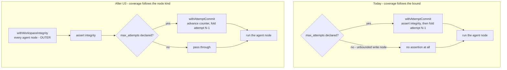

# Engine Slice 2 Round-2 Findings Fix Set - Plan

## Goal Capsule

- **Objective:** close the twelve round-2 review findings against `bb6fba1..aa277ce`, plus six residual risks and one containment gap promoted to defects, so PR #15 describes work whose shipped controls actually cover what they claim.
- **Authority hierarchy:** this plan > the findings doc (`docs/plans/2026-07-25-003-engine-slice-2-round-2-review-findings.md`) > the slice-2 fix plan (`docs/plans/2026-07-25-002-fix-engine-slice-2-review-findings-plan.md`). KTD-1 through KTD-14 in the slice-2 fix plan are settled and are not reopened by this plan; where a unit sharpens one, it cites it.
- **Execution profile:** every finding is latent — `npm test` is green (36 files, 376 passed, 11 skipped) and CI is green. There is no red to chase, so each unit starts by making its own red. A test that passes before the fix has not reproduced the finding.
- **Stop conditions:** U1's probe outcome decides U3's and U4's shape; do not implement either before the probe has run. Surface a blocker rather than guessing if the probe shows a third behavior neither arm anticipates.
- **Tail ownership:** the work lands on `feat/graph-bro-14-engine-slice-2` and PR #15 stays open until CI is green (KTD-1). This plan does not own the merge decision — see Open Questions.

---

## Product Contract

### Summary

Fix the twelve findings seven reviewers raised against the slice-2 fix set, sequenced so the one unknown resolves first: a single live `claude` probe settles whether a real CLI run writes into the workspace's `.claude` directory, because if it does, the integrity assertion fails every live write run and the fix shape for two other findings changes. Three findings are one defect class — the workspace-integrity and read-only backstops do not cover what they claim — and land as a group. Two more reject or endanger correct runs today and land first among the code changes.

### Problem Frame

The slice-2 fix set closed 21 findings and shipped controls for the tamper classes the sandbox cannot close. A second review round found that several of those controls have holes in exactly the surface they were written to guard, and that one of them may be actively incompatible with the CLI it guards.

The integrity manifest is currently the only shipped control for the planted-CLI-config class, because the sandbox-side half of that fix is deferred to issue #18. It skips symlink dirents entirely, and it is installed only on nodes that declare `max_attempts` — so an unbounded write-capable node boots its CLI against planted config before any check runs, which the shipped `examples/review-fix-loop` reaches on its `fix` node. The read-only backstop lost its view of the same surface to this fix set's own `fe51ff7`: routing `capturePorcelain` through the pinned git helper made it inherit `core.excludesFile`, whose content is `/.claude/`.

Separately, the fix set's own resume reconciliation infers spent attempts by parsing commit messages, but an attempt that changed nothing deliberately creates no commit. A healthy bounded node whose attempt produced no diff therefore leaves the checkpoint ahead of git, and resume refuses — permanently, on every retry. That is worse than the bug it replaced: it rejects healthy runs.

Nothing here is broken at the gate. Every finding is latent, which is why the tests miss them: every crash/resume fixture bounds the read-only `review` node, where the commit hook always has a diff to fold, and the fake CLIs vary their content every attempt.

### Requirements

R-IDs here are plan-local and do not correspond to the R-IDs in the source comments, which are inherited from the slice-2 plan. The code's `R8`, `R21`, and others mean different things than this plan's; cite by the text, not the number, when writing a commit message.

**Backstop coverage**

- R1. The integrity manifest sees a symlink placed anywhere under the tracked configuration surface.
- R2. Every agent node's activation is covered by the integrity assertion, whether or not the node declares `max_attempts`.
- R3. The read-only backstop's porcelain read sees writes to paths the engine's commit path excludes.
- R4. The tracked configuration surface is known to be compatible with a real `claude` invocation against a workspace.
- R5. The engine's excludes pin does not silently drop the operator's own global exclude rules from attempt commits.
- R21. A detected tamper is not folded into the run branch by the teardown commit.

**Resume and commit correctness**

- R6. Resume reconciles the checkpoint against a signal that records every spent attempt, including one that committed nothing.
- R7. Every engine path that stages the whole workspace tolerates a detached writer still modifying it.
- R8. A `start` that fails between workspace creation and the manifest append leaves no attached worktree pinning the run branch.
- R9. A run whose partial-attempt ref was created before the namespace change resumes without a git D/F conflict.
- R10. A run halted before the integrity manifest shipped fails to resume with an operator-facing upgrade-path message, not a bare internal error.

**Authoring guard and diagnostics**

- R11. The compile-time single-track guard rejects only topologies the runtime would also reject.
- R12. The guard's mutual-exclusion proof recognises exclusivity expressed by negation and by truthiness, not only by distinct `equals` literals.
- R13. A wiring regression that leaves the runtime capability map unpopulated fails a test.
- R14. Engine diagnostics use the domain term `CONTEXT.md` reserves, not the mechanism that implements it.

**Test integrity**

- R15. The staging retry's decision — retry, or rethrow — is covered by a test that does not race a live writer.
- R16. Resume's pre-terminal status write has a regression test that fails if the write is removed.
- R17. The unit suite writes nothing into the operator's real home directory.
- R18. CI proves the OS sandbox actually functions on the runner, not merely that its packages are installed.

**Documentation accuracy**

- R19. ADR-0012 describes the executor seam as it now stands, including what this fix set widened it by.
- R20. The slice-2 fix plan's stated semantics for an empty sandbox write scope match probe-verified behavior.

### Scope Boundaries

- The integrity assertion stays a fail-closed backstop. Narrowing the sandbox's own write scope remains deferred to issue #18, so U3's coverage widening is the whole of this plan's answer to that class.
- The read-only backstop keeps its documented residual: an empty `allowWrite` still permits writes to cwd and `$TMPDIR`. This plan does not close that; it only restores the backstop's view of the workspace.

#### Deferred to Follow-Up Work

- The live enforcement suite's automated execution path stays in issue #19 — it needs operator action and live quota. Only the CI sandbox-functionality probe (R18) comes forward, because a job that goes green on package presence is a false gate regardless of when the suite lands.
- Five of the findings doc's eleven residual risks are filed rather than fixed: memoizing the workspace git-target resolution, hermetic-git not reaching write-node subprocesses, a write node's own `git commit` inheriting the operator's signing config through the preserved `HOME`, `CONFIG_SURFACE_PATHS` not covering future project-root config paths, and `capturePorcelain`'s unpinned fallback for callers without a consumer repo. The other six are promoted to units U7, U8, U9, U10, U11, and U15.
- The run-level attribution skew stays in issue #17, where it was already tracked before this round.
- Issues #16 (read-only MCP/env confinement) and #18 (sandbox-side write-scope narrowing) stay closed to this plan.
- The hard-won context in the findings doc's standing-context section is not persisted to `docs/solutions/` here. That is `ce-compound`'s job after this set ships.

### Dependencies and Assumptions

- U1 spends live `claude` quota — one `--print` invocation against a throwaway worktree. Every other unit runs against the fake CLI backend.
- The findings doc's probe-verified reading of an empty `allowWrite` is authoritative over the slice-2 fix plan's Dependencies section, which states it wrongly. U15 corrects the record.
- A per-worktree `info/exclude` is not consulted by git — `info/` is a common path shared across a repo's worktrees. This was probe-verified in the prior round and is why R5's fix works on the excludes file's content rather than its location.

### Sources

- `docs/plans/2026-07-25-003-engine-slice-2-round-2-review-findings.md` — the twelve findings, eleven residual risks, and the standing context this plan is derived from.
- `docs/plans/2026-07-25-002-fix-engine-slice-2-review-findings-plan.md` — KTD-1 through KTD-14, settled.
- `docs/adr/0012-sandbox-enforced-write-isolation.md` — the executor-seam decision U14 corrects.
- `src/workspace/integrity.ts`, `src/workspace/commit.ts`, `src/executor/read-only-policy.ts`, `src/runtime/run.ts`, `src/topology/compile.ts`, `src/engine/loop.ts` — the six files carrying all but two of the findings.
- `examples/review-fix-loop/topology.json` — the shipped topology whose unbounded write-capable `fix` node makes F4 reachable.

---

## Planning Contract

### Key Technical Decisions

- KTD-15. The probe runs before any backstop code changes, as its own unit. The tracked configuration surface hashes the whole `.claude` tree while the excludes pin treats that same directory as the CLI's own scratch — the two mechanisms contradict each other, and only a live run says which reading is right. Planning both arms defensively would double the work on the class that is currently load-bearing and alone. (session-settled: user-approved — chosen over planning both arms without probing: the answer is a few cents of live quota and it decides U3's and U4's shape.)
- KTD-16. Resume stops inferring spent attempts from commit messages and reconciles against a durable per-boundary trace event recorded in `withAttemptCommit`. The trace is already the run's durable record, so this needs no new column and no fourth migration — the same reasoning KTD-8 used for the integrity manifest. This sharpens KTD-11's reconciliation *signal*; the refuse-loudly-rather-than-roll-back decision itself stands.
- KTD-17. The integrity assertion moves out of `withAttemptCommit` into its own `withWorkspaceIntegrity` wrapper applied to every agent node, leaving `withAttemptCommit` to own only the commit. Composing two wrappers is what keeps the assertion's coverage independent of whether a node happens to declare a bound — the coupling is the defect.
- KTD-18. The compile-time guard filters its edge groups to agent targets before testing exclusivity, matching the runtime frontier assertion's own filter. Two rules that disagree mean the compiler rejects topologies the runtime would run, and the runtime is the authority — it sees the real frontier. This sharpens KTD-10's compile-time courtesy; the keys-on-simultaneous-dispatch decision stands.
- KTD-19. The excludes pin keeps its graph-bro-owned file outside every workspace (KTD-6), but that file becomes content-addressed and its content becomes the union of `/.claude/` and the operator's global exclude rules, snapshotted once per run and replayed from the trace on resume. KTD-6 pins *a graph-bro-owned file*; neither its content nor its name was part of that decision. Content-addressing is what keeps the guarantee under concurrency — a fixed path with per-run content is a cross-run race, since two detached engine processes share one workspaces root. The alternative — accepting that the pin overrides the operator's global excludes — means files their `~/.gitignore_global` keeps out of git (`.env`, key material, `.direnv/`) get folded into attempt commits on the run branch. (session-settled: user-approved — chosen over accepting the override as intentional: the safety cost is real, and within-run determinism survives a snapshot that resume replays rather than re-derives.)
- KTD-20. The staging retry's decision is extracted as a pure predicate over stderr and unit-tested against synthetic text, rather than proven by racing a live background writer. This mirrors the `quiescenceWarningFor` extraction already in this file for an analogous untestable race — the prior round produced four vacuous or racy tests by trying to prove second effects of an injected fault.

### High-Level Technical Design

**Where the integrity assertion applies.** Today the assertion rides inside the commit wrapper, so its coverage is a side effect of which nodes declare a bound. U3 splits the two concerns. Both panels read in execution order at one attempt boundary, not in wrapper-application order — application order is inverted and is what makes this easy to get wrong.



**Why the resume reconciliation signal is wrong.** The checkpoint and git disagree legitimately whenever an attempt changed nothing, because the commit path deliberately creates no commit in that case.

```mermaid
sequenceDiagram
  participant N as bounded node
  participant C as commit path
  participant G as git
  participant K as checkpoint
  participant R as resume
  N->>C: attempt 2 finishes, tree unchanged
  C->>G: nothing to commit (by design)
  C-->>K: attempt count advances to 2
  Note over G,K: git holds attempt 1; checkpoint holds 2
  R->>G: parse "graph-bro: attempt N" messages
  G-->>R: highest committed = 1
  R->>R: 2 > 1 - refuse, permanently
  Note over R: healthy run rejected on every retry
```

U5 replaces the git-log parse with a per-boundary trace event written after the commit call returns, whether or not a commit resulted — after, so the event certifies the boundary completed rather than that it started.

### Sequencing

U1 first and alone — its outcome is an input to U3 and U4. U5 and U6 next: both reject or endanger correct runs today and neither depends on the probe. U2, U3, U4, U16 then land as the backstop-coverage group, with U16 after U3 since both edit the terminal block and U16 closes the containment half of the coverage U3 widens. The remaining units are independent of each other and can land in any order, though U13's hermetic-git change touches the suite's setup and is easier to land before the units that add tests.

### Risks and Dependencies

- **The probe may show a third behavior.** If a live run mutates `.claude` in a way that is neither "never touches it" nor "creates it wholesale" — a lockfile, a cache subdirectory — neither U3 arm applies cleanly. Surface it rather than forcing a fit.
- **U4 restores porcelain's view of `.claude`, which the commit path still excludes.** The read-only backstop compares before against after, so a stable `.claude` presence cancels out and only a new write trips it. But `commitAttempt`'s own dirty check and quiescence warning read unscoped porcelain, so U4 must not widen those reads or every attempt gains a spurious quiescence warning.
- **U6 changes a path that runs on every resume immediately after a kill.** That is precisely when a detached writer is most likely alive, which is the point — but it means a regression here surfaces only on the kill/resume fixtures.
- **KTD-19 reintroduces a machine-dependent input** to what an attempt commit contains. The snapshot-and-record shape bounds it to workspace-creation time and makes the run's own trace say what rules applied, but two operators running the same topology can still produce different attempt commits. An attempt commit is no longer reproducible from the topology plus base ref alone — auditable, not reproducible.
- **Under a probe-yes outcome, a legitimate CLI-created `.claude` may make a run permanently unresumable.** `preserveInterruptedAttempt`'s `clean -fd` does not remove ignored paths without `-x`, and the excludes pin makes `.claude` ignored, so the file survives the reset and the next resume's assertion trips on it again. Whatever carve-out U3 and U4 take for CLI-owned paths has to cover this path too.
- **U15's `bwrap` probe proves the runner's own shell can sandbox, not that the CLI's sandbox invocation succeeds.** The OS-boundary precheck still only tests binary presence, so the gate remains a proxy. The end-to-end evidence lives in the live enforcement suite, which stays deferred to issue #19, and the probe says nothing about the macOS path an operator develops against.
- **U3 widens a fail-closed control to every agent node while the tracked surface stays a static list.** The cost of any error in that list now scales with the whole run rather than with bounded nodes only.

### System-Wide Impact

- The integrity assertion's blast radius widens from bounded nodes to every agent node. A run that was passing because its write node was unbounded now fails closed if that node touches the configuration surface — correct, and a behavior change operators may notice.
- The reconciliation signal change (KTD-16) means runs started before this lands have no per-boundary trace events. They fall under the same upgrade-path class the slice-2 fix plan's own pre-upgrade resume guard covered for the manifest, which is why R10's operator message and the reconciliation change belong in the same plan.
- CI gains a hard dependency on the runner permitting unprivileged user namespaces (R18). A runner image change that removes that support will now fail the job instead of passing it silently — the intent, but it is a new way for CI to go red.

### Open Questions

Both defect questions below were found while reviewing this plan, not by the round-2 review. Neither blocks implementation, and neither is in the scope this plan was confirmed against — so each is recorded as a decision rather than silently promoted to a unit.

- **Two read-only nodes can share a frontier, and the violation names the innocent one — deferred.** The runtime single-track assertion fires only when the frontier holds a write-capable activation, but an empty sandbox write scope still permits writes to the node's own cwd. So one read-only node's plant trips the *other* node's cleanliness assertion, which names itself. U4's widened porcelain read extends that misattribution to `.claude` paths. The existing concurrent-write error already names every agent node sharing the frontier; the read-only violation could do the same.
- **Cross-model adversarial second opinion before merge — deferred, needs a decision before PR #15 merges.** The round-2 adversarial lens ran in-process, and this plan's own review was in-process too, so the independent-model perspective is still missing. Re-running that lens against a peer provider egresses repo code, and note the scope question: this plan and the findings doc quote source paths, control internals, and exact bypass conditions, so the planning corpus is a larger exposure than the diff alone. Not a planning blocker; it gates the merge.

---

## Implementation Units

### Unit Index

| U-ID | Title | Key files | Depends on |
|---|---|---|---|
| U1 | Probe the live CLI's workspace footprint | none (throwaway worktree) | — |
| U2 | Integrity manifest sees symlinks | `src/workspace/integrity.ts` | — |
| U3 | Integrity assertion on every agent node | `src/runtime/run.ts` | U1 |
| U4 | Read-only backstop sees excluded paths again | `src/executor/read-only-policy.ts`, `src/workspace/commit.ts` | U1 |
| U5 | Reconcile resume against a durable attempt trace | `src/runtime/run.ts`, `src/workspace/commit.ts` | — |
| U6 | Staging retry on every whole-workspace stage, and testable | `src/workspace/commit.ts` | — |
| U7 | Dispose the workspace when run setup fails | `src/runtime/run.ts` | — |
| U8 | Migrate the pre-namespace partial-attempt ref | `src/workspace/commit.ts` | — |
| U9 | Operator message for pre-upgrade unresumable runs | `src/runtime/run.ts` | — |
| U10 | Compile-time single-track guard matches the runtime rule | `src/topology/compile.ts`, `src/runtime/run.ts` | — |
| U11 | Preserve the operator's global excludes | `src/workspace/commit.ts`, `src/runtime/run.ts` | — |
| U12 | Reserved domain vocabulary in diagnostics | `src/engine/loop.ts`, `src/topology/compile.ts` | U10 |
| U13 | Unit suite stops writing to the operator's home | `test/setup/hermetic-git.ts` | — |
| U14 | Regression test for resume's pre-terminal status write | `test/cli/cli.test.ts` | — |
| U15 | CI proves the sandbox functions; doc corrections | `.github/workflows/`, `docs/adr/0012-sandbox-enforced-write-isolation.md` | — |
| U16 | Detected tamper is not committed to the run branch | `src/runtime/run.ts` | U3 |

---

### Phase A - Settle the unknown

### U1. Probe the live CLI's workspace footprint

- **Goal:** determine whether a real `claude` invocation creates or mutates `<workspace>/.claude`, and record the answer so U3 and U4 can be shaped against it.
- **Requirements:** R4
- **Dependencies:** none
- **Files:** none — a throwaway worktree outside the repo; the finding is recorded in this plan and in the eventual commit message.
- **Approach:** create a scratch linked worktree and invoke the CLI **through the engine's own argv construction**, not as a bare `claude --print`. Run both capability arms — once with the write policy's settings and bare `Bash`, once with the read-only policy plus its allowlist — using a prompt that actually exercises tool use and forces a permission decision. Diff the worktree before and after each arm. Record what appeared under `.claude`, whether it is created unconditionally or only on some paths, whether content varies between two runs, and whether the two arms differ. The two mechanisms this settles between are the excludes pin, which treats `.claude` as the CLI's own scratch directory, and the integrity manifest, which treats any change under it as tamper.
- **Invocation fidelity is the whole validity of this unit.** A minimal `--print` run with no tool use, no permission decision, and no settings block may never reach whatever code path writes `<workspace>/.claude`. A false negative there is worse than not probing: it keeps the config surface wide, U3 then widens the fail-closed assertion to every agent node, and F8's original consequence — every live write run failing closed — ships with a green suite and a probe that appears to have cleared it.
- **The answer is version-scoped.** Record the probed `claude` version in a comment beside `CONFIG_SURFACE_PATHS`, following the precedent already set in `src/executor/read-only-policy.ts`, which pins its own residual to a probed version. A commit message alone is not re-checked by any gate, and after U3 a stale answer's blast radius is every agent node in every run.
- **Execution note:** this is a discovery unit, not a code change. It spends live quota once. Do not batch it with a code change — its whole value is that the answer arrives before the shape is chosen.
- **Test scenarios:** `Test expectation: none -- discovery unit, produces a finding rather than behavior.`
- **Verification:** the probe's outcome is written down, and it answers one question unambiguously for both capability arms: does a live run change the tracked configuration surface? If yes, `CONFIG_SURFACE_PATHS` narrows to the real startup surface (`settings.json`, `settings.local.json`, `hooks/**`) in U3 and U4 takes its probe-yes arm. If no, the surface stays as it is, U3 is purely the wrapper split, and U4 needs no carve-out. Note that narrowing does not automatically resolve the yes case: if what the live CLI writes is `settings.local.json`, that path is *inside* the narrowed surface, and the decision moves to dropping the excludes pin instead — surface that as a blocker rather than forcing the narrowing to fit.
- **Follow-up gate:** add the footprint probe to the gated live suite (`npm run test:e2e`, issue #19) so a CLI upgrade re-verifies the arm instead of discovering drift through mass run failures.

---

### Phase B - Backstop coverage

### U2. Integrity manifest sees symlinks

- **Goal:** a symlink placed under the tracked configuration surface changes the manifest hash.
- **Requirements:** R1
- **Dependencies:** none
- **Files:** `src/workspace/integrity.ts`, `test/workspace/integrity.test.ts`
- **Approach:** three related holes, all in how the manifest treats links.
- **The walk skips symlink dirents.** `hashDirectory` branches only on `isDirectory()` and `isFile()`, so a symlink falls through both arms and is skipped entirely — a symlinked `settings.local.json` inside an already-present `.claude` is invisible. Hash the link itself: path plus `readlinkSync` target, without following it. Following would make the manifest depend on content outside the workspace and could recurse on a link to a parent.
- **`hashConfigPath` follows links at the top level.** `existsSync`, `statSync`, and `readFileSync` all resolve symlinks, so replacing `.claude` itself with a link to a directory the node seeded with identical content hashes identically and the assertion passes — after which the CLI boots against content outside the workspace that any process can swap between the assertion and the read. `lstat` each tracked path and, when it is a link, digest path plus target without following. Same rule as the walk gets, applied one level up.
- **Hash the target's content when it resolves inside the workspace.** A repo that commits `.claude/settings.json` as a link to an in-workspace path outside the tracked surface — `../config/claude.json`, a common shared-config layout — leaves the effective settings agent-writable and unhashed by any path. When `realpathSync` lands inside the workspace, hash the entry *and* the resolved target's content, guarded by a visited-realpath set so a cycle terminates. When it lands outside, path plus target string only. Both objections to following dissolve for an in-workspace target: no outside content is pulled in, and the visited set bounds the walk.
- **Patterns to follow:** the existing digest shape in `hashDirectory` — relative path, NUL separator, then content. Add a one-byte kind tag ahead of the path (`f` for file, `l` for link) so the file and link encodings do not share a namespace; without it, replacing a file whose content is exactly a relative path with a link to that path yields an identical digest.
- **Test scenarios:**
  - A workspace with `.claude/settings.json` present; adding a symlink `.claude/settings.local.json` pointing outside the workspace changes the manifest hash and the assertion names the node.
  - Repointing an existing symlink at a different target, with no other change, changes the hash.
  - A symlink to a directory inside the surface does not cause the walk to recurse or to loop.
  - Replacing `.claude` itself with a link to an identical-content directory changes the hash.
  - A baseline link under `.claude` whose in-workspace target is edited, with the link unchanged, changes the hash.
  - A file whose content is exactly a relative path, replaced by a link to that path, changes the hash — the kind tag holds.
  - Two workspaces with identical files and identical symlinks hash identically — the digest stays order-independent.
- **Verification:** the assertion fails on a planted symlink and the test fails before the fix.

### U3. Integrity assertion on every agent node

- **Goal:** every agent node's activation is covered by the integrity assertion, independent of whether it declares `max_attempts`.
- **Requirements:** R2, and R4 when U1's probe narrowed the surface
- **Dependencies:** U1
- **Files:** `src/runtime/run.ts`, `src/workspace/integrity.ts`, `test/integration/workspace-isolation.test.ts`
- **Approach:** extract a `withWorkspaceIntegrity` wrapper and apply it to every agent node in the node-fn composition; leave `withAttemptCommit` owning only the commit (KTD-17).
- **The terminal assertion covers graceful exits only — the kill path needs its own cover.** `installKillCascade`'s signal handler sweeps its children and calls `process.exit(1)`, which bypasses the terminal block entirely, and a kill is the most likely way a write run ends. Worse, the resume path runs `preserveInterruptedAttempt` — a full `add -A` / `write-tree` / `commit-tree` fold of whatever the killed node left behind — *before* it reads the recorded manifest, so tampered content enters git history on the one path where nothing checked it first. Move the manifest read ahead of `preserveInterruptedAttempt` on the resume arm and assert there, so the next resume covers what the kill skipped. A run killed and never resumed still leaves the tamper undetected in a retained workspace; that is acceptable, since nothing has executed against it.
- **The assertion must precede the attempt commit, and `withWorkspaceIntegrity` therefore has to be the outer wrapper.** `withAttemptCommit` does all its work on the way *in* — assert, advance the counter, commit whatever accumulated since the last boundary, then call the inner node fn. The commit at boundary N folds attempt N−1's output, so a plant made by the previous node is folded there unless the assertion runs first. Check-before-fold is load-bearing and documented as such in `src/runtime/run.ts`: this is the one seam that would otherwise commit a planted `.claude`, `.mcp.json`, or rewritten gitlink into real run history before anything inspected it. The excludes pin covers only `/.claude/`, so a planted `.mcp.json` or `CLAUDE.md` is staged by `git add -A`.
- Because the composition loop applies wrappers innermost-first, the integrity wrapper must be applied **after** `withAttemptCommit` to end up outside it. Getting this backwards silently moves the assertion to *after* the fold, and the existing coverage tests still pass because the assertion does still fire — one commit too late. Pin the order with the `.mcp.json` scenario below rather than trusting the reasoning. Today the assertion is installed inside `withAttemptCommit`, which is applied only when `attemptBounds[nodeId] !== undefined`, so the unbounded write-capable `fix` node in `examples/review-fix-loop` boots its CLI against planted config before any check runs. If U1's probe showed a live run touches `.claude`, narrow `CONFIG_SURFACE_PATHS` to the real startup surface in the same unit — the widened coverage is what makes a false positive there fail every live run.
- **Patterns to follow:** the existing wrapper composition in `main()` (`withConsumerBaseline` → conditional `withAttemptCommit` → `withTracing`); add the new wrapper unconditionally for agent nodes at the same seam.
- **Test scenarios:**
  - Covers R2. A topology whose write-capable node declares no `max_attempts` fails the run and names that node when a fake CLI plants `.claude/settings.local.json`. This is the reachability case the shipped example carries; it must fail before the fix.
  - A bounded node still trips the assertion exactly as it does today — the split does not lose the existing coverage.
  - The assertion fires at the activation boundary of a read-only node too, not only write-capable ones.
  - A run with no tamper completes unchanged, with no new failure mode introduced by the extra wrapper.
  - A bounded node that plants `.mcp.json` is caught with no attempt commit having been created — the check-before-fold window. Pins the wrapper ordering; passes in both arrangements if it only asserts that the run failed, so assert on the absence of the commit.
  - A killed run whose node planted config is caught on the next resume, before `preserveInterruptedAttempt` folds the tree into a partial-attempt ref.
  - The terminal-path assertion still runs once and still names `run-teardown`.
- **Verification:** the shipped `examples/review-fix-loop` shape is covered; removing the new wrapper turns the first scenario red.

### U4. Read-only backstop sees excluded paths again

- **Goal:** the read-only node's porcelain check sees a write to a path the engine's commit path excludes.
- **Requirements:** R3
- **Dependencies:** U1
- **Files:** `src/workspace/commit.ts`, `src/executor/read-only-policy.ts`, `test/executor/read-only-policy.test.ts`
- **Approach:** this fix set's own `fe51ff7` routed `capturePorcelain` through `runWorkspaceGit`, which made it inherit the pinned `core.excludesFile` whose content is `/.claude/` — so `git status --porcelain` can no longer see a read-only node planting `.claude/settings.local.json`, exactly what the backstop is documented to catch. Give `runWorkspaceGit` an `honourExcludes` opt-out defaulting to true, so `add` and `commit` are unchanged, and call it from `capturePorcelain` with excludes off plus `--untracked-files=all`. Do not widen `commitAttempt`'s own porcelain reads: they feed the dirty check and the quiescence warning, and an unscoped read there would warn on every attempt.
- **"Excludes off" means pinning an empty file, not omitting the flag.** The helper's only excludes input is its `-c core.excludesFile=<pinned>` argument, so an opt-out that simply drops that `-c` hands resolution back to the operator's own `core.excludesFile` and then git's XDG `~/.config/git/ignore` fallback — which on this operator's machine ignores `.claude/`, reproducing exactly the blindness this unit exists to fix. Pass `-c core.excludesFile=/dev/null` instead, mirroring the `/dev/null` neutralisation `core.hooksPath` already uses in the same helper. The test suite cannot catch the wrong choice on its own: `test/setup/hermetic-git.ts` already forces the excludes file empty, so both implementations look identical under test and diverge only in production.
- **What U1's outcome changes here.** If the probe showed a live run writes into `.claude`, restoring porcelain's view of that directory makes the read-only backstop see the node's own CLI scratch writes and fail *every* live read-only node — F8's contradiction reappearing one layer down, and a fail-closed break of correct runs rather than a missed detection. In that case, subtract exactly the CLI-owned sub-paths the probe identified from the read-only before/after comparison and leave coverage of the config surface to U3's integrity assertion, which is narrowed by the same probe. Narrowing `CONFIG_SURFACE_PATHS` alone does not help here: that list governs the manifest, and `capturePorcelain` has no notion of it. If the probe showed the CLI never touches `.claude`, the comparison needs no carve-out and this unit is only the opt-out plumbing.
- **`core.excludesFile` is not git's only ignore source.** A consumer repo whose committed `.gitignore` lists `.claude/` — a widespread convention — keeps `git status --porcelain` silent about a planted `settings.local.json` no matter what the excludes file says, because the workspace is a checkout of that repo. Add a pathspec-limited `--ignored=matching` read over the tracked config paths and fold it into the before/after comparison, so a newly planted ignored path shows up while stable ignored content cancels out. Pathspec-limiting keeps this from enumerating `node_modules`.
- **Patterns to follow:** the existing options-object shape on `commitAttempt`; keep the opt-out a named field rather than a positional boolean.
- **Test scenarios:**
  - Covers R3. A read-only node that plants `.claude/settings.local.json` raises the read-only violation and the error names the path. Fails before the fix.
  - A read-only node whose own CLI writes a path the probe identified as CLI-owned does not raise — asserted only when U1 found such paths.
  - A workspace whose consumer repo commits a `.gitignore` containing `.claude/` still surfaces a planted `settings.local.json`. The hermetic fixtures have no such file, so without this scenario the requirement reads as met while the threat survives for a large class of consumers.
  - A read-only node that writes an ordinary untracked file still raises, as it does today.
  - A read-only node that changes nothing does not raise when a pre-existing `.claude` directory is present in the workspace — the baseline comparison cancels a stable presence.
  - `commitAttempt` on a workspace whose only dirty path is under `.claude` still reports nothing to commit and emits no quiescence warning — the opt-out did not leak into the commit path.
  - With a real global `core.excludesFile` containing `/.claude/` — overriding the hermetic default, so the test exercises production resolution — a planted `.claude/settings.local.json` still appears in porcelain.
  - The unpinned fallback for callers with no consumer repo is unchanged.
- **Verification:** the planted-config case is caught, and the attempt-commit path's behavior is byte-identical to before.

### U16. Detected tamper is not committed to the run branch

- **Goal:** a run whose terminal integrity assertion failed does not fold the tampered workspace into the run branch.
- **Requirements:** R21
- **Dependencies:** U3 — U16 closes the containment half of the coverage U3 widens, and both edit the same terminal block.
- **Files:** `src/runtime/run.ts`, `test/integration/workspace-isolation.test.ts`
- **Approach:** the terminal block already asserts *before* `commitFinalAttempt`, deliberately, so that a violation names a node rather than the teardown commit. But it catches the violation into `status = "failed"` and then commits unconditionally, so the planted file still lands on the run branch — the branch is the handback artifact, so a detected tamper ships in it. Skip `commitFinalAttempt` when the terminal assertion failed, and trace why it was skipped.
- **The boundary hook is the shape to match.** There the assertion throws and the commit below it never runs, so the boundary path already contains the tamper. Only the terminal path swallows the error to keep writing a status, which is correct for the status and wrong for the commit. This unit makes the two paths agree.
- **The withheld work is not lost.** A `failed` run keeps its workspace, so the last uncommitted attempt stays on disk for inspection. Earlier attempt commits remain on the branch and are not retroactively removable — each was asserted before its own fold, so this is the right scope: stop adding to history, don't try to rewrite it.
- **Patterns to follow:** the existing isolation convention in the same block — a skipped or failed teardown step adds a trace event and never revisits the status this process already decided.
- **Test scenarios:**
  - Covers R21. A run whose last node plants `.mcp.json` ends `failed` and the run branch has no commit containing the planted file. Fails before the fix.
  - The trace records both the violation naming the node and the reason the final commit was skipped.
  - A clean run still commits its final attempt exactly as today — the skip is conditional, and this is the regression to guard.
  - A terminal assertion failure still writes the `failed` status and still disposes per the halted-run convention, keeping the workspace.
  - A run whose teardown commit fails for an unrelated reason (not tamper) still traces the error and still writes its status, unchanged.
- **Verification:** on a detected tamper the run branch's tip is the last asserted-clean attempt commit, and the workspace holding the tamper is retained.

---

### Phase C - Resume and commit correctness

### U5. Reconcile resume against a durable attempt trace

- **Goal:** resume accepts a healthy run whose last attempt committed nothing, and still refuses the genuine mismatch KTD-11 exists for.
- **Requirements:** R6
- **Dependencies:** none
- **Files:** `src/workspace/commit.ts`, `src/runtime/run.ts`, `test/integration/write-crash-resume.test.ts`
- **Approach:** record a per-boundary trace event at each attempt boundary, whether or not a commit resulted, and reconcile the resumed checkpoint against those events instead of against `committedAttemptCounts`' commit-message parse (KTD-16).
- **Append the event only after `commitAttempt` returns — not at the counter increment.** The wrapper's order is assert, advance counter, commit, so an event written at the increment precedes the commit by three git subprocesses. A kill in that window leaves the trace claiming attempt N while git holds N−1 and the hard reset discards the edits — and resume would then proceed silently on precisely the mismatch KTD-11 exists to refuse. Today's signal is git itself, which is atomic with the thing being protected; moving to the trace trades that atomicity away unless the append follows the commit. A `committed: false` return still reaches the append, so R6 is satisfied either way. Carry `attemptNumber`, `nodeId`, and `committed` on the payload. The current signal cannot see an attempt that changed nothing, because the commit path deliberately returns `committed: false` and creates no commit in that case — so the checkpoint sits at N, git at N−1, and resume refuses permanently on every retry. Retain the refuse-loudly behavior and the error's shape; only the count's source changes. `committedAttemptCounts` may stay for its other caller or be removed if this was its only one.
- **Execution note:** write the failing integration test first. The existing fixtures all bound the read-only `review` node, where the hook always has a diff to fold, and the fake CLIs vary content every attempt — so this needs a fixture whose bounded node produces byte-identical output twice. Verify the new test fails for the reconciliation reason and not because the fixture broke something else.
- **Patterns to follow:** `findRecordedManifest`'s shape in `src/workspace/integrity.ts` — a typed payload discriminant plus a reader over `listEvents`. Reuse the shape, not the function: the manifest reader deliberately returns the *first* match, while this reader is a per-node maximum over *every* matching event, so a run resumed twice reconciles against its whole history.
- **Test scenarios:**
  - Covers R6. A bounded node whose second attempt produces no diff, killed and resumed, resumes successfully and does not spend a fresh attempt. Fails before the fix with the attempt-count mismatch error.
  - A genuine mismatch — a kill between the checkpoint write and the attempt commit, whose edits the hard reset discarded — still refuses loudly, with the run marked failed and the reason in the trace.
  - A kill after the counter advances but before the commit lands still refuses on resume. This is the narrow window the append-position decision turns on, and the scenario above does not reach it.
  - A run resumed twice, whose middle cycle committed nothing, reconciles against the full event history rather than only the latest cycle's.
  - A node with no bound records no boundary events and is unaffected.
  - The attempt numbering in the trace stays numerically identical to the loop's own continued counts across the resume.
- **Verification:** the healthy-resume case passes and the genuine-mismatch case still fails the run; both are asserted, so a fix that merely disables the reconciliation does not pass.

### U6. Staging retry on every whole-workspace stage, and testable

- **Goal:** every engine path that stages the whole workspace tolerates a detached writer, and the retry-or-rethrow decision has a test.
- **Requirements:** R7, R15
- **Dependencies:** none
- **Files:** `src/workspace/commit.ts`, `test/workspace/commit.test.ts`
- **Approach:** two halves of one defect. `preserveInterruptedAttempt` still calls `runWorkspaceGit(target, ["add", "-A"])` directly, bypassing the `stageAll` retry that this fix set introduced precisely because a leaked background writer makes `git add -A` die with `short read while indexing` — and it runs on every resume immediately after a kill, when a detached writer is most likely still alive. Route it through `stageAll`. Then extract `stageAll`'s decision as a pure predicate over the error text and unit-test it against synthetic stderr (KTD-20): neither the retry-and-succeed branch nor the exhausted-or-non-matching throw branch is covered today, and the only test that could have reached the path was deleted in this same fix set for being racy.
- **Patterns to follow:** the `quiescenceWarningFor` extraction already in this file, for an analogous race that could not be proven end-to-end. Same rationale, same shape: the decision carries the behavior, so test the decision.
- **The routing half needs a seam the code does not have.** `preserveInterruptedAttempt` shells out through `execFileSync` with no injection point, the retry loop has no delay, and hooks are disabled by the pinned `core.hooksPath`, so there is no in-process way to make `git add -A` fail once and then succeed. The Verification Contract bars a background writer and names this unit as the one most likely to want one. Use a scratch directory prepended to `PATH` holding a one-shot `git` shim that emits `fatal: short read while indexing` on its first `add -A` and delegates to the real git thereafter — that proves the routing deterministically without racing anything.
- **Test scenarios:**
  - Covers R7. `preserveInterruptedAttempt` on a workspace whose staging first fails with a concurrent-modification error and then succeeds preserves the attempt rather than throwing. Fails before the fix.
  - Covers R15. The predicate returns retry for each of the three matched git wordings, case-insensitively.
  - The predicate returns rethrow for an unrelated failure — a locked index, a full disk — so a genuine error is not retried five times and reported late.
  - The predicate returns rethrow once the attempt count reaches the cap, even for a matched wording.
  - A workspace already at its last committed attempt with a clean tree is still a no-op, unchanged.
- **Verification:** both the routing fix and the predicate are covered, and neither test spawns a background writer.

### U7. Dispose the workspace when run setup fails

- **Goal:** a `start` that fails between workspace creation and the manifest append leaves no attached worktree pinning the run branch.
- **Requirements:** R8
- **Dependencies:** none
- **Files:** `src/runtime/run.ts`, `test/integration/workspace-isolation.test.ts`
- **Approach:** the setup catch records the error, marks the run failed, and returns without calling `disposeWorkspace`, so R12 as written is not met. Call it on that path, guarded to the `start` arm with `mode === "start"` and passing `converged: true` to match the prompt-token gate's precedent.
- **The guard is the whole point: that catch is shared with `resume`.** Its resume arm covers `reuseWorkspace`, `reattachToRunBranch`, `preserveInterruptedAttempt`, and the missing-manifest throw. `finalizeWorkspace` force-removes the worktree when `converged` is true, so disposing on a resume failure would turn a recoverable condition — the run branch checked out elsewhere, say — into a permanently unresumable run, since every later resume then fails with the workspace-is-missing error. That directly contradicts the convention that a halted run keeps its workspace for inspection.
- A `createWorkspace` failure inside the `start` arm may leave nothing to dispose. `disposeWorkspace` already isolates its own failure into a trace event and never revisits a status, so the worst case is one spurious finalize-error event rather than a masked setup error.
- **Patterns to follow:** the prompt-token gate further down `main()`, which is the existing precedent for a post-creation failure path that disposes exactly once and names the disposal in its own error message. `disposeWorkspace` is declared below the catch but is a hoisted function declaration closing only over bindings established above the `try`, so calling it from the catch needs no restructuring.
- **Test scenarios:**
  - Covers R8. A `start` whose manifest append fails after workspace creation leaves no worktree registered against the consumer repo and the run branch is not pinned. Fails before the fix.
  - The run's status is still `failed` and the original setup error is still the one in the trace — disposal did not overwrite the outcome.
  - A failure of `createWorkspace` itself still reports that error, with at most an additional finalize-error trace event and no crash.
  - A failing `resume` leaves the workspace on disk and still resumable — the guard holds. This is the regression the unguarded fix would introduce.
  - The successful path disposes exactly once, not twice.
- **Verification:** `git worktree list` on the consumer repo shows no leftover entry after the failing start.

### U8. Migrate the pre-namespace partial-attempt ref

- **Goal:** a run whose partial-attempt ref was created before KTD-13's namespace change resumes without a git D/F conflict.
- **Requirements:** R9
- **Dependencies:** none
- **Files:** `src/workspace/commit.ts`, `test/workspace/commit.test.ts`
- **Approach:** the old code wrote a ref at `refs/graph-bro/partial-attempt/<runId>`; the new code writes `<runId>/<n>` beneath it. Git cannot hold a ref and a ref directory at the same path, so `update-ref` on the first preserved attempt of such a run fails with a directory/file conflict — and `for-each-ref` on `<runId>/*` does not match the bare namespace ref, so the code does not currently notice. Migrate the bare ref to `<runId>/1` before allocating the next name, keeping the old preserved commit reachable rather than deleting it.
- **The migration cannot be one atomic step, so order it to keep the commit always referenced.** Git refuses to create `<namespace>/1` while `<namespace>` exists as a ref, and it refuses inside a single `update-ref --stdin` transaction too — a delete-then-create pair in one transaction still fails. So the delete has to precede the create, which leaves a window where the preserved commit has no ref at all; `refs/graph-bro/*` keeps no reflog, so a crash in that window makes the commit immediately gc-eligible, which is the exact loss this unit exists to prevent. Park the sha on a holding ref outside the namespace first, then delete the bare ref, then create `<namespace>/1`, then delete the holding ref. One extra `update-ref` buys a window-free migration.
- **Patterns to follow:** `nextPartialAttemptRefName`'s highest-suffix-plus-one allocation; the migration slots in ahead of it so the allocation sees a consistent namespace.
- **Test scenarios:**
  - Covers R9. A workspace with a ref at the bare namespace path preserves a new interrupted attempt successfully, and both the migrated and the new commit are reachable. Fails before the fix with a D/F conflict.
  - The migrated commit lands at suffix 1 and the new one at suffix 2 — the old attempt is not displaced.
  - A run with no pre-existing ref is unaffected and still allocates suffix 1.
  - A run already using the namespaced shape is unaffected.
  - The preserved commit is reachable from some ref at every step of the migration.
- **Verification:** `for-each-ref` over the namespace lists both commits after a migrated run's second preservation.

### U9. Operator message for pre-upgrade unresumable runs

- **Goal:** a run halted before the integrity manifest shipped fails to resume with an upgrade-path message rather than a bare internal error.
- **Requirements:** R10
- **Dependencies:** none — lands cleanly alongside U5, which introduces the same class for the attempt trace
- **Files:** `src/runtime/run.ts`, `test/integration/write-crash-resume.test.ts`
- **Approach:** a run halted before the manifest existed has no recorded manifest event, so resume throws `no workspace integrity manifest recorded for run '<id>' — cannot resume safely`, which reads as an internal invariant failure rather than the upgrade-path consequence it is. Reword it to say the run predates the control and cannot be resumed, and to name what the operator can still do — the attempt commits remain on the run branch. U5 and U11 each introduce another signal in the same class (the per-boundary attempt event, the excludes snapshot), so cover all three with one message shape.
- **The three checks do not share a catch block.** The manifest read happens inside the setup try/catch; U5's reconciliation runs later, past it. So "one message shape" means one shared message builder called from both sites, not one call site — otherwise the wording drifts the first time either is edited.
- **Patterns to follow:** `src/cli/resume.ts`'s existing `predates the workspace migration and cannot resume` message — the established wording for this class — and the prompt-token gate's convention of naming the consequence and the operator's next move in the error itself.
- **Test scenarios:**
  - Covers R10. Resuming a run whose trace holds no manifest event fails with a message naming the upgrade path and the run branch, not a bare invariant error.
  - The same shape covers a run with no per-boundary attempt events. This scenario is only writable once U5 has landed the trace event; if U9 goes first, land the message shape and add this scenario with U5.
  - A run with both signals recorded resumes normally.
- **Verification:** the message names the cause and the operator's next move; the run is still marked failed.

---

### Phase D - Authoring guard and diagnostics

### U10. Compile-time single-track guard matches the runtime rule

- **Goal:** the compiler rejects only topologies the runtime would also reject, and its exclusivity proof recognises negation and truthiness.
- **Requirements:** R11, R12, R13
- **Dependencies:** none
- **Files:** `src/topology/compile.ts`, `src/runtime/run.ts`, `test/topology/compile.test.ts`, `test/topology/__snapshots__/compile.test.ts.snap`, `test/engine/loop.test.ts`
- **Approach:** two facets of one over-strictness, plus a wiring assertion. First, the guard groups all plain out-edges — including edges into `set` nodes and `END` — while the runtime frontier assertion filters to agent activations, so the two rules disagree and the compiler rejects shapes the runtime would run happily; narrow the group to the agent activations each out-edge reaches (KTD-18). Second, `isMutuallyExclusiveGroup` accepts only `equals` literals, so a provably exclusive `equals: L` / `not_equals: L` pair on one key is rejected, as is a `truthy`/`falsy` pair; extend the proof to those two shapes without weakening it — an unguarded edge in the group must still fail by construction. Third, `agentNodeCapability` is optional on the engine graph and nothing asserts `main()` populates it, so a wiring regression silently disables the runtime enforcement while every loop test stays green; assert the wiring where the graph is built.
- **Narrow to the agent-reachable closure, not to direct agent targets.** A `set` node is a one-step delay to an agent activation, so filtering on direct targets trades an over-rejection for an under-rejection: a source fanning unguarded into a write node and a `set` node is rejected today, would compile after a direct-target filter, and then the runtime rejects step k+1 when the `set` node's agent successor shares a frontier with whatever the write node routed to. That moves the failure from `validate` to a run that has already minted a run id, created a workspace, and spent live quota. Resolve each out-edge to the first agent node reachable through non-agent nodes, and group on that closure — the runtime rule is over the frontier, so the compile-time model has to be too.
- **R13 needs a seam that does not exist yet.** The engine graph literal is assembled inline inside `main()`, and `src/runtime/run.ts` exports only the status mapper, `buildNodeFns`, and the barrier reconstructor — so there is nothing for the assertion to call, and a subprocess-level test cannot see the map. Extract and export a `buildEngineGraph(compiled)` that `main()` then calls, following the precedent `buildNodeFns` already set for exactly this reason, and assert against that.
- **Patterns to follow:** `isMutuallyExclusiveGroup`'s existing set-based key-and-literal accounting; extend it with the two new leaf shapes rather than special-casing them at the call site.
- **Test scenarios:**
  - Covers R11. A source with one edge into a write-capable agent node and one into `END` compiles, where it is rejected today.
  - A source with one edge into a write-capable node and one into a `set` node whose own successor is `END` compiles.
  - The same shape, but where the `set` node's successor is a second agent node, still fails at compile time — the closure sees through the `set` hop, so the compiler catches what would otherwise become a runtime failure after quota is spent.
  - Covers R12. `equals: L` / `not_equals: L` on one key compiles; `truthy` / `falsy` on one key compiles.
  - The genuine hazard still fails: two unguarded out-edges into two agent nodes, at least one write-capable.
  - A group with one guarded and one unguarded edge into agent targets still fails — the unguarded edge always fires alongside whatever else fires.
  - Two guards on *different* keys still fail; they are not provably exclusive.
  - The shipped `examples/review-fix-loop` still compiles, and the compile snapshot is updated deliberately rather than accepted blind.
  - Covers R13. Building the engine graph from a topology with agent nodes populates the capability map for every agent node; a graph built without it is what the existing no-op test already covers, so this asserts the production wiring specifically.
- **Verification:** the runtime frontier assertion and the compile-time guard agree on every scenario above — no topology is accepted by one and rejected by the other.

### U11. Preserve the operator's global excludes

- **Goal:** the engine's excludes pin no longer silently drops the operator's own global exclude rules from attempt commits.
- **Requirements:** R5
- **Dependencies:** none
- **Files:** `src/workspace/commit.ts`, `src/runtime/run.ts`, `test/workspace/commit.test.ts`
- **Approach:** the pin currently overwrites graph-bro's excludes file with `/.claude/` alone, so every engine `git add -A` ignores the operator's `~/.gitignore_global` — files their global rules keep out of git (`.env`, key material, `.direnv/`) are folded into attempt commits on the run branch. Make the pinned file's content the union of `/.claude/` and the operator's global exclude rules, snapshotted once per run and recorded in the trace (KTD-19). The file stays graph-bro-owned and outside every workspace, so KTD-6's pin is intact; only its content and filename change. Four mechanics have to be right, and each is a way the naive version fails silently.
- **1. A plumbing channel has to exist.** `resolveExcludesFilePath()` is a zero-argument, process-memoized function called from inside `runWorkspaceGit`, which takes only a target and argv — there is no channel for a per-run snapshot and no `db`/`runId` in scope. Add an explicit one-shot initializer in `src/workspace/commit.ts` that `main()` calls before any git invocation, with the uninitialized case falling back to `/.claude/` alone so the CLI helpers and unit tests that call `runWorkspaceGit` directly keep working. `src/workspace/lifecycle.ts` and `src/executor/read-only-policy.ts` are also callers.
- **2. Resume must replay the snapshot, not re-derive it.** The snapshot happens at workspace creation, which only `start` performs; a resumed run is a fresh process that would otherwise re-resolve whatever the machine now holds. An operator who edited `~/.gitignore_global` between the kill and the resume would then get one run branch carrying two different exclusion semantics. Read the recorded trace event back on resume, mirroring `findRecordedManifest` in `src/workspace/integrity.ts` — same pattern, same reason. A pre-U11 run has no such event; route that through U9's upgrade-path message rather than silently re-deriving.
- **3. The filename must be content-addressed.** The single static `.git-excludes` path is safe today only because its content is invariant, so every overwrite is a no-op. Per-run content turns that singleton into a cross-run race: two detached engine processes sharing `GRAPH_BRO_WORKSPACES` overwrite each other's file, and one run's `git add -A` silently applies another run's rules while its trace confidently records its own. Write to `<workspacesRoot>/excludes/<sha256 of the content>` and memoize per digest.
- **4. The operator's rules must be read global-scoped, from outside any workspace.** A repo-discovered `git config --get core.excludesFile` resolved from the workspace lets an agent node choose what the engine commits: it rewrites `<workspace>/.git` to point at a repo it controls, sets `core.excludesFile` there, and its own subsequent writes then vanish from `git add -A` *and* from `commitAttempt`'s dirty check — so the attempt reports nothing committed and the run's history shows no work. That is the discovery-by-walking-up defect `resolveWorkspaceGitTarget` exists to defeat. Use `git config --global --get core.excludesFile` with cwd outside any workspace, falling back to `$XDG_CONFIG_HOME/git/ignore` then `~/.config/git/ignore`. Covering that fallback is not optional: with `core.excludesFile` unset, which is the common case, a resolver that reads only the config setting returns empty and the fix ships doing nothing.
- **Record a digest, not the rule text.** The operator's `~/.gitignore_global` content would otherwise land verbatim in the run database and be printed raw by `graph-bro tail`, which JSON-dumps every event payload — carrying client names, local directory layout, and secret filenames into wherever a trace gets pasted. Record the resolved source paths, a sha256 of the concatenated rule text, and the rule count. That is enough to tell two rule sets apart, which is all the auditability claim needs, and it is the same digest the filename uses.
- **Patterns to follow:** `resolveExcludesFilePath`'s overwrite-rather-than-append discipline; `findRecordedManifest`'s trace-read-back shape for the resume path.
- **Test scenarios:**
  - Covers R5. With a global excludes rule for a given path, an attempt commit does not contain a file at that path, where it does today. Fails before the fix.
  - With `core.excludesFile` unset and rules present only in `$XDG_CONFIG_HOME/git/ignore`, those rules still reach the snapshot. The hermetic setup forces `core.excludesFile` to an empty file for every test process, so this scenario has to clear that injection for its duration — otherwise the fallback branch is unreachable and a silently-empty resolver passes.
  - `.claude` is still excluded from attempt commits regardless of what the operator's rules say.
  - An operator with no global excludes configured produces the same excludes content as today — `/.claude/` alone.
  - A resumed run's attempt commits honour the rule set the start-time snapshot recorded, even when the operator's global rules changed in between.
  - Two concurrent runs with different snapshots each read their own excludes file.
  - A workspace-local `.git` rewrite plus a repo-local `core.excludesFile` does not change the snapshot.
  - The trace payload carries source paths, a digest, and a count — not the rule text.
- **Verification:** a workspace containing a globally-ignored file commits without it, `.claude` stays out either way, and a resume reproduces the start-time rule set.

### U12. Reserved domain vocabulary in diagnostics

- **Goal:** the two new single-track diagnostics use `workspace`, the term `CONTEXT.md` reserves.
- **Requirements:** R14
- **Dependencies:** none
- **Files:** `src/engine/loop.ts`, `src/topology/compile.ts`
- **Approach:** `CONTEXT.md` reserves *workspace* as the domain term and names *worktree* as merely a mechanism that might implement it. Both new diagnostics — the runtime single-track violation and the compile-time guard's rejection — say "one worktree" in the reserved sense. Change the message text. No test asserts either string today, so this is a safe text fix; U10 touches the same guard, so land this after it to avoid a conflict on the same lines.
- **Test scenarios:** `Test expectation: none -- diagnostic text only, no behavioral change. U10's scenarios already assert both diagnostics fire.`
- **Verification:** neither message uses `worktree` in the domain sense; `npm test` stays green.

---

### Phase E - Test integrity and the record

### U13. Unit suite stops writing to the operator's home

- **Goal:** the unit suite writes nothing into the operator's real home directory.
- **Requirements:** R17
- **Dependencies:** none
- **Files:** `test/setup/hermetic-git.ts`, `src/workspace/commit.ts`
- **Approach:** `resolveExcludesFilePath` writes to `GRAPH_BRO_WORKSPACES` or `~/.graph-bro-workspaces/.git-excludes`, so in-process unit tests touch the operator's `$HOME`. Point `GRAPH_BRO_WORKSPACES` at a scratch directory in the hermetic setup file, and make the write itself atomic and conditional on the content having changed, so repeated resolution in one process does not rewrite the file. Land this before the units that add tests — it changes the suite's setup and is cheaper to land in isolation.
- **Patterns to follow:** `hermetic-git.ts`'s existing convention of setting the environment at setup-file scope so spawned CLI subprocesses inherit it, and its documented reason for doing so there rather than per test.
- **Test scenarios:**
  - Covers R17. The full unit suite creates nothing under the real `~/.graph-bro-workspaces`.
  - Resolving the excludes path twice in one process writes the file once.
  - A concurrent resolution does not observe a partially-written excludes file.
  - Tests that depend on the excludes mechanism still pass against the scratch location.
- **Verification:** the suite runs green with the real home directory untouched.

### U14. Regression test for resume's pre-terminal status write

- **Goal:** removing resume's pre-terminal status write turns a test red.
- **Requirements:** R16
- **Dependencies:** none
- **Files:** `test/cli/cli.test.ts`
- **Approach:** R14's whole point was that a wait for a terminal value must not be satisfiable by the prior process's row — resume marks the run `running` the moment ownership is claimed, before the detached engine is even spawned. Nothing asserts it. Assert that a caller polling for a terminal status immediately after `resume` returns does not observe the stale terminal value the dead process left behind.
- **Execution note:** verify the test fails for the right reason. Comment out the status write and confirm the test goes red on the stale-value assertion, not on a timing coincidence — the prior round produced four tests that asserted a second effect the injected fault also broke.
- **Patterns to follow:** the existing `waitForRunStatus` helper and the `not_converged` resume fixtures in `test/integration/write-crash-resume.test.ts`, which already construct a run left in a terminal state by a dead process.
- **Test scenarios:**
  - Covers R16. A run left `not_converged` by a dead process reads `running` immediately after `resume` claims ownership, before the engine has reached any terminal state.
  - A caller waiting for `not_converged` across the resume is satisfied by the resumed run's own terminal write, not the stale row.
  - Resume of a run it cannot claim does not touch the status.
- **Verification:** removing the status write turns the first scenario red.

### U15. CI proves the sandbox functions; doc corrections

- **Goal:** CI fails when the runner cannot actually run the OS sandbox, and two documents state the executor seam and the sandbox write-scope semantics correctly.
- **Requirements:** R18, R19, R20
- **Dependencies:** none
- **Files:** `.github/workflows/` (the workflow installing `bubblewrap` and `socat`), `docs/adr/0012-sandbox-enforced-write-isolation.md`, `docs/plans/2026-07-25-002-fix-engine-slice-2-review-findings-plan.md`
- **Approach:** three record-and-gate corrections. CI installs `bubblewrap` and `socat` but nothing exercises a real sandbox, so the job goes green on package presence even where the runner forbids unprivileged user namespaces; add a functional probe (`bwrap --dev-bind / / --ro-bind /etc /etc true`) after the install so the dependency is proven rather than assumed. ADR-0012's KTD-12 correction claims the executor seam gains only a workspace root, permitted domains, a declared output schema, and a named capability discriminant — but the run options now also carry the consumer repo path, and the read-only policy imports workspace git internals; record that widening. Finally, the slice-2 fix plan's Dependencies section states that an empty `sandbox.filesystem.allowWrite` array means no writable paths; probe-verified against `claude` 2.1.220 it does not — cwd and `$TMPDIR` stay writable and only paths outside that default set are refused. Correct that sentence in place; the plan is a decision artifact, so change the factual claim and nothing else.
- **Test scenarios:** `Test expectation: none -- CI configuration and documentation. The bwrap probe is itself the gate; it fails the job on a runner that cannot sandbox.`
- **Verification:** the probe step passes on the current runner and would fail on one without user-namespace support; ADR-0012 names the consumer repo path and the workspace-git import; the slice-2 plan's `allowWrite` sentence matches `src/executor/read-only-policy.ts`'s documented residual.

---

## Verification Contract

| Gate | Command | Applies to | Signal |
|---|---|---|---|
| Type check and build | `npm run build` | every unit | clean; `postbuild` copies migrations and marks the CLI executable |
| Blocking test gate | `npm test` | every unit | 36+ files green; no new skips beyond the existing 11 |
| Live enforcement suite | `npm run test:e2e` | not required by this plan | opt-in, spends live quota; stays gated per KTD-2 |
| Sandbox functionality | the CI `bwrap` probe | U15 | fails the job where the runner cannot sandbox |
| CI | the workflow on PR #15 | the branch | green before merge |

Per-unit reproduction is the binding gate: each unit's first test must fail before its fix and pass after. Every finding in this set is latent, so a test that passes on the unfixed code has not reproduced anything. For U5, U6, and U14 specifically, confirm the red is for the intended reason by reverting only the fix, not the fixture.

`npm test` must not gain a test that spawns a background writer and asserts on a race (R5's bar from the prior round). U6 and U11 are the two units most likely to tempt one.

## Definition of Done

**Global**

- All 21 requirements are met or explicitly deferred in Scope Boundaries.
- `npm run build` and `npm test` are green, and CI is green on PR #15.
- No unit's test passes against its own unfixed code.
- The five deferred residual risks are filed as issues, each naming the file and the reading that makes it a risk. Issue #17 is already tracked and needs no new filing.
- U1's probe outcome is recorded in the commit that acts on it, so a later reader knows why `CONFIG_SURFACE_PATHS` has the shape it has.
- Abandoned-attempt code is removed. The probe's scratch worktree is deleted, and any exploratory fixture that did not become a test is gone from the diff.
- The cross-model second-opinion question in Open Questions is resolved before the PR merges.

**Per unit**

| U-ID | Done signal |
|---|---|
| U1 | The probe has run once and answered whether a live run changes the tracked configuration surface. |
| U2 | A planted symlink under the surface trips the assertion. |
| U3 | The unbounded write-capable node in the shipped example is covered. |
| U4 | A read-only node planting `.claude/settings.local.json` is caught, and the commit path is unchanged. |
| U5 | A healthy run whose attempt committed nothing resumes; a genuine mismatch still refuses. |
| U6 | The post-kill preservation path retries, and the retry decision has a non-racy test. |
| U7 | A failing start leaves no worktree registered against the consumer repo. |
| U8 | A pre-namespace ref migrates and both commits stay reachable. |
| U9 | The pre-upgrade resume failure names the cause and the operator's next move. |
| U10 | Compiler and runtime agree on every scenario; the capability wiring is asserted. |
| U11 | A globally-ignored file stays out of attempt commits, and `.claude` still does too. |
| U12 | Neither diagnostic uses `worktree` in the domain sense. |
| U13 | The suite leaves the real home directory untouched. |
| U14 | Removing resume's status write turns a test red. |
| U15 | The `bwrap` probe gates CI; both documents state the corrected facts. |
| U16 | A detected tamper leaves no commit containing it on the run branch. |
